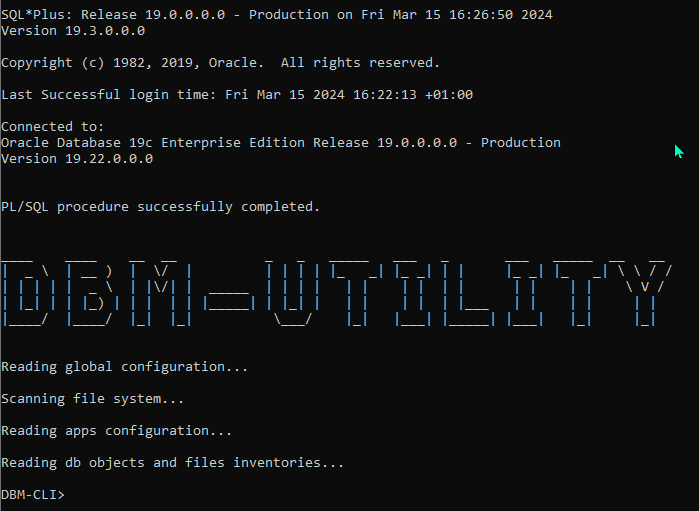
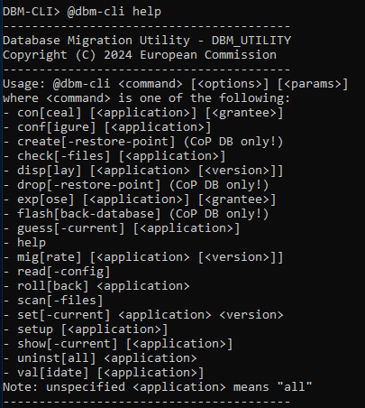
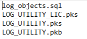
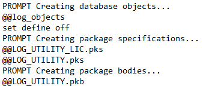
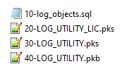
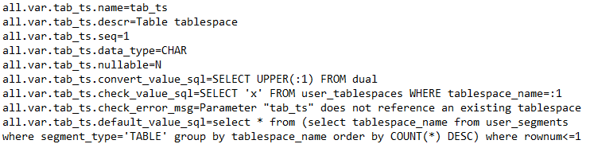
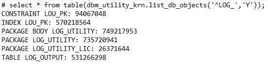
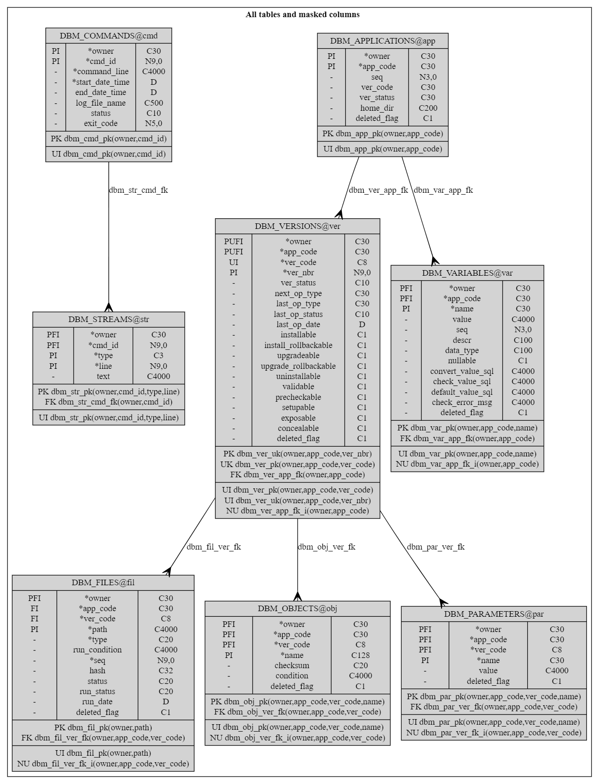

<!-- omit in toc -->
# Data Base Migration Utility v25.1 - User's Guide

<!-- omit in toc -->
## Author: Philippe Debois (European Commission)

<!-- omit in toc -->
# Table of Contents
- [1. Introduction](#1-introduction)
  - [1.1. Overview](#11-overview)
  - [1.2. Purpose](#12-purpose)
  - [1.3. Key Features](#13-key-features)
- [2. Quick Start](#2-quick-start)
  - [2.1. Check pre-requisites](#21-check-pre-requisites)
    - [2.1.1. Database Platform](#211-database-platform)
    - [2.1.2. Installer Platform](#212-installer-platform)
    - [2.1.3. System privileges](#213-system-privileges)
  - [2.2. Get the DBM tool](#22-get-the-dbm-tool)
    - [2.2.1. Archive distribution](#221-archive-distribution)
    - [2.2.2. OSS distribution](#222-oss-distribution)
  - [2.3. Set environment](#23-set-environment)
  - [2.4. Install/Upgrade the DBM tool](#24-installupgrade-the-dbm-tool)
  - [2.5. Launch the DBM tool](#25-launch-the-dbm-tool)
  - [2.6. Configure applications](#26-configure-applications)
  - [2.7. Install/Upgrade applications](#27-installupgrade-applications)
- [3. Execution mode and usage](#3-execution-mode-and-usage)
  - [3.1. Execution mode](#31-execution-mode)
  - [3.2. Usage](#32-usage)
- [4. Commands](#4-commands)
  - [4.1. Commands Overview](#41-commands-overview)
  - [4.2. List of commands](#42-list-of-commands)
  - [4.3. Configure](#43-configure)
  - [4.4. Precheck](#44-precheck)
  - [4.5. Migrate / Install / Upgrade](#45-migrate--install--upgrade)
  - [4.6. Validate](#46-validate)
  - [4.7. Check files](#47-check-files)
  - [4.8. Rollback](#48-rollback)
  - [4.9. Make inventory](#49-make-inventory)
  - [4.10. Show / Guess / Set current](#410-show--guess--set-current)
  - [4.11. Uninstall](#411-uninstall)
  - [4.12. Scan files](#412-scan-files)
  - [4.13. Read config](#413-read-config)
  - [4.14. Display](#414-display)
  - [4.15. Setup](#415-setup)
  - [4.16. Create / Drop restore point](#416-create--drop-restore-point)
  - [4.17. Flashback database](#417-flashback-database)
  - [4.18. Expose / Conceal](#418-expose--conceal)
  - [4.19. Export / Import](#419-export--import)
    - [4.19.1. Exporting Data](#4191-exporting-data)
    - [4.19.2. Importing Data](#4192-importing-data)
    - [4.19.3. Export/Import for All Applications](#4193-exportimport-for-all-applications)
    - [4.19.4. Supported Options](#4194-supported-options)
    - [4.19.5. File Naming and Storage](#4195-file-naming-and-storage)
    - [4.19.6. Implementation Details](#4196-implementation-details)
- [5. Folder Structure and Versioning](#5-folder-structure-and-versioning)
  - [5.1. Folder Structure](#51-folder-structure)
  - [5.2. Versioning](#52-versioning)
- [6. Scripts Execution Methods](#6-scripts-execution-methods)
  - [6.1. Changelog File](#61-changelog-file)
  - [6.2. Master Script](#62-master-script)
  - [6.3. File Naming Conventions](#63-file-naming-conventions)
- [7. Configuration Files](#7-configuration-files)
  - [7.1. Parameters](#71-parameters)
  - [7.2. Variable Definitions](#72-variable-definitions)
  - [7.3. Application dependencies](#73-application-dependencies)
- [8. Database Object Inventory](#8-database-object-inventory)
  - [8.1. Overview](#81-overview)
  - [8.2. Generating the Inventory](#82-generating-the-inventory)
  - [8.3. Checksum Computation](#83-checksum-computation)
  - [8.4. Conditional database objects](#84-conditional-database-objects)
- [9. Conditional file execution](#9-conditional-file-execution)
  - [9.1. Overview](#91-overview)
  - [9.2. Conditional File Execution in Detail](#92-conditional-file-execution-in-detail)
    - [9.2.1. Creating the "files.dbm" File](#921-creating-the-filesdbm-file)
    - [9.2.2. Specifying Conditions](#922-specifying-conditions)
    - [9.2.3. Substitution Variables](#923-substitution-variables)
    - [9.2.4. Evaluating Conditions](#924-evaluating-conditions)
- [10. Privileges management](#10-privileges-management)
  - [10.1. Creating the "privileges.dbm" file](#101-creating-the-privilegesdbm-file)
  - [10.2. File location](#102-file-location)
  - [10.3. File format](#103-file-format)
    - [10.3.1. Privilege usage](#1031-privilege-usage)
    - [10.3.2. Privilege types](#1032-privilege-types)
    - [10.3.3. Grant type](#1033-grant-type)
    - [10.3.4. Privilege](#1034-privilege)
    - [10.3.5. Object](#1035-object)
    - [10.3.6. Admin/Grant option](#1036-admingrant-option)
    - [10.3.7. ANY privileges](#1037-any-privileges)
- [11. Migration Failure Recovery](#11-migration-failure-recovery)
  - [11.1. File Level Recovery](#111-file-level-recovery)
  - [11.2. Statement Level Recovery](#112-statement-level-recovery)
  - [11.3. Conditional Statement Execution](#113-conditional-statement-execution)
  - [11.4. Statement Tag Format](#114-statement-tag-format)
  - [11.5. Jump-to-Statement Option](#115-jump-to-statement-option)
  - [11.6. Skip-File Option](#116-skip-file-option)
- [12. Data Model](#12-data-model)
  - [12.1. Data Structure Diagram](#121-data-structure-diagram)
  - [12.2. Tables description](#122-tables-description)
    - [12.2.1. Applications](#1221-applications)
    - [12.2.2. Versions](#1222-versions)
    - [12.2.3. Files](#1223-files)
    - [12.2.4. Variables](#1224-variables)
    - [12.2.5. Parameters](#1225-parameters)
    - [12.2.6. Commands](#1226-commands)
    - [12.2.7. Streams](#1227-streams)
- [13. Glossary](#13-glossary)
  - [13.1. Release](#131-release)
  - [13.2. Version](#132-version)
  - [13.3. Migration](#133-migration)
    - [13.3.1. Installation Migration](#1331-installation-migration)
    - [13.3.2. Upgrade Migration](#1332-upgrade-migration)
- [14. Annexes](#14-annexes)
  - [14.1. Commands](#141-commands)
    - [14.1.1. End-users' commands](#1411-end-users-commands)
    - [14.1.2. Internal commands](#1412-internal-commands)
  - [14.2. Options](#142-options)
    - [14.2.1. Shell script options](#1421-shell-script-options)
    - [14.2.2. Command help](#1422-command-help)

## 1. Introduction

### 1.1. Overview

The DBM Utility is a database migration tool designed specifically for Oracle database developers. Similar to popular tools like Liquibase or Flyway, it operates primarily using SQL*Plus, shell scripts, and some database objects (some PL/SQL packages for business logic and some tables for data persistence). The utility is compatible with both Windows and Linux-based operating systems.

### 1.2. Purpose

The primary purpose of the DBM Utility is to streamline the process of migrating database objects within Oracle databases. Originally intended as the migration tool for the EC PL/SQL toolkit, it can also be used for migrating database objects of any Oracle-based application.

### 1.3. Key Features

- **Automatic Application Detection:** The tool can automatically detect applications, their versions, and associated properties by scanning the file system. This includes identifying full releases, incremental updates, rollback capabilities, validation requirements, and more.
- **Flexible Execution Methods:** Three execution methods are supported for deploying migration scripts: based on a changelog file (similar to Liquibase), file naming conventions (similar to Flyway), or a master script (similar to SQL*Plus). This allows developers to choose the method that best suits their deployment strategy.
- **Comprehensive Version Management:** The tool keeps track of installed versions and facilitates seamless migration to newer releases or specific versions. It employs checksums to ensure the integrity of database objects during installation and to determine the currently installed release.
- **Simplified Configuration:** Configuration files allow for the definition of parameters and variable definitions at different levels in the file hierarchy, providing flexibility and ease of customisation.
- **Conditional File Execution**: Execute files conditionally by defining SQL expressions with variables, enabling execution based on specific conditions like the current database environment.
- **Dependency Management**: Manages dependencies between applications or tools deployed with the DBM tool, ensuring that dependencies are satisfied before installation. Supports dependencies between applications and specific versions of dependent applications.
- **Database Object Inventory**: Generates and saves an inventory of database objects, used for validating application migrations or determining the version of an installed application. The inventory is saved in a designated file (`objects.dbm`) and includes a checksum for each object.
- **Files Inventory**: Generates and saves an inventory of files, used to detect missing or tampered files. The inventory is saved in a designated file (`files.dbm`) and includes a hash for each file.
- **Prerequisite Checks**: Supports pre-migration checks by allowing users to specify scripts in a "precheck" folder. These scripts raise exceptions if prerequisites are not met, preventing migration from proceeding if necessary conditions are not satisfied.
- **Rollback mechanism**: In the event of a migration failure, the tool offers a rollback mechanism to revert any changes made by executed scripts. This is achieved by executing companion rollback scripts provided by end-users, ensuring that the database can be restored to its previous state before the migration attempt.
- **Restore Point Management**: the tool provides commands to create and drop restore points before migrating schemas of a Cloud on Premise (CoP) database. This allows users to create a restore point for potential database flashbacks in case of major migration failure.
- **Access Management**: With this tool, you can effortlessly expose or conceal database objects to/from other schemas. It facilitates the creation or removal of private or public synonyms and the granting or revoking of corresponding access rights.
- **Multi-Schema Installation**: The tool can be centrally installed and accessed by other schemas, or it can be installed separately in multiple schemas.

In essence, the DBM Utility simplifies database migration tasks by automating discovery, execution, object tracking, and version management processes, making it a valuable asset for Oracle database developers seeking efficient and reliable migration solutions.

## 2. Quick Start

### 2.1. Check pre-requisites

#### 2.1.1. Database Platform

The EC PL/SQL toolkit requires an Oracle database version 19c or above. Note that it has not been tested on Oracle 21c and Oracle 23ai yet.

The database can be hosted in the EC Data Centre, in the EC Cloud on Prem (CoP), in the Amazon cloud (AWS), or in any other location (OTH).

#### 2.1.2. Installer Platform

The installer (the DBM tool) requires the following:

- A Windows laptop or server OR a Linux machine (to execute Windows or Linux shell scripts).
- A file system to unzip the supplied archive.
- SQL*Plus (any version compatible with the target database).
- A connection to the database via SQL*Net or JDBC.

#### 2.1.3. System privileges

The tool offers two installation options: centrally in a dedicated schema for shared access by other schemas, or separately in multiple schemas. Central installation is recommended. In this setup, the schema requires "CREATE PUBLIC SYNONYM" and "GRANT PUBLIC SYNONYM" system privileges to expose or conceal its database objects to other schemas.

### 2.2. Get the DBM tool

The DBM tool is part of the EC PL/SQL toolkit whose code is either distributed as an archive (`ec_plsql_toolkit.zip`), either made available as an open source software on the `code.europa.eu` and `github.com` platforms.

#### 2.2.1. Archive distribution

The `ec_plsql_toolkit.zip` archive can be unzipped into any folder of your choice. This action will create a sub-folder named `ec-plsql-toolkit` from which the DBM tool can be launched.

#### 2.2.2. OSS distribution

To get access to the code of the DBM tool, clone the `ec-plsql-toolkit` repository from `code.europa.eu` or `github.com` using the `git clone <repo>.git` command.

### 2.3. Set environment

Define the following environment variables as appropriate.

| Name          |  Description                    | Mandatory? |
| ------------- | ------------------------------- | - |
| DBM_USERNAME  | Schema username | Y |
| DBM_PASSWORD  | Schema password | Y |
| DBM_DATABASE  | Schema database | Y |
| DBA_USERNAME  | CoP admin username | N |
| DBA_PASSWORD  | CoP admin password | N |
| DBA_DATABASE  | CoP admin database | N |
| DBM_CONF_PATH | Path of the configuration file  | N |
| DBM_APPS_DIR  | Alternate location for apps dir | N |
| DBM_LOGS_DIR  | Alternate location for logs dir | N |
| DBM_TMP_DIR   | Alternate location for tmp dir  | N |

The first three environment variables allow the DBM tool to connect to the schema in which it must be installed. The DBM tool will connect to the schema using the following connect string: `"$DBM_USERNAME/$DBM_PASSWORD@$DBM_DATABASE"`.

The following three environment variables are used by the installer to connect to the admin account of a Cloud on Prem database for the purpose of creating and dropping restore points, as well as for flash-backing the database in the event of a migration failure. This optional feature is available exclusively in EC Cloud on Prem databases.

Other environment variables allow you to define an alternate location for the configuration file (`conf/dbm_utility.conf` by default), the application folder (`apps` by default), the folder where logs are stored (`logs` by default), and the folder where temporary files are created (`tmp` by default).

Environment variables can be defined using the following syntax:

- Under Windows: `C:> set VARIABLE=value`
- Under Linux: `$ export VARIABLE=value`

### 2.4. Install/Upgrade the DBM tool

The DBM tool can be installed and/or upgraded by executing the `migrate-dbm` script while being located in the `ec_plsql_installer` folder.

This script will install and/or upgrade the DBM tool to the latest available version. Tables, views, and packages of the DBM tool created in the schema can be easily identified by their name, all prefixed with `DBM_`.

Due to the dependencies between shell scripts and database objects, this upgrade is mandatory before launching the DBM tool. It is recommended to do it each time a new version of the EC PL/SQL toolkit is deployed.

### 2.5. Launch the DBM tool

To launch the command-line client (CLI) of the DBM tool, execute the `dbm-cli` shell script from a terminal window while being located in the `ec_plsql_toolkit` folder.

Upon startup, you will encounter the following screen:



Note that the information displayed may vary depending on the version of SQL\*Plus and the database version you are connected to.

Once SQL\*Plus is connected to your schema, it initiates the "startup.sql" script situated in the "sql" folder. This script scans the file system under the "apps" folder to identify managed applications or tools and their respective versions. Additionally, it reads all configuration files ("\*.conf"), "database objects inventories" ("objects.dbm"), files inventories ("files.dbm"), and privileges inventories ("privileges*.dbm") associated with each version of each application or tool.

The prompt "DBM-CLI>" then invites you to execute one DBM command.

### 2.6. Configure applications

Before proceeding with the migration, you need to configure the substitution variables that are referenced in the migration scripts, if not already done before. To proceed, just type `@dbm-cli configure` and follow the instructions. You will be requested to enter a value for each substitution variable. Entered value are persisted in the database making this step optional for the next migration.

### 2.7. Install/Upgrade applications

The next step is to launch the installation or upgrade of all managed applications or tools by typing `@dbm-cli migrate`. Based on what is already installed in the connected schema, the DBM tool will determine for each application or tool whether to perform a full install or to upgrade exiting database objects.

As a final step, you may wish to grant access to database objects of managed applications or tools to other schemas by executing `@dbm-cli expose`. This action grants access to other schemas and creates synonyms for easy access.

## 3. Execution mode and usage

The DBM Utility provides both interactive and batch modes for executing commands via the `dbm-cli` shell script. Depending on the parameters passed to `dbm-cli`, users can choose their preferred mode of operation.

### 3.1. Execution mode

**Interactive Mode:**

- In interactive mode, users can enter commands one by one until they decide to exit the tool.
- The tool remains active and responsive to user input until the user chooses to exit, typically by using the "exit" command of SQL*Plus.

**Batch Mode:**

- In batch mode, users can pass a single command along with optional parameters directly to the `dbm-cli` shell script.
- This mode is suitable for automated or scripted operations, allowing for the execution of commands without user interaction.

You can also execute several commands by separating them with a slash (`/`), but this feature is considered experimental (i.e., not all combinations of commands are currently supported).

### 3.2. Usage

**Usage of the dbm-cli Shell Script:**

```plaintext
Data Base Migration Utility
Usage: dbm-cli [options] [command]

Commands (use help command to get full list)
   migrate <app>      migrate an application
   rollback <app>     rollback a failed migration
   uninstall <app>    uninstall an application
   validate <app>     validate a migration
   help               display all dbm-cli commands

Options (format: -option or "-parameter=value")
   apps_dir=<path>    applications directory
   conf_path=<file>   configuration file path
   help               this help
   noexit             do not exit after executing command
   silent             run silently
```

**Commands:**

- The available commands include `migrate`, `rollback`, `uninstall`, `validate`, and `help`.
- Users can use the `help` command to get a full list of available `dbm-cli` commands.

**Options:**

- Users can specify additional options using the `-option` or `"-parameter=value"` format. On Windows, parameter name and value must be enclosed in double quotes.
- Options include `apps_dir` for specifying the applications directory (full or relative path), `conf_path` for providing the configuration file path, `help` for displaying help information, and `noexit` for preventing the tool from exiting after executing a command.

By offering both interactive and batch modes, along with a variety of commands and options, the Database Migration Utility provides flexibility and convenience for managing database migrations efficiently.

## 4. Commands

The DBM Utility offers a range of commands to facilitate database migration tasks. Each command serves a specific purpose and can be invoked via the command-line interface (CLI) client.

To execute a command, type `@dbm-cli <command>` in the CLI and press Enter. The command will be passed to the "dbm-cli.sql" script for execution, which in turn will call the "dbm_utility_krn" package driving all commands.

Commands can also accept options and parameters, with the general syntax being:

```SQL*Plus
@dbm-cli <command> [<options>] [<parameters>]
```
Options and parameters are described with the commands to which they apply.

Additionally, multiple commands can be executed at once, both interactively and in batch mode. To do this, separate your commands with a slash ("/"). On Linux, as slashes are used in paths, you must add a space before it.

As an example, the following sequence of commands install an application, expose it to other schemas, then show installed applications:

```SQL*Plus
@dbm-cli install <app> / expose <app> / show
```

For commands that accept an application as parameter, several applications can be specified by separating them with a comma, as in the following example:

```SQL*Plus
@dbm-cli install <app1>, <app2>, <app3>
```

Finally, applications can be referenced either by their code, either by their alias.

### 4.1. Commands Overview

Below is a comprehensive list of available commands along with their functionalities:

- **Configure:** Configures an application by defining values for substitution variables or placeholders used in migration scripts.
- **Migrate / Install / Upgrade:** Migrates database objects of an application to the latest version, installing or upgrading as necessary.
- **Validate:** Validates the current version of an application, ensuring the integrity of migrated database objects.
- **Check File:** Checks the checksum of files executed successfully during migration to detect tampering or modification.
- **Rollback:** Rolls back a failed migration by executing rollback scripts, if available.
- **Make an inventory:** Make and save the inventory of all database objects and/or files belonging to an application.
- **Show / Guess / Set Current:** Show, guess or set the current version of an application.
- **Uninstall:** Uninstalls an application by executing uninstallation scripts.
- **Scan Files:** Requests a new scan of the file system to detect any changes made during tool operation.
- **Read Config:** Requests a new reading of configuration files to reflect any changes made during tool operation.
- **Display:** Displays applications, versions, scripts, files, parameters, and variables loaded into the internal memory of the tool during startup.
- **Setup:** Setup an application by executing application specific scripts.
- **Create / Drop Restore Point:** Create or drop a restore point (CoP databases only).
- **Flashback database to restore point:** Flashback a database to a restore point previously created in case of major migration failure.
- **Expose / Conceal**: expose/conceal an application by creating/dropping public synonyms and granting/revoking access rights.

These commands provide users with comprehensive control over the database migration process, enabling efficient and reliable management of database objects across different applications and versions.

### 4.2. List of commands

To get the list of available commands, type `@dbm-cli help`. You will get the following screen:



Commands and their options do not need to be fully typed; they can be abbreviated by providing only the first 3, 4 or 5 characters (or any longer prefix), depending on each command and option.

To get help for a specific command (including a description of its purpose, parameters, and available options), type `@dbm-cli help <command>`.

As a rule of thumb, when no application is specified, the command is executed for all applications installed or found on the file system (depending on the command). When no version is specified, the command is executed for the currently installed version.

### 4.3. Configure

Before migrating an application, you may need to configure it i.e., define a value for each of the substitution variables or placeholders that are used in the migration scripts. To configure an application, enter `@dbm-cli configure <application>`. When no application is given or if "all" is specified, the configuration is launched for all applications.

Substitution variables, including how their values are requested from end-users and how they are validated, are specified in the configuration files (*.conf). The value of substitution variables entered by end-users are stored in the database itself.

### 4.4. Precheck

Before proceeding with the migration of an application, you can check whether the preconditions or prerequisites are met by invoking `@dbm-cli precheck <application>`. All scripts placed in the "precheck" folder will be executed. Furthermore, required system/object privileges and/or roles specified in "privileges.dbm" files will also be checked. Note that these verifications are automatically performed before any migration unless the "-nopre[check]" option and/or "-nopriv[ileges]" options are specified respectively.

### 4.5. Migrate / Install / Upgrade

General syntax: `@dbm-cli install [<options>] <application> [<version>]`

To migrate the database objects of an application to the latest version, type `@dbm-cli migrate <application>`. When no application is specified or if "all" is specified, all applications are migrated to their respective latest release.

Migrating an application involves installing it if it's not yet installed and upgrading it if it's already installed. During installation, the scripts from the latest full release (found in the "install" folder) are executed. During an upgrade, the scripts from all intermediary incremental releases up to the latest one (located in the "upgrade" folders) are executed.

The "install" command installs the latest full release of apps that are not installed yet (so it does not upgrade already installed apps). Subsequent upgrades are also performed to the latest available version unless the `-noupgrade` option (or its `-noup` shortcut) is specified.

The "upgrade" command upgrades only apps that are already installed (so it does not install any non-installed app).

The "migrate" command performs both installation and upgrade, without any distinction between applications that are already installed and those that are not.

A validation is automatically performed  after each migration unless the `-novalidate` option (or its `-noval` shortcut) is specified.

When migrating a single application, you have the flexibility to migrate to a specific release, which may not be the latest one (for instance, opting for a more stable version). You can achieve this by specifying the version number along with the application name, as `@dbm-cli migrate <application> <version>` Moreover, if you wish to test migrations incrementally (i.e., one version at a time), you can specifically request an upgrade to the "next" available version as `@dbm-cli migrate <application> next`. This can be performed for either a single application or for all applications collectively.

The scripts executed depend on the chosen execution method (as detailed later). When a changelog file is used, a "show errors" SQL\*Plus command is executed after compiling each package specification and body, provided the "show_compilation_errors" parameter is set to "true" or "yes". This allows immediate identification of the location of the error.

### 4.6. Validate

To validate the current version of an application, enter `@dbm-cli validate <application>`. If no application is specified or if "all" is specified, each current version of every application is validated.

The validation process involves executing any SQL script located in the "validate" folder(s) within the current version folder and/or within the "all" version folder. The validation fails when an exception is raised by one of the scripts.

When a database object inventory is provided in an "objects.dbm" file, the tool verifies the existence and validity of all listed database objects after the migration. Invalid objects are recomputed before the validation when the "recompile_invalid_objects" parameter is set to "yes" or "true". If a checksum is associated with a database object in the inventory file, the tool also verifies the correctness of the checksum. If an object is missing, invalid, or if a checksum is incorrect, the validation fails and raises an exception. The "object_name_pattern" parameter specifies which database objects should be considered. The computation of checksums is specific to each object type and enables detection of changes in the most critical properties of the objects.

Although end-users can manually request a validation, it is automatically triggered after each migration, occurring once per version.

### 4.7. Check files

This command enables you to check the integrity of distributed files as well as to detect files that have been changed or removed from the distribution since their execution. To proceed, execute `@dbm-cli check-files [<application> [<version>]]`. When no application or no version is specified, files of all applications or versions are checked. The `-exec[uted]` and `-dist[ributed]` options can be used to limit the check to respectively executed or distributed files. When no option is specified, both checks are performed.

The inventory of distributed files and their hash is stored (in each directory in a file named `files.dbm`. This file can be generated using the `@dbm-cli make -files` command. The format of each line is: `<file-name>: <MD5-hash> [<run-condition>]`. When a file is executed during a migration, its hash is stored in an internal table of the tool to allow detection of any change.

### 4.8. Rollback

This command enables you to rollback a failed migration under the condition that rollback scripts have been provided in a "rollback" subfolder. Files executed during a migration, along with their outcomes, are registered in the database. The rollback process involves executing the corresponding rollback scripts in reverse order of their execution, beginning with the one that failed. To proceed, execute `@dbm-cli rollback <application>`. Rollback cannot be applied to multiple applications, so "all" is not a valid option. No version can be specified either. Rollback will fail if any of the executed scripts lack equivalents in the "rollback" subfolder or if their execution fails.

### 4.9. Make inventory

An inventory of database objects and files can be built and saved by invoking the following command: `@dbm-cli make-inventory <application>`.

The inventory of database objects is saved into the following file: `apps/<application>/releases/<version>/config/objects.dbm`. Each database object is stored with its type, its name, its checksum, and an optional run condition. The query used to generate the inventory is placed in the first line as a comment. This inventory is used to validate an application migration or to detect which version of an application is currently installed.

An inventory of files is saved into a `files.dbm` file located in each directory. Each file is listed with its name, its hash, and an optional run condition. This inventory is used to detect whether distributed files have been deleted or changed, in which case they are reported respectively as `MISSING` or `TAMPERED`. It is also use to detect files that have been deleted or changed since their execution.

Options `-db[-objects]` and `-file[s]` can be specified to limit the inventory to respectively database objects and files (instead of making both).

### 4.10. Show / Guess / Set current

When the migration tool is installed in a schema that already contains the database objects of an application, the tool can try to guess which version of this application is installed by comparing the objects inventory of each release (and their checksum if any) with the database object installed in the schema (and their checksum). To proceed, type `@dbm-cli guess-current [options] <application>`.

Available options:

- `-best[-guess]`: find the best matching version when no exact match is found.
- `-set[-current]`: set the current version of the application to the found version.

By default, the tool performs an exact match and does not change the current version of an application.

End-user can also manually define which version of the application is currently installed. To proceed, type `@dbm-cli set-current <application> <version>`.

You can also ask the tool to display which version of each application is currently installed by typing the following command: `@dbm-cli show-current <application>`.

### 4.11. Uninstall

To uninstall an application, execute `@dbm-cli uninstall [<options>] <application>`. If no application is specified or if "all" is specified, all applications are uninstalled by executing the SQL scripts located in the "uninstall" folder(s). These scripts may be version-specific, in which case they are located under each version folder, or version-independent, in which case they are located under the "all" version folder.

Sometimes, the DBM tool may incorrectly report that an application is not installed, although some database objects are still present. This situation can prevent you from dropping them via the uninstall command. In such cases, you can force the DBM tool to execute the uninstall scripts by specifying the `-force` option. For example:

```SQL*Plus
@dbm-cli uninstall -force <application>
```

### 4.12. Scan files

The file system is scanned during the tool's startup. Consequently, if a file is created, modified, or deleted while the tool is running, it will not be detected. To address this, you can request a new scan of the file system by executing `@dbm-cli scan-files`. Alternatively, you can exit SQL\*Plus and relaunch `dbm-cli`.

### 4.13. Read config

Configuration files ("\*.conf"), database objects inventories ("objects.dbm"), and files inventories ("files.dbm") are read during the tool's startup. Consequently, if such files are created, modified, or deleted while the tool is running, they will not be detected. To address this, you can request a new reading of configuration files by executing `@dbm-cli read-config`. Alternatively, you can exit SQL\*Plus and relaunch `dbm-cli`.

### 4.14. Display

This command allows you to see and check applications, versions, scripts, files, parameters, variables, etc. that have been loaded into the internal memory of the tool during startup. To proceed, execute `@dbm-cli display <application> <version>`. When no version is specified, all versions are displayed. When no application is given, all applications are displayed.

### 4.15. Setup

This command performs the setup of an application by executing the scripts located in the "setup" folder. To proceed, execute `@dbm-cli setup <application>`.

### 4.16. Create / Drop restore point

Prior to migrating schemas on a CoP database, it's advisable to create a restore point as a precautionary measure against significant migration failures. This can be accomplished by running the command: `@dbm-cli create-restore-point`. Once the restore point is no longer required, it can be removed by executing `@dbm-cli drop-restore-point`.

This command is exclusive to EC CoP (Cloud on Premise) databases and necessitates the prior definition of environment variables to connect to the `C##APPDBA` schema. The required variables include `DBA_USERNAME`, `DBA_PASSWORD`, and `DBA_DATABASE`. Additionally, it's important to establish an SSH tunnel to the database server before launching the tool.

### 4.17. Flashback database

In case of major migration failure, you can restore/flashback the database to the previously created restore point by executing `@dbm-cli flashback-database`. Note that this operation is asynchronous and can take a while to complete. There is currently no way to know whether it is started, completed, and its outcome (success/failure). This operation does not drop the restore point so don't forget to do it once the flashback is complete.

This command is exclusive to EC CoP (Cloud on Premise) databases and necessitates the prior definition of environment variables to connect to the `C##APPDBA` schema. The required variables include `DBA_USERNAME`, `DBA_PASSWORD`, and `DBA_DATABASE`. Additionally, it's important to establish an SSH tunnel to the database server before launching the tool.

### 4.18. Expose / Conceal

The "expose" command makes the database objects of an application available to public or to another schema by granting public or private access rights to them and by creating public or private synonyms for them. Scripts that create synonyms and grant access rights must be located within the "expose" folder of the application. Exposing an application is performed by executing the command `@db-cli expose <application> [<schema>]` where "schema" can be either PUBLIC or the name of an existing schema. When no schema is given, application is by default exposed to PUBLIC.  When no application is specified or when "all" is explicitly mentioned, all applications with exposure scripts are exposed, thereby making their contents accessible.

The "conceal" command functions inversely, concealing database objects previously exposed by an application. This process involves dropping either public or private synonyms and revoking corresponding access rights. Scripts responsible for dropping synonyms and revoking access rights should be located within the "conceal" folder of the application. Concealing an application is performed by executing the command `@db-cli conceal <application> [<schema>]` where "schema" can be either PUBLIC or the name of an existing schema. When no schema is given, all existing expositions (public and/or private) are canceled. When no application is specified or when "all" is explicitly mentioned, all applications with conceal scripts are concealed, resulting in their contents becoming inaccessible.

### 4.19. Export / Import

The `export` and `import` commands enable the backup and restoration of application data using SQL scripts. These commands are particularly useful before upgrading an application (to safeguard against potential failures) or for transferring data between environments.

#### 4.19.1. Exporting Data

To export the data of a specific application, execute:

```sql
@dbm-cli export <application>
```

This command runs all scripts located in the `export` subfolder of the application.

#### 4.19.2. Importing Data

To import the data of a specific application, execute:

```sql
dbm-cli import <application>
```

This command runs all scripts located in the `import` subfolder of the application.

#### 4.19.3. Export/Import for All Applications

If no application is specified, or if `all` is explicitly provided, the data of all applications is exported or imported.

#### 4.19.4. Supported Options

Both commands support the following options:

- **`-verbose`**: Enables detailed informational messages in the logs (disabled by default).
- **`-path=<path>`**: Specifies the storage location for the data file. The default location is the `tmp` directory.
- **`-date[=<format>]`**: Appends a date to the data file name. By default, no date is added. The default date format is `YYMMDD`.
- **`-time[=<format>]`**: Appends a time to the data file name. By default, no time is added. The default time format is `YYMMDDHHMMSS`.

#### 4.19.5. File Naming and Storage

The exported or imported data file is named as follows:

```plaintext
<app>[_<datetime>].<extension>
```

- `<app>`: Application name.
- `<datetime>`: Optional date and/or time, based on the specified options.
- `<extension>`: Depends on the tool used for exporting data.

The file is stored in the directory specified by `<path>`.

#### 4.19.6. Implementation Details

The implementation of these commands is application-specific. Common approaches include:

1. **SQL Script Generation**: For example, the EC PL/SQL toolkit uses a dataset utility to extract data and generate a SQL script. This script can later be executed to import the data back. In this case, the file extension is `.sql`.
   
2. **Third-Party Tools**: Commands may invoke external tools (e.g., Oracle `exp`/`imp`) using SQL\*Plus's `host` command. For such cases, the data file extension is typically `.dmp`.

These flexible options ensure compatibility with a range of use cases and tools.

## 5. Folder Structure and Versioning

### 5.1. Folder Structure

Upon startup of DBM-CLI, the file system is scanned, starting with the "apps" directory, to discover applications for which migrations are provided, the releases that are available, their  characteristics (e.g., incremental or full, support for rollback, etc.), the configuration files and the SQL scripts to be executed. This information is derived from the file structure and some naming conventions.

The folder structure under the "apps" folder is the following:


Each application managed by the tool possesses a dedicated folder within the "apps" directory, with the application code derived from the folder name. Additionally, a special directory named "all" can be established to accommodate materials common to all applications, such as shared configuration files. You can use numerical prefixes in the application folder names to instruct the tool to process them in a certain order.

Under each application folder resides a "releases" folder that contains the various releases. Release numbers are derived from the folder name. Similarly, a designated "all" folder can be created to house materials common to all releases of an application, such as scripts for uninstalling the application or configuration settings independent of specific releases.

Every operation applicable to a release is represented by a dedicated folder within the release folder. These folders are named after the respective commands, including "install," "upgrade," "validate," and "uninstall," and contain all necessary scripts for the associated operation. Additionally, a "config" folder may be created to contain release-specific configuration files.

In certain scenarios, it may be necessary to verify certain prerequisites before executing a migration. For example, you might need to ensure that the schema has specific privileges. This can be accomplished by placing one or more scripts in a "precheck" folder. These scripts should raise an exception if the prerequisite conditions are not met, thereby preventing the migration from proceeding.

For operations that support rollback functionality, such as install or upgrade, a dedicated "rollback" folder may exist within its respective folder. This folder signifies the operation's ability to be reverted and includes the necessary scripts for rollback execution.

Here is an example of file structure showing 5 applications. Application folders are numbered to sequence them. For the LOG utility, 3 versions are provided (1.0, 1.0.1, and 23.0). Version 1.0 is a full release (as indicated by the "install" folder). Version 1.0.1 is an incremental release (as indicated by the "upgrade" folder). Upgrade to version 1.0.1 can be rolled back (as indicated by the "rollback" sub-folder). Uninstallation is independent from the version installed, reason why the "uninstall" folder is located under the special "ALL" version. Each version has a "config" folder that holds version specific configuration (e.g., the inventory of database objects).


### 5.2. Versioning

A release number is structured as follows: "xx.yy.zz", where each number comprises one or two digits at most. The "xx" denotes the mandatory major release number, while "yy" and "zz" represent the optional minor and bugfix release numbers, respectively. These components are separated by dots. Valid examples of release numbers include: 1, 1.0, 1.0.1, 23.0.

The alphanumeric representation of the release number described above is referred to as the version code. Internally, this code undergoes transformation into a numeric value known as the version number. This transformation enables proper ordering of versions during deployment. For instance, the aforementioned releases are converted into 10000, 10000, 10001, and 230000, correspondingly, using the following formula: `xx * 100^2 + yy * 100 + zz`.

## 6. Scripts Execution Methods

Three distinct methods are at your disposal to guide the tool in determining which scripts within each folder to execute and their sequence of execution. These methods include one based on a changelog file, one based on a master script, and one based on file naming conventions. They are presented below in their order of precedence.

### 6.1. Changelog File

Similarly to Liquibase, you have the option to specify the list of scripts to execute by arranging them in the desired order within a changelog file named "install.dbm" or "upgrade.dbm". These files are placed in the "install" or "upgrade" folder, respectively. When such a file exists, it takes precedence over the two other methods.

Here is an example of such an "install.dbm" file:



The files listed will be executed in the specified sequence, prioritising the creation of database objects followed by package specifications and bodies.

This file can easily be created in the following way:

- Under Windows: `dir/b > install.dbm`
- Under Linux: `ls -1 > install.dbm`

Files order can then be adapted using an editor of your choice.

This method also allows specifying a run condition, which is a conditional expression involving variables or parameters. This expression is evaluated to determine whether the file should be executed or not.

Here is an example of a "upgrade.dbm" file:

```txt
dbm_objects.sql
DBM_UTILITY_VAR.pks
DBM_UTILITY_KRN.pks
DBM_UTILITY_KRN.pkb
dbm_public_synonyms.sql: '&&public' = 'true'
dbm_public_grants.sql: '&&public' = 'true'
```

The last 2 scripts will be executed only if the "public" variable or parameter is set to "true".

SQL*Plus master scripts (e.g., `install.sql`) can be used as changelog files by simply renaming them (e.g., to `install.dbm`). All SQL\*plus commands that they contain will be ignored except the `PROMPT` command that can be used to display a message before executing a file. Any `@` preceding file names are allowed but ignored.

### 6.2. Master Script

Alternatively, you can opt to create a master script that executes your files utilising the `@@` command of SQL\*Plus. Any other SQL\*Plus command can also be used (e.g., "prompt" to display information messages). This master script must be named "install.sql" or "upgrade.sql" depending on the operation to be performed. When such a file exists, it is the only one executed and it takes precedence over the naming convention method.

Here is the "install.sql" file corresponding to the above example:



Note that "@@" is used rather than "@" or the "start" command to instruct SQL\*Plus that files are located in the same directory as the master script.

Also note that changelog files take precedence over master scripts. Therefore, master scripts will be ignored if changelog files are present (for example, `install.sql` will be ignored if `install.dbm` is found).

### 6.3. File Naming Conventions

Similarly to Flyway, you can define the execution order of files within a directory by incorporating a sequence number into their names. Only files with extensions such as ".sql", ".pks", ".pls", ".pkb", ".plb", and "java" will be executed, while all other files will be disregarded.

Here is an example of how to name files for the above described example:



It is recommended to leave gaps in the numbering to ease the potential addition of new files in the future.

## 7. Configuration Files

The configuration files containing parameters and substitution variable definitions can be situated at different levels in the file hierarchy, depending on the application and/or version to which they apply.

Structured akin to Java property files, configuration files comprise key-value pairs. The key is made-up of several components separated by dots, beginning with the application code to which it pertains ("all" for parameters or variables common to all applications).

Comment lines, denoted by a "#" at the beginning, are disregarded.

### 7.1. Parameters

A line describing a parameter must follow this format: `<application>.par.<par-name>=<par-value>`

Here are some parameters defined for the DBM tool:

- `dbm_utility.par.object_name_pattern=^DBM_.*$`: defines the name pattern of DBM database objects (used to find database objects that need to be validated against the inventory).
- `dbm_utility.par.show_compilation_errors=true`: specifies that the tool must show errors when compiling package specifications and package bodies, valid for all applications.
- `dbm_utility.par.recompile_invalid_objects=true`: specifies that the tool must recompile invalid objects before validating a release, valid for all applications.

The default value of parameters can be overwritten for a specific application or version by redefining them in a file located at a lower level in the file hierarchy.

### 7.2. Variable Definitions

A line describing a substitution variable must follow this format: `<application>.var.<var-name>.<property-name>=value`.

Where property name is one of the following:

- "name": name of the variable.
- "descr": description of the variable, used as prompt.
- "seq": sequence specifying display/processing order.
- "data_type": data type the value must comply with (CHAR, NUMBER or DATE).
- "nullable": indicates whether a value is optional or not (Y/N).
- "convert_value_sql": SQL statement converting entered value.
- "check_value_sql": SQL statement checking value validity.
- "default_value_sql": SQL statement providing a default value.
- "check_error_msg": error message raised when value is invalid.

Here follows the example of the definition of a "tab_ts" variable that holds the name of the tablespace in which tables must be created:



This variable is referenced in the migration scripts as `&&tab_ts`. It will be substituted with its actual value when the script executes.

### 7.3. Application dependencies

When deploying multiple applications or tools using the DBM tool, dependencies between them may arise. For instance, application A might need to be installed after application B is already present. Dependencies can also extend to specific versions of these applications. For example, version X of application A may necessitate the presence of version Y of application B.

Dependencies must be declared by creating a "requires" parameter in the configuration of the dependant application (in the folder of a specific version or of the "all" version) as what follows:

`<dependent-app>.par.requires=<dependency-app> <dependency-ver>`

Example: to declare that `ds_utility v23.0` depends on `log_utility v23.0`, the following line must be added to "ds_utility.conf" located in "apps/ds_utility/releases/23.0/config":

`ds_utility.par.requires=log_utility 23.0`

Version and name of the dependency application are separated with a space.

## 8. Database Object Inventory

### 8.1. Overview

A database inventory includes a comprehensive list of database objects including packages, package bodies, procedures, functions, types, type bodies, triggers, java sources, keys, constraints, indexes, views, materialised views, tables, and sequences. This inventory is stored in an "objects.dbm" file associated with each release. Following release deployment, the DBM tool verifies the existence and validity of all listed database objects in the database. Only objects whose names match the regular expression pattern associated with the application are considered (cfr. "object_name_pattern" parameter described above). Additionally, an optional checksum capturing the most important properties of each database object can be computed and stored in the inventory. A condition can also be specified e.g., to tell that an object only exists is some environments.

An error is raised if an object from the inventory is missing in the database or if its checksum does not match, indicating an unexpected modification. A warning is issued if a database object is found missing in the inventory, suggesting a potential oversight during inventory creation.

Moreover, this inventory serves as a reference for determining the current installed version of the application when the DBM tool is installed in a schema already containing the database objects of the application.

Inventory files, named "objects.dbm," are required to be situated in the "config" directory of each application version. These files comprise one line for each database object, formatted as what follows:

 `<object-type> <object-name>[: [<checksum>] [<condition>]]`.

Here is an example of a database objects inventory file:



Comment lines, denoted by a "#" at the beginning, are disregarded.

### 8.2. Generating the Inventory

This inventory can be generated using the `list_db_objects()` pipelined function. It accepts the database object name pattern as the first parameter and a flag indicating whether the checksum should be computed or not as the second parameter. An anti-pattern can also be specified to exclude some database objects.

In the example above, the query executed to generate the inventory is placed in a comment at the first line of the file.

### 8.3. Checksum Computation

Here's a summary of how the checksum is computed for each object type:

- For packages, package bodies, procedures, functions, types, type bodies, triggers, and java sources, the checksum is computed based on the following properties:
  - Object type
  - Object name
  - Source code text (excluding trailing whitespace and newlines)
  - Object status

- For PK, UK and FK constraints, the checksum is computed based on:
  - Constraint name
  - Constraint type
  - Table name
  - Columns list

- For check constraints, the checksum is computed based on:
  - Constraint name
  - Constraint search condition (excluding trailing whitespace and newlines)

- For indexes, the checksum is computed based on:
  - Index name
  - Uniqueness
  - Table name
  - Column lists

- For views, the checksum is computed based on:
  - View name
  - View text (excluding trailing whitespace and newlines)

- For materialised views, the checksum is computed based on:
  - Materialised view name
  - Materialised view query text (excluding trailing whitespace and newlines)
  
- For tables, the checksum is computed based on:
  - Object type
  - Object name
  - Column names, data types, precision, scale, length, nullability (sorted alphabetically);
    Note that column positions are not used so as to have the same checksum when installing and upgrading.
  - Object status

- For sequences, the checksum is computed based on sequence attributes such as increment by, min value, max value, cycle flag, cache size, order flag, keep value, scale flag, sharded flag, and session flag.

These checksums help identify changes or differences in the properties of database objects, facilitating database management, version control, and change tracking. Checksum computation is designed to be independent from the type of migration (full installation vs incremental upgrade).

### 8.4. Conditional database objects

For each database object, you can specify a conditional expression. The evaluation of this expression (TRUE or FALSE) determines whether the database object is expected to exist or not. A common scenario is to specify that an object should only exist in certain environments.

Syntax of conditional expressions for database objects are the same as for conditional file execution (see section  [9. Conditional execution](#9-conditional-execution)).

Here follows an example of a unit test package (`DS_CRYPTO_TST`) that exists only in the "dev" environment.

With checksum:

```txt
PACKAGE BODY DS_CRYPTO_TST: 807219452 '&&env' = 'dev'
PACKAGE DS_CRYPTO_TST: 943970027 '&&env' = 'dev'
```

Without checksum:

```txt
PACKAGE BODY DS_CRYPTO_TST: '&&env' = 'dev'
PACKAGE DS_CRYPTO_TST: '&&env' = 'dev'
```

Note that when no checksum is specified, the conditional expression shall not start with a digit.

## 9. Conditional file execution

### 9.1. Overview

One of the key features of the migration tool is its ability to execute files conditionally based on specified criteria. With this feature, users can define conditions under which certain migration scripts should be executed, allowing for greater flexibility and control over the migration process.

For instance, users can specify conditions in a "files.dbm" file located within the directory of each script. These conditions are SQL expressions that determine whether the associated script should be executed. The tool evaluates these expressions and executes the script only if the conditions are met.

This feature provides users with the capability to tailor the migration process to specific environments or circumstances. For example, scripts intended for development environments can be set to execute only in those environments, ensuring that production environments remain unaffected.

By enabling conditional execution, the migration tool empowers users to automate and streamline the migration process while maintaining control over script execution based on their unique requirements and environments.

### 9.2. Conditional File Execution in Detail

In this section, we delve deeper into the mechanics of conditional execution, providing a step-by-step guide on how to leverage this feature effectively.

#### 9.2.1. Creating the "files.dbm" File

To enable conditional execution for a specific file, create a "files.dbm" file within the directory where the file is located.

#### 9.2.2. Specifying Conditions

Each line in the "files.dbm" file must follow a specific format: `<file>: <condition>`.

- `<file>` represents the name of the file to be executed conditionally (without path).
- `<condition>` is a conditional expression (without the surrounding SQL syntax).

Example: `script.sql: '&&env' = 'dev'`

#### 9.2.3. Substitution Variables

Conditions can contain substitution variables, such as &&env, which must be enclosed in single quotes when compared to a string. Substitution variables enable dynamic condition evaluation based on environment-specific parameters.

#### 9.2.4. Evaluating Conditions

The tool first substitutes the variables then evaluates the conditional expression specified in each condition line via the following SQL statement: `SELECT 'x' FROM dual WHERE <condition>`. If the expression evaluates to true (i.e., the condition is met), the associated script will be executed. If the expression evaluates to false, the script will not be executed.

By understanding the structure of the "files.dbm" file and how conditions are evaluated, users can effectively control the execution of migration scripts based on their specified criteria and requirements.

## 10. Privileges management

This section describes how to specify the privileges that a schema must have before migrating or operating an application.

### 10.1. Creating the "privileges.dbm" file

### 10.2. File location

To enable automatic checking of privileges, create a "privileges.dbm" file in the "config" folder of an application version (or under "all" when applicable to all versions).

### 10.3. File format

The format of each line in the "privileges.dbm" file is the following:

`<privilege_usage> <privilege-type> [DIRECT] <oracle-privilege> [ON <object_type> <object_owner>.<object_name>] [WITH ADMIN|GRANT OPTION][: <condition>]`

Examples:

```text
MIGRATE ROLEPRIV DC_RESOURCE: '&&installation_env' in ('DC', 'COP')
MIGRATE SYSPRIV DIRECT CREATE TABLE
MIGRATE TABPRIV DIRECT EXECUTE ON PACKAGE SYS.DBMS_AQ: '&&installation_env' in ('AWS', 'COP')
OPERATE SYSPRIV DIRECT CREATE TABLE
```

#### 10.3.1. Privilege usage

The following privilege usages are supported:

- MIGRATE: privileges that the schema in which the application will be installed must have.
- OPERATE: privileges that the schema from which the application is run must have.

These schemas can be the same or can be different.

Privileges used to MIGRATE an application are checked by the DBM tool when running the precheck, migrate, install, and upgrade commands.

Privileges used to OPERATE must be checked by the application itself, by invoking the `check_runtime_privileges()` procedure with the application code passed in parameter. For an application that is based on database packages, it is recommended to make this call in the initialisation section of its main package. The package initialisation will fail until the required privileges have been granted to the connected user.

#### 10.3.2. Privilege types

The following types of privileges are supported:

- SYSPRIV: System privileges (those found in `USER_SYS_PRIVS` and `ROLE_SYS_PRIVS` views).
- TABPRIV: Table/object privileges (those found in `USER_TAB_PRIVS` and `ROLE_TAB_PRIVS` views).
- ROLEPRIV: Roles (those found in `USER_ROLE_PRIVS` and `ROLE_ROLE_PRIVS` views).

#### 10.3.3. Grant type

The schema can be granted privileges/roles directly or receive them via a role. The `DIRECT` keyword indicates that the privilege must be granted directly. Privileges required within a package/procedure/function must typically be granted directly. This property can be checked in the data dictionary views using the `inherited` column. The value `YES` indicates a privilege received through a role.

#### 10.3.4. Privilege

The name of the Oracle system privilege, table/object privilege, or role is then specified.

#### 10.3.5. Object

For table/object privileges, the type, owner and name of the object must be specified. The object type is used for checking the corresponding ANY privileges (see below). Valid object types are TABLE, VIEW, MVIEW, SEQUENCE, PACKAGE, PROCEDURE, FUNCTION, and TYPE.

#### 10.3.6. Admin/Grant option

You can specify whether the tool must check whether the privilege can be delegated further or not with the `WITH ADMIN OPTION` (for system privileges and roles) or `WITH GRANT OPTION` (for table/object privileges). These properties can be checked in the data dictionary views using the `admin_option` and `grantable` columns respectively.

#### 10.3.7. ANY privileges

System privileges that include the keyword `ANY` provide broad administrative capabilities across the entire database, allowing the user to perform actions on objects in any schema. These privileges often supersede more specific privileges that are limited to certain schemas or objects.

To verify if a specific privilege has been granted, the DBM tool not only checks for that particular privilege but also checks if a superseding `ANY` privilege has been granted.

For system privileges, the superseding privilege contains the additional `ANY` keyword in its name compared to the superseded privilege, as in the following examples:

- `ALTER ANY TABLE` supersedes `ALTER TABLE`.
- `...`
- `CREATE ANY CONTEXT` supersedes `CREATE CONTEXT`.

For table/object privileges, here are the superseding `ANY` privileges that are checked and the object types to which they apply:

- `SELECT ANY TABLE` applies to `TABLE`, `VIEW`, `MVIEW`, and `SEQUENCE`.
- `INSERT ANY TABLE` applies to `TABLE` and `VIEW`.
- `UPDATE ANY TABLE` applies to `TABLE` and `VIEW`.
- `DELETE ANY TABLE` applies to `TABLE` and `VIEW`.
- `ALTER ANY TABLE` applies to `TABLE` and `VIEW`.
- `INDEX ANY TABLE` applies to `TABLE`.
- `REFERENCES ANY TABLE` applies to `TABLE`.
- `EXECUTE ANY PROCEDURE` applies to `PACKAGE`, `PROCEDURE`, `FUNCTION`, and `TYPE`.
- `ALTER ANY SEQUENCE` applies to `SEQUENCE`.

## 11. Migration Failure Recovery

Recovery from a migration failure can be performed at the file level or the statement level.

### 11.1. File Level Recovery

During a migration (installation or upgrade), the DBM tool tracks which files have been successfully executed. If a failure occurs, relaunching the migration will skip the already executed files and resume from the script that failed, assuming it has been corrected. This approach works only if the script can be re-executed without error or if the actions performed have been rolled back.

### 11.2. Statement Level Recovery

A more detailed recovery option is available at the statement level for SQL scripts containing multiple DDL or DML statements. This functionality applies to SQL scripts having a `.sql` extension. Each statement in the file must be marked with a statement identifier formatted as `DBM-XXXXX`, where `XXXXX` is a sequential number between 1 and 99999. This tag should be placed in a `REM[ARK]` above each statement. You can include a comment after the statement identifier, which is ignored by the DBM tool. It is recommended to leave gaps in the numbering (e.g., numbering by multiples of 10) to allow for future additions.

For such `.sql` files, the DBM tool records the last executed statement. If a failure occurs, the migration will resume from the statement that failed. A temporary file (prefixed with `~`), stored in the same folder as the original script, is created where successfully executed statements are replaced with blank lines. This temporary file is automatically deleted upon successful execution.

Note that multiple SQL statements and/or SQL\*Plus commands can be included between two tags. In case of re-execution, all these statements will be re-executed.

### 11.3. Conditional Statement Execution

The DBM tool supports the conditional execution of SQL statements using the described tags. To use this feature, add a colon (`:`) after the statement ID (or its comment) and specify a condition using the same syntax as for conditional file execution.

### 11.4. Statement Tag Format

The general format of a statement tag is: `REM[ARK] DBM-99999 [<comment>] [: <condition>]`.

Example: The SQL statements following the tag will be executed only in Cloud on Prem DBs.

```text
REMARK DBM-12345 - Only in CoP DBs: '&&install_env' = 'COP'
INSERT INTO ... VALUES (...);
COMMIT;
```

### 11.5. Jump-to-Statement Option

When relaunching a migration after a failure, the end-user can skip certain statements in a SQL script by jumping directly to a specific statement ID. This can be done using the `-jump[-to-statement]=XXXXX` option of the `migrate` command, where `XXXXX` is the statement ID. This option is useful for skipping statements that cannot be re-executed.

### 11.6. Skip-File Option

During a migration, the end-user can choose to skip a specific file using the `-skip[-file]=<file>` option of the `migrate` command. The file name can be specified with or without its relative path, which is relative to the `apps` folder.

This option is particularly useful for skipping a script that makes structural changes while still executing scripts that perform code upgrades.

## 12. Data Model

This sections described the internal data model of the DBM tool.

### 12.1. Data Structure Diagram



All database objects are prefixed with DBM.

### 12.2. Tables description

#### 12.2.1. Applications

The tool supports the migration of one or several applications identified by a code. The optional sequence indicates the order in which application are migrated. A dummy "all" application can be created when variables common to all applications are defined.

The version of an application currently installed is indicated by "ver_code". When migrating, this version will not changed until the next one is successfully installed and validated.

The version status ("ver_status") is one of the following:

- VALID: current version is valid (migration succeeded and version is valid).
- INVALID: current version is invalid (migration or validation failed).
- MIGRATING: current version is migrating to next one.

The full pathname of the application folder is indicated by "home_dir".

#### 12.2.2. Versions

An application can have one or multiple versions, each identified by a code and a number. A dummy "all" version (numbered 0) can be created when configuration files or scripts common to all versions are defined.

The version code ("ver_code") follows the format "xx.yy.zz", where "xx" represents the major version number, "yy" indicates the minor version number, and "zz" denotes the bugfix version number. A valid version code must adhere to the regular expression: `^[0-9]{1,2}(\.[0-9]{1,2}){0,2}$`.

The version number ("ver_nbr") is computed from the version code using the formula: `xx * 10^2 + yy * 10 + zz`. In cases where "yy" or "zz" doesn't exist in the code, they are considered zero in the formula.

Version status ("ver_status") is one of the following:

- PAST: past version.
- PREVIOUS: previous version migrated from.
- CURRENT: current version.
- NEXT: next version to migrate to.
- FUTURE: future version.

Next operation type ("next_op_type") indicates the anticipated action for this version and can be one of the following:

- INSTALL: install next (full) version.
- UPGRADE: upgrade to next version (increment).
- UNINSTALL: uninstall version (after uninstall failure).
- ROLLBACK: rollback version (after upgrade failure).

Last operation type ("last_op_type") indicates the action executed most recently and can be one of the following:

- INSTALL
- UPGRADE
- VALIDATE
- ROLLBACK INSTALL
- ROLLBACK UPGRADE
- UNINSTALL
- FORCE CURRENT

Last operation status ("last_op_status") indicates the status of the action executed most recently and can be one of the following:

- ONGOING: operation is still ongoing.
- SUCCESS: last operation succeeded.
- ERROR: last operation failed.

Last operation date ("last_op_date") indicates the date an time when the status of the last operation was last modified.

Remaining fields are flags indicating whether the version can be installed, upgraded, validated and/or rolled back.

#### 12.2.3. Files

During installation or migration to a specific version, the DBM tool registers the files or scripts that are applied, along with the outcome of their execution and their hash. This registration enables the tool to detect any tampering with the executed files or scripts at a later stage.

Files are uniquely identified by their path within the system and are designated for a specific type of migration, which is determined based on the folder in which they are located. Typically, files are categorised into two migration types: INSTALL or UPGRADE, based on the purpose they serve within the migration process.

File status denotes the current state or condition of a particular file within the system and can be one of the following:

- MISSING: file is missing on the file system.
- TAMPERED: file has changed since its last execution.
- NORMAL: file is neither missing, neither tampered.

Run status ("run_status") denotes the current state or outcome of the execution of a particular file and can be one of the following:

- ONGOING: script is currently executing.
- SUCCESS: script execution completed successfully.
- ERROR: script execution ended with an error.
- ROLLED BACK: changes resulting from the script execution were rolled back.

Run date ("run_date") indicates the date an time when the run status was last modified.

#### 12.2.4. Variables

Substitution variables, known as placeholders in Liquibase and Flyway, are SQL\*Plus symbolic names (e.g., `&&var`) used in scripts that are replaced with specific values during their execution. They are defined for individual applications or globally across all applications. Before applying any migration, their values must be defined using the "configure" command to prevent any end-user interaction during script execution.

Variables in the context of an application have unique names. The following properties are used during the interactive configuration:

"seq": defines the order in which end-users are prompted to enter values.
"descr": describes the variable, serving as a prompt.
"data_type": specifies the data type (CHAR, NUMBER, DATE) for input validation.
"nullable": indicates whether a value is optional.
"convert_value_sql": SQL statement applied to the entered value (e.g., conversion to uppercase).
"check_value_sql": SQL statement used to validate the value.
"default_value_sql": SQL statement providing a default value.
"check_error_msg": error message displayed if the value check fails.
"value": the actual value stored in the database.

#### 12.2.5. Parameters

Parameters, used for configuring applications, have the following properties:

"name": name of the parameter.
"value": actual value of the parameter.

#### 12.2.6. Commands

A command refers to a specific action or operation that can be executed via the command-line interface (CLI). These commands facilitate database migration tasks such as installing, upgrading, validating, rolling back, configuring, and uninstalling applications and their associated versions.

A command is uniquely identified by an ID ("cmd_id") generated from a sequence. The command line entered by the end-user is recorded along with its start and end date and time. The "log_file_name" specifies the path of the file where the command's screen output is logged.

The status of a command can be one of the following:

- ONGOING: the command is currently executing.
- SUCCESS: the command completed successfully.
- FAILURE: the commend ended with an error.

The "exit_code" is set to zero upon successful completion and to a non-zero value otherwise. On Windows, it corresponds to the Oracle exception number raised during the command execution. However, on Linux, due to OS limitations, it is set to 1, and the log file must be consulted to retrieve the actual exception.

#### 12.2.7. Streams

In the context of the DBM tool, streams facilitate the exchange of information between the SQL\*Plus script ("dbm-cli.sql") executed when an end-user initiates a command and the main DBM_UTILITY_KRN package responsible for executing all commands. These streams serve as channels through which instructions, such as SQL\*Plus commands like "start" or "host," are sent from the package to SQL\*Plus via the input stream. Subsequently, the output stream transmits the results of the SQLPlus command back to the package. This bidirectional flow of data enables seamless communication and coordination between the SQL\*Plus script and the core functionality of the DBM tool. Streams are temporary in nature and are automatically deleted upon the completion of a command.

A stream, categorised as either IN or OUT via its "type", consists of lines of text, each uniquely numbered for processing purpose.

## 13. Glossary

### 13.1. Release

In the context of database migration, a release refers to a specific version of the database schema or structure that is deployed or made available for users. It represents a snapshot of the database configuration at a particular point in time, often including schema changes, data updates, and new features. A release may encompass more than one version.

### 13.2. Version

A version in database migration denotes a distinct iteration or variant of the database schema or structure. Versions may indicate changes, updates, or enhancements made to the database, often identified by a unique number or designation. Each version may include modifications to the schema, data model, or stored procedures. Not all versions are necessarily released.

### 13.3. Migration

Migration in the context of database management refers to the process of transferring or transitioning from one database schema or structure to another. It involves tasks such as schema modifications, data transformation, and application updates to facilitate a smooth transition from the existing database version to the new one.

#### 13.3.1. Installation Migration

Installation migration involves deploying a new version or release of the database schema from scratch. It includes tasks such as initial setup, configuration, and data loading to establish the new database environment.

#### 13.3.2. Upgrade Migration

Upgrade migration entails transitioning from an older version of the database schema to a newer version while preserving existing data and configurations. It involves upgrading database components and ensuring compatibility with existing applications and systems.

## 14. Annexes

### 14.1. Commands

This section gives a list of all dbm-cli available commands and their shortcut. It is recommended to specify full commands in scripts and to reserve shortcuts for the interactive mode.

#### 14.1.1. End-users' commands

Here follows the list of commands (and their shortcut) available to end-users:

| Command | Description |
| ------- | ----------- |
| `check[-files]` | check tampering of executed files with checksums. |
| `conc[eal]` | hide application(s) to public/private schema |
| `conf[igure]` | configure application(s) |
| `create[-restore-point]` | create a restore point for subsequent flashback |
| `disp[lay]` | display application(s) information |
| `drop[-restore-point]` | drop a previously created restore point |
| `expos[e]` | expose application(s) to public/private schema |
| `expor[t]` | export application's data |
| `flash[back-database]` | restore a database to last created restore point |
| `guess[-current]` | guess currently installed version of application(s) |
| `help` | get list of commands |
| `imp[ort]` | import application's data |
| `ins[tall]` | install application(s) |
| `make[-inventory]` | make an inventory of db objects with checksums |
| `mig[rate]` | install and/or upgrade application(s) |
| `pre[check]` | perform pre-migration checks |
| `roll[back]` | rollback a migration using provided scripts |
| `set[-current]` | set the current version of an application |
| `setup` | set-up application(s) |
| `show[-current]` | show current version of application(s) |
| `uninst[all]` | uninstall application(s) |
| `upg[rade]` | upgrade application(s) |
| `val[idate]` | validate application(s) |

#### 14.1.2. Internal commands

Here follows the list of internal commands (and their shortcut) for internal use only:

| Command | Description |
| ------- | ----------- |
| `exec[ute]` | execute command(s) upon startup |
| `load[-cache]` | load cache from database |
| `noop` | do nothing |
| `read[-config]` | read configuration files |
| `save[-cache]` | save cache into database |
| `scan[-files]` | scan the file system |
| `start[up]` | dbm-cli startup |

### 14.2. Options

#### 14.2.1. Shell script options

Here follows the list of the `dbm-cli` shell script options.

| Option | Description |
 ------ | ----------- |
| `-silent` | Run silently |
| `-noscan` | Do not scan file system for a quick startup (experimental) |
| `-nosplash` | Do not display the splash screen |
| `-noexit` | Do not exit after command execution |
| `-trace` | Trace calls (for debugging purpose) |
| `-debug` | Show debugging information |
| `-apps_dir=<path>` | Alternate location of `apps` folder |
| `-logs_dir=<path>` | Alternate location of `logs` folder |
| `-tmp_dir=<path>` | Alternate location of `tmp` folder |
| `-conf_path=<path>` | Alternate path of configuration file `conf/dbm_utility.conf` |
| `-[no]color` | Display messages with or without colors (when available)  |

#### 14.2.2. Command help

Here follows the list of available commands with their abbreviation, purpose, parameters, and possible options (obtained with the command `@dbm-cli help all`):

```txt
========================================
Usage: check[-files] [<options-list>] [<apps-list> | all] [<version>]
Check integrity of distributed files and/or executed files using hashes.
<apps-list> is a comma-separated list of applications.
<version> is an application version (if a single app)
<options-list> is a space-separated list of options:
.  -dist[ributed]: check distributed files only
.  -exec[uted]: check executed files only
.  -h[elp] or -?: this help
.  -v[erbose]: display status of all files
========================================
Usage: conc[eal] [<options-list>] [<apps-list> | all] [<grantee>]
Conceal an application by revoking grants and dropping synonyms.
<grantee> can be a private schema or "public" (default)
<apps-list> is a comma-separated list of applications.
<options-list> is a space-separated list of options:
.  -h[elp] or -?: this help
========================================
Usage: conf[igure] [<options-list>] [<apps-list> | all]
Configure substitution variables for given applications.
<apps-list> is a comma-separated list of applications.
<options-list> is a space-separated list of options:
.  -h[elp] or -?: this help
========================================
Usage: disp[lay] [<options-list>] [<apps-list> | all] [version]
Display information about given applications (stored in the internal cache).
<apps-list> is a comma-separated list of applications.
<options-list> is a space-separated list of options:
.  -h[elp] or -?: this help
========================================
Usage: expor[t] [<options-list>] [<apps-list> | all]
Export configuration of given applications.
<apps-list> is a comma-separated list of applications.
<options-list> is a space-separated list of options:
.  -h[elp] or -?: this help
.  -date[=<YYMMDD>]: add date to file name (default: today)
.  -path=<path>: path of default directory
.  -time[=<YYMMDDHHMMSS>]: add date/time to file name (default: now)
.  -verb[ose]: show information messages
========================================
Usage: expos[e] [<options-list>] [<apps-list> | all] [<grantee>]
Expose an application using private or public grants and synonyms.
<grantee> can be a private schema or "public" (default)
<apps-list> is a comma-separated list of applications.
<options-list> is a space-separated list of options:
.  -h[elp] or -?: this help
========================================
Usage: guess[-current] [<options-list>] [<apps-list> | all]
Guess which version of given applications are installed using checksums.
A best guess can be performed in case no exact match is found.
Application version can be changed so as to reflect matching one.
<apps-list> is a comma-separated list of applications.
<options-list> is a space-separated list of options:
.  -best[-guess]: make a best guess (vs exact match)
.  -d[ebug]: enable debugging
.  -h[elp] or -?: this help
.  -set[-current]: set guessed version as current
========================================
Usage: imp[ort] [<options-list>] [<apps-list> | all]
Import configuration of given applications.
<apps-list> is a comma-separated list of applications.
<options-list> is a space-separated list of options:
.  -h[elp] or -?: this help
.  -date[=<YYMMDD>]: add date to file name (default: today)
.  -path=<path>: path of default directory
.  -time[=<YYMMDDHHMMSS>]: add date/time to file name (default: now)
.  -verb[ose]: show information messages
========================================
Usage: ins[tall] [<options-list>] [<apps-list> | all]
Install applications that are not installed yet (do not upgrade already installed ones).
<apps-list> is a comma-separated list of applications.
<options-list> is a space-separated list of options:
.  -h[elp] or -?: this help
.  -jump[-to-statement] <id>: jump to statement id
.  -nocond[-stmt-exec]: disable conditional statement execution
.  -nodep[endencies]: do no check application dependencies
.  -nohash[-check]: do no check file hashes (i.e., ignore tampered files)
.  -noshow[-errors]: do not show compilation errors
.  -nopriv[ileges]: do no check required privileges
.  -nostop[-on-error]: do not stop on error
.  -nostop[-on-warning]: do not stop on warning
.  -noup[grade]: do not upgrade after install
.  -noval[idate]: do not validate after install
.  -reexec[ute]: re-execute scripts already successfuly executed
.  -show[-errors]: show compilation errors
.  -sim[ulate]: simulate i.e. do not execute install
.  -skip[-file] <file>: skip specified file
.  -stop[-on-warning]: stop on warning
========================================
Usage: make[-inventory] [<options-list>] <app> [<ver>]
Make inventory of database objects and files with checksums/hashes.
<app> is the application code or abbreviation
<ver> is the application version (default: latest)
<options-list> is a space-separated list of options:
.  -db[-objects]: make db objects inventory only
.  -file[s]: make files inventory only
.  -h[elp] or -?: this help
========================================
Usage: mig[rate] [<options-list>] [<apps-list> | all]
Install non-installed applications and upgrade installed ones.
<apps-list> is a comma-separated list of applications.
<options-list> is a space-separated list of options:
.  -h[elp] or -?: this help
.  -jump[-to-statement] <id>: jump to statement id
.  -nocond[-stmt-exec]: disable conditional statement execution
.  -nodep[endencies]: do no check application dependencies
.  -nohash[-check]: do no check file hashes (i.e., ignore tampered files)
.  -noshow[-errors]: do not show compilation errors
.  -nopriv[ileges]: do no check required privileges
.  -nostop[-on-error]: do not stop on error
.  -nostop[-on-warning]: do not stop on warning
.  -noval[idate]: do not validate after migrate
.  -reexec[ute]: re-execute scripts already successfuly executed
.  -show[-errors]: show compilation errors
.  -sim[ulate]: simulate i.e. do not execute migrate
.  -skip[-file] <file>: skip specified file
.  -stop[-on-warning]: stop on warning
========================================
Usage: pre[check] [<options-list>] [<apps-list> | all]
Check installation pre-requisites (without performing any migration).
<apps-list> is a comma-separated list of applications.
<options-list> is a space-separated list of options:
.  -h[elp] or -?: this help
========================================
Usage: roll[back] [<options-list>] [<apps-list> | all]
Rollback failed migration of given applications.
<apps-list> is a comma-separated list of applications.
<options-list> is a space-separated list of options:
.  -h[elp] or -?: this help
.  -noshow[-errors]: do not show compilation errors
.  -nostop[-on-warning]: do not stop on warning
.  -show[-errors]: show compilation errors
.  -stop[-on-warning]: stop on warning
========================================
Usage: set[-current] [<options-list>] <app> <ver>
Set the current version of an application.
<options-list> is a space-separated list of options:
.  -h[elp] or -?: this help
========================================
Usage: setup[] [<options-list>] [<apps-list> | all]
Perform the setup or configuration of given applications.
<apps-list> is a comma-separated list of applications.
<options-list> is a space-separated list of options:
.  -h[elp] or -?: this help
========================================
Usage: show[-current] [<options-list>] [<apps-list> | all]
Show currently installed version of given applications.
<apps-list> is a comma-separated list of applications.
<options-list> is a space-separated list of options:
.  -all[-schemas]: show applications of all schemas
.  -h[elp] or -?: this help
========================================
Usage: unins[tall] [<options-list>] [<apps-list> | all]
Uninstall given applications.
<apps-list> is a comma-separated list of applications.
<options-list> is a space-separated list of options:
.  -f[orce]: force uninstall
.  -h[elp] or -?: this help
========================================
Usage: upg[rade] [<options-list>] [<apps-list> | all]
Upgrade applications that are already installed (do not install non-installed ones).
<apps-list> is a comma-separated list of applications.
<options-list> is a space-separated list of options:
.  -h[elp] or -?: this help
.  -jump[-to-statement] <id>: jump to statement id
.  -nocond[-stmt-exec]: disable conditional statement execution
.  -nodep[endencies]: do no check application dependencies
.  -nohash[-check]: do no check file hashes (i.e., ignore tampered files)
.  -noshow[-errors]: do not show compilation errors
.  -nopriv[ileges]: do no check required privileges
.  -nostop[-on-error]: do not stop on error
.  -nostop[-on-warning]: do not stop on warning
.  -noval[idate]: do not validate after upgrade
.  -reexec[ute]: re-execute scripts already successfuly executed
.  -show[-errors]: show compilation errors
.  -sim[ulate]: simulate i.e. do not execute upgrade
.  -skip[-file] <file>: skip specified file
.  -stop[-on-warning]: stop on warning
========================================
Usage: val[idate] [<options-list>] [<apps-list> | all]
Check the validity of given applications using checksums.
<apps-list> is a comma-separated list of applications.
<options-list> is a space-separated list of options:
.  -h[elp] or -?: this help
```
