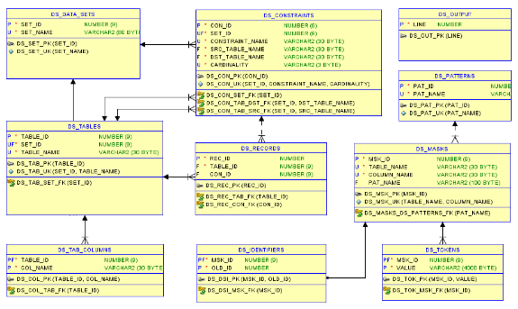
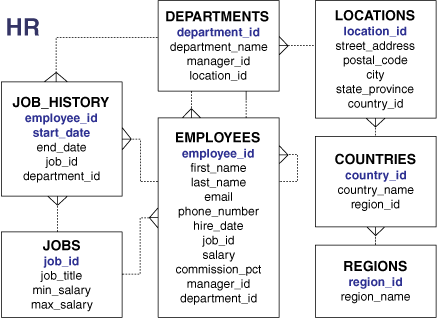
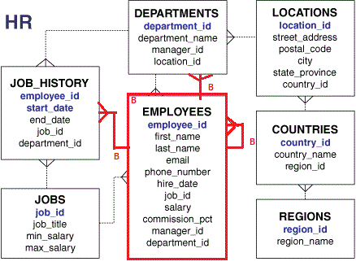
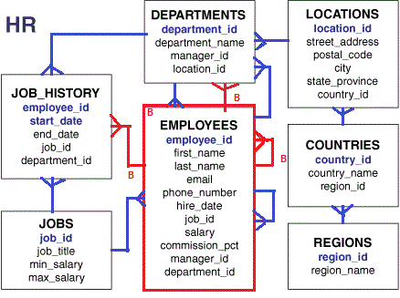
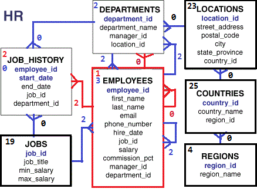
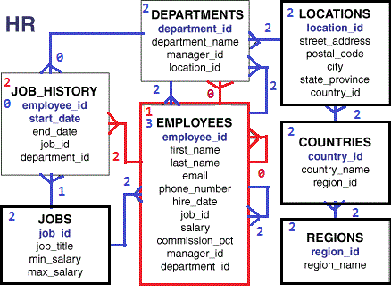

<!-- omit in toc -->
# Data Set Utility - Data Subsetting - User's Guide v24.2

<!-- omit in toc -->
## Author: Philippe Debois (European Commission)

<!-- omit in toc -->
# Table of Contents
- [1. Data Subsetting](#1-data-subsetting)
  - [1.1. Introduction](#11-introduction)
  - [1.2. The Data Model](#12-the-data-model)
    - [1.2.1. Configuration tables](#121-configuration-tables)
    - [1.2.2. Transactional tables](#122-transactional-tables)
  - [1.3. The process](#13-the-process)
    - [1.3.1. Reference data](#131-reference-data)
    - [1.3.2. Master data](#132-master-data)
    - [1.3.3. Transactional data](#133-transactional-data)
    - [1.3.4. Base tables](#134-base-tables)
    - [1.3.5. Referential integrity](#135-referential-integrity)
    - [1.3.6. Extraction of rowids](#136-extraction-of-rowids)
    - [1.3.7. Data Transportation](#137-data-transportation)
- [2. Tutorial](#2-tutorial)
  - [2.1. Data model](#21-data-model)
    - [2.1.1. HR Data Model](#211-hr-data-model)
  - [2.2. Case Study 1 – Data Subsetting and Transportation](#22-case-study-1--data-subsetting-and-transportation)
    - [2.2.1. Data set creation](#221-data-set-creation)
    - [2.2.2. Identification of base tables](#222-identification-of-base-tables)
    - [2.2.3. Extraction of rowids](#223-extraction-of-rowids)
    - [2.2.4. Referential integrity](#224-referential-integrity)
    - [2.2.5. Managing reference data](#225-managing-reference-data)
    - [2.2.6. First scenario – no extraction of reference data](#226-first-scenario--no-extraction-of-reference-data)
    - [2.2.7. Second scenario – full extraction of reference data](#227-second-scenario--full-extraction-of-reference-data)
    - [2.2.8. Third scenario – partial extraction of reference data](#228-third-scenario--partial-extraction-of-reference-data)
    - [2.2.9. Extracting rowids](#229-extracting-rowids)
      - [2.2.9.1. First scenario – no extraction of reference data](#2291-first-scenario--no-extraction-of-reference-data)
      - [2.2.9.2. Second scenario – full extraction of reference data](#2292-second-scenario--full-extraction-of-reference-data)
      - [2.2.9.3. Third scenario – partial extraction of reference data](#2293-third-scenario--partial-extraction-of-reference-data)
    - [2.2.10. Preview data set](#2210-preview-data-set)
    - [2.2.11. Data set transportation](#2211-data-set-transportation)
    - [2.2.12. Variants](#2212-variants)
      - [2.2.12.1. Variant 1](#22121-variant-1)
        - [2.2.12.1.1. Excluding columns](#221211-excluding-columns)
        - [2.2.12.1.2. Forcing column value](#221212-forcing-column-value)
      - [2.2.12.2. Variant 2](#22122-variant-2)
      - [2.2.12.3. Variant 3](#22123-variant-3)
      - [2.2.12.4. Variant 4](#22124-variant-4)
  - [2.3. Case Study 2 – Change Data Capture](#23-case-study-2--change-data-capture)
    - [2.3.1. Create data set definition](#231-create-data-set-definition)
    - [2.3.2. Include captured tables](#232-include-captured-tables)
    - [2.3.3. Create database triggers](#233-create-database-triggers)
    - [2.3.4. Perform some operations](#234-perform-some-operations)
    - [2.3.5. Check captured operations](#235-check-captured-operations)
    - [2.3.6. Generate redo script](#236-generate-redo-script)
    - [2.3.7. Generate undo script](#237-generate-undo-script)
    - [2.3.8. Rollback captured operations](#238-rollback-captured-operations)
    - [2.3.9. Drop database triggers](#239-drop-database-triggers)
    - [2.3.10. Delete data set definition](#2310-delete-data-set-definition)
    - [2.3.11. Variants](#2311-variants)
      - [2.3.11.1. Synchronous replication](#23111-synchronous-replication)
      - [2.3.11.2. Asynchronous replication](#23112-asynchronous-replication)

# 1. Data Subsetting

## 1.1. Introduction

Data subsetting involves selecting and extracting specific portions or subsets of data from a larger dataset based on defined criteria or conditions. This process is valuable in data analysis, management, and various development and testing scenarios.

Data subsetting helps reduce the complexity of working with large datasets, improves performance by requiring fewer computational resources, and enhances relevance by focusing on data relevant to specific analyses. It can be used to customize data analysis for research questions, protect data privacy by excluding sensitive information, and facilitate data preprocessing.

In development and testing environments, data subsetting is a common practice to feed non-production databases. It allows developers to work with smaller, representative datasets for coding and debugging, supports quality assurance by creating test environments with relevant data subsets, and populates staging environments for final testing before deployment. Subsetting is also used for educational purposes, to address security and privacy concerns, and for performance testing.

Overall, data subsetting is a valuable technique for streamlining data handling, improving testing and development processes, and safeguarding data privacy in various data-related contexts.

## 1.2. The Data Model

The data set utility has no GUI and is entirely operated by calling APIs and querying its internal tables, reason why a good understanding of its internal data model is crucial:



### 1.2.1. Configuration tables

`DATA SETS` are uniquely identified by their `SET_ID` (`SET_PK`). Their `SET_NAME` must also be unique (`SET_UK`). `DATA SETS` are defined for one or more `TABLES` which are uniquely identified by a `TABLE_ID` (`TAB_PK`). `TABLE_NAME` must also be unique within a data set (`TAB_UK`).

`DATA SETS` may have one or more foreign key `CONSTRAINTS` that will be walked through during the extraction or generation process. They are uniquely identified by a `CON_ID` (`CON_PK`). Foreign key `CONSTRAINTS` link source `TABLES` (`CON_TAB_SRC_FK`) with destination `TABLES` (`CON_TAB_DST_FK`).

A constraint can be walked through in both directions in which case it will be registered twice with 2 different cardinalities (1-N for master/detail and N-1 for referential integrity). The pair of columns `CONSTRAINT_NAME` and `CARDINALITY` is therefore unique within a given data set (`DS_CON_UK`).

Sensitive data types are discovered using search `PATTERNS` and masked using `MASKS`. As data discovery and data masking are not dependent on a particular data set, they have no link with `DATA SETS`. *See Sensitive Data Discovery and Data Masking User's guide for more information.*

For synthetic data generation, `TAB COLUMNS` define how each column must be generated. *See Synthetic Data Generation User's guide for more information.*

### 1.2.2. Transactional tables

For tables that are generated or partially extracted, `ROWID` of generated or extracted records are stored in `RECORDS`. This table is also used to shuffle records when masking data. `TABLES` may have one or several `RECORDS`, identified by a `REC_ID`. Records are linked to `CONSTRAINTS` (`REC_CON_FK`) when they are extracted or generated in the context of a master / detail relationship.

The masking of columns (`DS_MASKS`) may require the generation of `TOKENS` or the generation (via an Oracle sequence or an in-memory sequence) of new `IDENTIFIERS` (mapped with old ones). *See Sensitive Data Discovery and Data Masking User's guide for more information.*

`OUTPUT` is used to persist error, warning, and/or information messages as well as SQL scripts.

## 1.3. The process

### 1.3.1. Reference data

Reference data can be defined as data that are used to define other data and which are stable over time i.e., which do not change very frequently (e.g., countries, languages, nationalities, etc.). In the HR sample data model (see below), `COUNTRIES`, `REGIONS`, and `LOCATIONS` can be considered as reference data.

Most reference data do not reference any other data although some exceptions are possible (e.g., reference data organised in a hierarchy, etc.). In the HR data model, `LOCATIONS` reference `COUNTRIES` which in turn reference `REGIONS`. `JOBS` might also be considered as reference data although their min and max salary values are likely to change more regularly than traditional reference data.

When defining a data set, you must decide on whether reference data must be extracted in full (all rows), partially (only those referenced) or not at all. This depends on the target schema into which the data set will be imported.

If the target schema is completely empty, you need at least to import reference data which are referenced by extracted transactional data. Alternatively, you can also decide to import reference data in full.

If the target schema is not empty, it's likely that reference data are managed via a standard release process and do not need to be extracted as they are in principle already present and up to date. In this case, reference data shall not be extracted at all, assuming source and destination schema are at the same version level.

To define the extraction strategy, you must therefore know your data model very well and be able to make the distinction between reference data, master data, and transactional data. Using a naming convention to identify reference data is helpful from that perspective (e.g., `REF` contained in table names).

To fully extract a reference table, just include the table in the data set with an extraction type equal to "F" which stands for "Full extraction". To exclude reference data from a data set, set the extraction type of the table to "N" which stands for "No extraction". Otherwise, extraction type will be of type "P" which stands for "Partial extraction".

### 1.3.2. Master data

   Master data can be defined as foundational and critical business entities shared across an organisation. Master data are relatively stable but can change from time to time. In the HR sample data model, `EMPLOYEES` and `DEPARTMENTS` are considered as key information for the company and are therefore part of the master data.

   Master data are often driving the extraction process. We often want to extract and transport them (and their details) from one environment to another e.g., from production to test. In the first use case, we will be interested in extracting data of `EMPLOYEES`.

### 1.3.3. Transactional data

Transactional data are related to day-to-day activities and operations. They represent individual transactions or events within an organisation and are highly dynamic and frequently changing. They are generated by the various business processes of the organisation (e.g., customers, orders, bills, etc.). In the HR sample data model, `JOB HISTORY` is considered as transactional data from an HR perspective.

### 1.3.4. Base tables

The first step when defining a data set is to define which key concept you want to extract. The tables and records which are the starting point of the extraction are respectively called base tables and base records. Most of the time, a data set is made up of a single base table although it may sometimes contain several.

To define a table as the starting point of the extraction process, you must include it in the data set with an extraction type equal to "B" which stands for "Base". To limit the extraction to a subset of your base table, a filter (where clause) should also be defined to precisely identify the base records i.e., the rows that will be retrieved. Alternatively, records can also be selected randomly within a defined limit (maximum number of rows, percentage of the total number of rows, etc.).

It's likely that you also want to extract detail information of your base records i.e., information from other tables that are linked via one-to-many relationships (1-N). It's also probable that these details have in turn their own details (in case of master-detail-detail relationships) so this is an iterative process. As an example, in the OE schema (Order entry), a `CUSTOMER` may place several `ORDERS` which in turn may be composed of several `ORDER LINES`.

You can either include these 1-N relationships to the data set yourself (manually) or let the tool discover and add them to the data set for you. This will depend on the specified recursive level passed in parameter. NULL means no automatic discovery/inclusion. 0 means unlimited number of levels. X (with X>=1) means X levels of details.

Such one-to-many constraints must be of type "B" which stands for "Base extraction". It means that these 1-N links of type "B" will be followed or walked-through during the extraction process to find detail records. Other possible extraction types for constraints are "N" for "None" and "P" for "Partial" (see later).

Although the automatic discover process of detail information is helpful, its results must be thoroughly checked as some 1-N relationships might be considered as master/detail relationships by the tool while they are not from a conceptual point of view. The `detect_true_master_detail_cons()` procedure sets some flags that can help to take the right decision.

True master/detail relationships are also called identifying relationships and have the following characteristics:

- A child record cannot exist without its parent record i.e., the foreign key of the child table is mandatory (meaning that its columns are mandatory); constraints fulfilling this condition have their `MD_OPTIONALITY_OK` flag set to Y.
- A child record is identified by its parent record plus some additional columns i.e., the foreign key columns of the child table include all primary (or unique) key columns of the parent table; constraints fulfilling this condition have their `MD_UID_OK` flag set to Y.

Non-identifying relationships (those that do not meet the two above conditions) should not be considered when extracting details. As an example, a foreign key towards a look-up or reference table is non-identifying (reference records can exist without necessarily being referenced) and should therefore not be used.

Furthermore, a child table is also expected to contain more records than its parent table (although this is not necessarily always the case, especially if many parents have no child); constraints fulfilling this condition have their `MD_CARDINALITY_OK` flag set to Y.

The `exclude_constraints()` procedure can be invoked to exclude constraints based on the 3 flag described above.

### 1.3.5. Referential integrity

Once base records and their details have been defined, you need in turn to identify the data that they reference (reference data and/or live data). Not including those many-to-one (N-1) constraints in the data set would result in foreign key violations while importing the data set in the target schema.

After having defined base tables/records and base constraints for finding details, you must include all referential constraints (N-1) in your data set. The tool can do it automatically for you. By default, the `include_referential_cons()` procedure will include all referential constraints (N-1) and tables referenced by these constraints with an extraction type "P" for "Partial".

### 1.3.6. Extraction of rowids

The extraction process consists in identifying rows that must be part of the data set based on its definition. This process is recursive and requires storing candidate rows in a temporary storage. For the sake of limiting the space required by this temporary storage, only the `ROWIDS` of candidate records are stored in the `DS_RECORDS` internal table. When a table is fully extracted, no record is stored in that table.

### 1.3.7. Data Transportation

Data sets can be transported via different methods including database link, XML, export/import, data pump, and SQL scripts.

# 2. Tutorial

The tutorial should help you to get a better understanding of the data set utility by demonstrating some of its functionalities with concrete use cases that you can reproduce yourself.

## 2.1. Data model

### 2.1.1. HR Data Model

This tutorial is based on the Oracle Sample Database described in the following document:

- <https://docs.oracle.com/cd/E11882_01/server.112/e10831/title.htm>

Scripts for installing this sample database can be downloaded directly from GitHub:

- <https://github.com/oracle/db-sample-schemas>

Data models (for Oracle Data Modeler) are also available:

- <https://www.oracle.com/database/technologies/appdev/datamodeler-samples.html>

Here follows a diagram and a description of the HR data model.



In the Human Resource (HR) records, each employee has an identification number, e-mail address, job identification code, salary, and manager. Some employees earn commissions in addition to their salary.

The company also tracks information about jobs within the organization. Each job has an identification code, job title, and a minimum and maximum salary range for the job. Some employees have been with the company for a long time and have held different positions within the company. When an employee resigns, the duration the employee was working, the job identification number, and the department are recorded.

The sample company is regionally diverse, so it tracks the locations of its warehouses and departments. Each employee is assigned to a department, and each department is identified either by a unique department number or a short name. Each department is associated with one location, and each location has a full address that includes the street name, postal code, city, state or province, and the country code.

In places where the departments and warehouses are located, the company records details such as the country name, currency symbol, currency name, and the region where the country is located geographically.

To be noted that this sample HR schema is not the best example in terms of database design. Indeed, many fields (including unique identifiers) are accepting NULL values while they should not in reality.

## 2.2. Case Study 1 – Data Subsetting and Transportation

The first use case consists of extracting the data of a single employee. The code shown in this section can be found in `ds_tutorial_case_1.sql`.

We have chosen Jonathon Taylor (employee id 176) to keep the use case simple, since he is not a manager. Let's have a look at the base record:

```sql
REM Show employee to be extracted

SELECT employee_id, first_name, last_name, department_id, manager_id
  FROM employees
 WHERE employee_id = 176
/
```

|**`EMPLOYEE_ID`**|**`FIRST_NAME`**|**`LAST_NAME`**|**`DEPARTMENT_ID`**|**`MANAGER_ID`**|
| :- | :- | :- | :- | :- |
|176|Jonathon|Taylor|80|149|

We will then transport this employee and his detail data into a separate but identical target schema, and we will consider the 3 following scenarios:

1. The target schema contains already all reference data.
1. The target schema is empty, and all reference data will be transported
1. The target schema is empty and only needed reference data will be transported.

### 2.2.1. Data set creation

The first step is to create a data set definition and give it a unique name (Jonathon Taylor) via the `create_data_set_def()` function.

```sql
REM Create data set

DECLARE
   l_set_id ds_data_sets.set_id%TYPE;
BEGIN
   l_set_id := ds_utility_krn.create_data_set_def('Jonathon Taylor');
   dbms_output.put_line('set_id='||l_set_id);
   COMMIT;
END;
/

set_id=23
```

The id returned upon the data set creation is used in all subsequent operations.

It can also be retrieved from the data set name via the `ds_utility_krn.get_data_set_def_by_name()` function.

```sql
REM Show how to get the id of a data set based on its name

DECLARE
   l_set_id ds_data_sets.set_id%TYPE;
BEGIN
   l_set_id := ds_utility_krn.get_data_set_def_by_name('Jonathon Taylor');
   dbms_output.put_line('set_id='||l_set_id);
END;
/

set_id=23
```

You can check that the data set has been well created by looking in `DS_DATA_SETS` (one of the internal tables of the tool).

```sql
SELECT * FROM ds_data_sets WHERE name = 'Jonathon Taylor'
/
```

### 2.2.2. Identification of base tables

The second step is to specify which table(s) and row(s) are the starting point of the extraction. In our example, the EMPLOYEE table is defined as the base table (the table from which records will be retrieved first) and filter `employee_id=176` is applied to limit the extraction to Jonathon Taylor.

A base table is included in the data set definition via the `include_tables()` procedure and by specifying "B" as extraction type:

```sql
REM Define base table and its filter + include first level of child tables

DECLARE
   l_set_id ds_data_sets.set_id%TYPE := ds_utility_krn.get_data_set_def_by_name('Jonathon Taylor');
BEGIN
   ds_utility_krn.include_tables(
      p_set_id => l_set_id
    , p_table_name => 'EMPLOYEES'
    , p_extract_type => 'B' -- base table
    , p_where_clause => 'employee_id=176'
    , p_recursive_level => 1
   );
   COMMIT;
END;
/
```

Extracting data from the only `EMPLOYEES` table is probably not enough. We may also want to get some details from other tables linked via master-detail or one-to-many relationships like `JOB_HISTORY`.

Foreign keys that need to be followed to get detail records can be added manually one by one to the data set via the `include_constraints()` procedure. Manual inclusion is easy when the schema is small but it becomes quickly cumbersome with real non-trivial schemas.

Alternatively, detail tables can be included in the data set while including the base table by specifying a value for the `p_recursive_level` parameter. A value of 1 indicates that we want to include one level of details i.e., the details of EMPLOYEES but not the details of its details.

Tables that have been included in the data set can be found via the following query.

```sql
REM Show included tables

SELECT set_id, table_id, table_name, extract_type, pass_count
  FROM ds_tables
 WHERE set_id = ds_utility_krn.get_data_set_def_by_name('Jonathon Taylor')
 ORDER BY table_id
/
```

|**`SET_ID`**|**`TABLE_ID`**|**`TABLE_NAME`**|**`EXTRACT_TYPE`**|**`PASS_COUNT`**|
| :- | :- | :- | :- | :- |
|24|24|EMPLOYEES|B|1|
|24|25|DEPARTMENTS|P|2|
|24|26|JOB_HISTORY|P|2|

The `EMPLOYEES` table has been selected during the first iteration (inclusion of the base table) and the two other tables during the second iteration (inclusion of detail tables), as indicated by the `PASS_COUNT` column (read "pass" as "iteration").

The `DS_CONSTRAINTS` internal table can also be consulted to see which one-to-many relationships have been followed to find those detail tables.

```sql
REM Show constraints followed while getting child tables

SELECT con_id, constraint_name, src_table_name
     , dst_table_name, cardinality, extract_type
  FROM ds_constraints
 WHERE set_id = ds_utility_krn.get_data_set_def_by_name('Jonathon Taylor')
/
```

|**`CON_ID`**|**`CONSTRAINT_NAME`**|**`SRC_TABLE_NAME`**|**`DST_TABLE_NAME`**|**`CARDINALITY`**|**`EXTRACT_TYPE`**|
| :- | :- | :- | :- | :- | :- |
|6|DEPT_MGR_FK|EMPLOYEES|DEPARTMENTS|1-N|B|
|7|EMP_MANAGER_FK|EMPLOYEES|EMPLOYEES|1-N|B|
|8|JHIST_EMP_FK|EMPLOYEES|JOB_HISTORY|1-N|B|

Note that `CON_ID` is generated from a sequence so you might get different values should you run the tutorial scripts yourself.

The diagram below shows in **red** the base table from which records will be extracted first as well as the 1-N relationships that will be followed for extracting detail records.



The `JHIST_EMP_FK` foreign key between `EMPLOYEES` and `JOB_HISTORY` has been included meaning that the job history data of Jonathon Taylor will be extracted.

The recursive `EMP_MANAGER_FK` foreign key has also been included meaning that, if Jonathon Taylor is a manager, his subordinates will also be extracted. At this point, we should question ourselves if this is desired or not. Let's keep it as Jonathon Taylor is not a manager anyway.

The `DEPT_MGR_FK` foreign key between `EMPLOYEES` and `DEPARTMENTS` has also been included meaning that, if Jonathon Taylor is the manager of a department, this latest will be extracted too. This foreign key is in reality the implementation of a 1-1 relationship. Departments may be managed by one and only one employee and an employee may be the manager of one and only one department. Even if it does not seem to be a parent/child relationship, let's keep it as Jonathon Taylor doesn't manage any department anyway.

### 2.2.3. Extraction of rowids

Extraction of rowids performed at this stage is for the only purpose of this tutorial. It's normally not performed before the next step which consists in including reference constraints.

The purpose of this step is to identify precisely the rows that will be ultimately extracted by calling the `extract_data_set_row_ids()` procedure.

```sql
REM Extract rowids of records identified so far

DECLARE
   l_set_id ds_data_sets.set_id%TYPE := ds_utility_krn.get_data_set_def_by_name('Jonathon Taylor');
BEGIN
   ds_utility_var.g_msg_mask := 'RS'; -- Show Rowcount & SQL
   ds_utility_krn.extract_data_set_rowids(l_set_id);
   COMMIT;
END;
/
```

The `ROWIDs` of identified records are stored in the `DS_RECORDS` internal table.

```sql
REM Show records found (+ via which fk)

SELECT tab.table_name, rec.record_rowid, con.constraint_name
  FROM ds_records rec
 INNER JOIN ds_tables tab
    ON tab.table_id = rec.table_id
   AND tab.set_id = ds_utility_krn.get_data_set_def_by_name('Jonathon Taylor')
  LEFT OUTER JOIN ds_constraints con
    ON con.con_id = rec.con_id
 ORDER BY tab.table_name
/
```

|**`TABLE_NAME`**|**`RECORD_ROWID`**|**`CONSTRAINT_NAME`**|
| :- | :- | :- |
|EMPLOYEES|AAAYwVACjAABcXvABM||
|JOB_HISTORY|AAAYwZACjAABh3XAAI|JHIST_EMP_FK|
|JOB_HISTORY|AAAYwZACjAABh3XAAH|JHIST_EMP_FK|

You can see that the data set is made up of 1 record from the `EMPLOYEES` table and 2 records from the `JOB_HISTORY` table both found via the `JHIST_EMP_FK` foreign key. The `RECORD_ROWID` column contains `ROWIDS` (string of 18 characters) of records to be extracted.

Let's have a look at some extraction statistics from `DS_TABLES` and `DS_CONSTRAINTS` tables.

```sql
REM Show statistics on tables (extracted vs total)

SELECT table_name, source_count, extract_count
  FROM ds_tables
 WHERE set_id = ds_utility_krn.get_data_set_def_by_name('Jonathon Taylor')
 ORDER BY table_name
/
```

|**`TABLE_NAME`**|**`SOURCE_COUNT`**|**`EXTRACT_COUNT`**|
| :- | :- | :- |
|DEPARTMENTS|27|0|
|EMPLOYEES|107|1|
|JOB_HISTORY|10|2|

The `extract_count` column shows that 1 row will be extracted from `EMPLOYEES`, 2 from `JOB_HISTORY` and none for `DEPARTMENTS`.

```sql
REM Show constraint statistics

SELECT src_table_name, constraint_name, dst_table_name, extract_count
  FROM ds_constraints
 WHERE set_id = ds_utility_krn.get_data_set_def_by_name('Jonathon Taylor')
 ORDER BY 1, 2
/
```

|**`SRC_TABLE_NAME`**|**`CONSTRAINT_NAME`**|**`DST_TABLE_NAME`**|**`EXTRACT_COUNT`**|
| :- | :- | :- | :- |
|EMPLOYEES|DEPT_MGR_FK|DEPARTMENTS|0|
|EMPLOYEES|EMP_MANAGER_FK|EMPLOYEES|0|
|EMPLOYEES|JHIST_EMP_FK|JOB_HISTORY|2|

This confirms that Jonathon Taylor is not the manager of any department (0 rows extracted via `DEPT_MGR_FK`), he has no subordinates (0 rows extracted via `JHIST_EMP_FK`), and he has 2 jobs in his career history (2 rows extracted via `JHIST_EMP_FK`).

### 2.2.4. Referential integrity

Because of the referential constraints in force, the 3 records identified so far cannot be injected in another HR schema because many-to-one relationships would then be violated. Indeed, each `JOB_HISTORY` references a `DEPARTMENT` and a `JOB`, and each `EMPLOYEE` is assigned to a `JOB`.

```sql
REM Include referential constraints (N-1)

DECLARE
   l_set_id ds_data_sets.set_id%TYPE := ds_utility_krn.get_data_set_def_by_name('Jonathon Taylor');
BEGIN
   ds_utility_krn.include_referential_cons(l_set_id);
   COMMIT;
END;
/
```

Next step therefore consists in extracting referenced data (from tables which are referenced by a foreign key). This is performed by calling the `include_referential_cons()` procedure.

The diagram below shows in blue the referential constraints that have been added recursively to the data set definition.



These referential constraints that have been included can be found via the following query:

```sql
REM Show referential constraints (N-1) that have been included

SELECT src_table_name, constraint_name, dst_table_name, cardinality
  FROM ds_constraints
 WHERE set_id = ds_utility_krn.get_data_set_def_by_name('Jonathon Taylor')
   AND cardinality = 'N-1'
 ORDER BY 1, 2
/
```

|**`SRC_TABLE_NAME`**|**`CONSTRAINT_NAME`**|**`DST_TABLE_NAME`**|**CARDINALITY**|
| :- | :- | :- | :- |
|COUNTRIES|COUNTR_REG_FK|REGIONS|N-1|
|DEPARTMENTS|DEPT_LOC_FK|LOCATIONS|N-1|
|DEPARTMENTS|DEPT_MGR_FK|EMPLOYEES|N-1|
|EMPLOYEES|EMP_DEPT_FK|DEPARTMENTS|N-1|
|EMPLOYEES|EMP_JOB_FK|JOBS|N-1|
|EMPLOYEES|EMP_MANAGER_FK|EMPLOYEES|N-1|
|JOB_HISTORY|JHIST_DEPT_FK|DEPARTMENTS|N-1|
|JOB_HISTORY|JHIST_JOB_FK|JOBS|N-1|
|LOCATIONS|LOC_C_ID_FK|COUNTRIES|N-1|

You will notice that the recursive foreign key `EMP_MANAGER_FK` is record twice, once with 1-N cardinality (for getting child records i.e., subordinates) and once with N-1 cardinality (for ensuring referential integrity i.e., for getting the manager). The same applies to the `DEPT_MGR_FK` constraint.

The direction a foreign key is walked through is therefore of upmost important. Both directions must be considered as they have each their own purpose (1-N for finding details and N-1 for ensuring referential integrity).

### 2.2.5. Managing reference data

The management of reference data depends on the scenario. The `update_table_properties()` procedure is used to specify the `EXTRACT_TYPE` property of all reference tables.

While executing the following block of code, specify one of the following `EXTRACT_TYPE`: N for None (first scenario), F for Full (second scenario), P for Partial (third scenario).

```sql
REM Specify on of the following extract type: N, F, P
REM First scenario - no extraction of reference data 
REM Second scenario - Full extraction of reference data
REM Third scenario - Partial extraction of reference data

DECLARE
   l_set_id ds_data_sets.set_id%TYPE :=
      ds_utility_krn.get_data_set_def_by_name('Jonathon Taylor');
   l_extract_type ds_tables.extract_type%TYPE := '&extract_type';
BEGIN
   IF l_extract_type IS NULL THEN
      raise_application_error(-20000,'Extract type is mandatory');
   END IF;
   IF l_extract_type NOT IN ('F','P','N') THEN
      raise_application_error(-20000,'Extract type must be F, P or N');
   END IF;
   ds_utility_krn.update_table_properties(p_set_id=>l_set_id
      ,p_table_name=>'REGIONS', p_extract_type=>l_extract_type);
   ds_utility_krn.update_table_properties(p_set_id=>l_set_id
      ,p_table_name=>'COUNTRIES', p_extract_type=>l_extract_type);
   ds_utility_krn.update_table_properties(p_set_id=>l_set_id
      ,p_table_name=>'LOCATIONS', p_extract_type=>l_extract_type);
   ds_utility_krn.update_table_properties(p_set_id=>l_set_id
      ,p_table_name=>'JOBS', p_extract_type=>l_extract_type);
   COMMIT;
END;
/
```

### 2.2.6. First scenario – no extraction of reference data

In the first scenario, the target schema already contains all reference data i.e., `LOCATIONS`, `COUNTRIES`, `REGIONS` and `JOBS`. We therefore need to exclude theses tables from the extraction.

During the extraction process, constraints which lead to tables marked as not extracted will just be ignored whatever is their extraction type. So `DEP_LOC_FK` and `JHIST_JOB_FK` constraints will not be walked through despite their "P" extraction type.

### 2.2.7. Second scenario – full extraction of reference data

In the second scenario, the target schema is empty and all reference data (`LOCATIONS`, `COUNTRIES`, `REGIONS` and `JOBS`) will be added to the data set and subsequently transported.

During the extraction process, constraints which lead to tables marked as fully extracted will just be ignored whatever is their extraction type. So `DEP_LOC_FK` and JHIST_JOB_FK` constraints will not be walked-through despite their "P" extraction type.

### 2.2.8. Third scenario – partial extraction of reference data

In the third scenario, the target schema is empty and only the reference data that are needed (i.e., referenced) to guarantee referential integrity are extracted.

### 2.2.9. Extracting rowids

Next step is to extract rowids to take into account changes that have been made to the definition of the data set (inclusion of referential constraints and management of reference data) since the first extraction.

If an extraction was attempted at this point, it would end up in an error as a loop would be detected in the table dependencies. Indeed, EMPLOYEES depend on DEPARTMENTS which in turn depend on EMPLOYEES. As a concrete example, Steven King (`employee_id` 100) works in Executive department (`department_id` 90) which is managed by Steven King (`employee_id 100).

To prevent this dependency, one of the two constraints (`DEPT_MGR_FK` or `EMP_DEPT_FK`) must be declared as `DEFERRED`:

```sql
REM Defer one constraint to avoid loop in dependencies

DECLARE
   l_set_id ds_data_sets.set_id%TYPE := ds_utility_krn.get_data_set_def_by_name('Jonathon Taylor');
BEGIN
   ds_utility_krn.update_constraint_properties(p_set_id=>l_set_id,p_constraint_name=>'DEPT_MGR_FK',p_deferred=>'DEFERRED');
   COMMIT;
END;
/
```

However, this will not be sufficient as `DEPT_MGR_FK` is declared as `IMMEDIATE` in the database while it should also be `DEFERRED`. It will therefore be necessary to disable it before transporting the data set (cfr. later).

```sql
REM Extract again rowids of records of the so defined data set

DECLARE
   l_set_id ds_data_sets.set_id%TYPE := ds_utility_krn.get_data_set_def_by_name('Jonathon Taylor');
BEGIN
   ds_utility_var.g_msg_mask := 'E'; -- Show Errors
   ds_utility_krn.extract_data_set_rowids(l_set_id);
   COMMIT;
END;
/
```

The number of records extracted from each table is given by the following query:

```sql
REM Show statistics on tables (extracted vs total)

SELECT table_name, source_count, extract_count
  FROM ds_tables
 WHERE set_id = ds_utility_krn.get_data_set_def_by_name('Jonathon Taylor')
 ORDER BY table_name
/
```

Details on extracted records are given by the following query:

```sql
REM Show constraint statistics

SELECT tab.table_name dst_tab_name, con.constraint_name, con.src_table_name, con.cardinality, COUNT(*)
  FROM ds_records rec
 INNER JOIN ds_tables tab
    ON tab.table_id = rec.table_id
   AND tab.set_id = ds_utility_krn.get_data_set_def_by_name('Jonathon Taylor')
  LEFT OUTER JOIN ds_constraints con
    ON con.con_id = rec.con_id
 GROUP BY tab.table_name, con.constraint_name, con.src_table_name, con.cardinality
 ORDER BY 1, 2
/
```

For each scenario, the following diagram show how many records will be extracted in each table and from which foreign key they come from (**red** = base records + 1-N relationships; **blue** = N-1 relationships; **black** = reference table).

#### 2.2.9.1. First scenario – no extraction of reference data


|**`TABLE_NAME`**|**`SOURCE_COUNT`**|**`EXTRACT_COUNT`**|
| :- | :- | :- |
|COUNTRIES|25|0|
|DEPARTMENTS|27|2|
|EMPLOYEES|107|4|
|JOBS|19|0|
|JOB_HISTORY|10|2|
|LOCATIONS|23|0|
|REGIONS|4|0|

|**`DST_TAB_NAME`**|**`CONSTRAINT_NAME`**|**`SRC_TABLE_NAME`**|**`CARDINALITY`**|**`COUNT(*)`**|
| :- | :- | :- | :- | :- |
|DEPARTMENTS|EMP_DEPT_FK|EMPLOYEES|N-1|2|
|EMPLOYEES|DEPT_MGR_FK|DEPARTMENTS|N-1|1|
|EMPLOYEES|EMP_MANAGER_FK|EMPLOYEES|N-1|2|
|EMPLOYEES|(null)|(null)|(null)|1|
|JOB_HISTORY|JHIST_EMP_FK|EMPLOYEES|1-N|2|

#### 2.2.9.2. Second scenario – full extraction of reference data



|**`TABLE_NAME`**|**`SOURCE_COUNT`**|**`EXTRACT_COUNT`**|
| :- | :- | :- |
|COUNTRIES|25|25|
|DEPARTMENTS|27|2|
|EMPLOYEES|107|4|
|JOBS|19|19|
|JOB_HISTORY|10|2|
|LOCATIONS|23|23|
|REGIONS|4|4|

|**`DST_TAB_NAME`**|**`CONSTRAINT_NAME`**|**`SRC_TABLE_NAME`**|**`CARDINALITY`**|**`COUNT(*)`**|
| :- | :- | :- | :- | :- |
|DEPARTMENTS|EMP_DEPT_FK|EMPLOYEES|N-1|2|
|EMPLOYEES|DEPT_MGR_FK|DEPARTMENTS|N-1|1|
|EMPLOYEES|EMP_MANAGER_FK|EMPLOYEES|N-1|2|
|EMPLOYEES|(null)|(null)|(null)|1|
|JOB_HISTORY|JHIST_EMP_FK|EMPLOYEES|1-N|2|

#### 2.2.9.3. Third scenario – partial extraction of reference data



|**`TABLE_NAME`**|**`SOURCE_COUNT`**|**`EXTRACT_COUNT`**|
| :- | :- | :- |
|COUNTRIES|25|2|
|DEPARTMENTS|27|2|
|EMPLOYEES|107|4|
|JOBS|19|3|
|JOB_HISTORY|10|2|
|LOCATIONS|23|2|
|REGIONS|4|2|

|**`DST_TAB_NAME`**|**`CONSTRAINT_NAME`**|**`SRC_TABLE_NAME`**|**`CARDINALITY`**|**`COUNT(*)`**|
| :- | :- | :- | :- | :- |
|COUNTRIES|LOC_C_ID_FK|LOCATIONS|N-1|2|
|DEPARTMENTS|EMP_DEPT_FK|EMPLOYEES|N-1|2|
|EMPLOYEES|DEPT_MGR_FK|DEPARTMENTS|N-1|1|
|EMPLOYEES|EMP_MANAGER_FK|EMPLOYEES|N-1|2|
|EMPLOYEES|(null)|(null)|(null)|1|
|JOBS|EMP_JOB_FK|EMPLOYEES|N-1|2|
|JOBS|JHIST_JOB_FK|JOB_HISTORY|N-1|1|
|JOB_HISTORY|JHIST_EMP_FK|EMPLOYEES|1-N|2|
|LOCATIONS|DEPT_LOC_FK|DEPARTMENTS|N-1|2|
|REGIONS|COUNTR_REG_FK|COUNTRIES|N-1|2|

### 2.2.10. Preview data set

The data set can be previewed before its transportation to another schema via ad-hoc views created by the `create_views()` procedure. View names are created by adding a `_V` suffix to underlying table names.

```sql
REM Create views to pre-view data set

DECLARE
   l_set_id ds_data_sets.set_id%TYPE := ds_utility_krn.get_data_set_def_by_name('Jonathon Taylor');
BEGIN
   ds_utility_var.g_msg_mask := 'EWIDSR'; -- Show all msgs
   ds_utility_krn.create_views(p_set_id=>l_set_id, p_view_suffix=>'_V');
END;
/
```

|**`VIEW_NAME`**|
| :- |
|COUNTRIES_V|
|DEPARTMENTS_V|
|EMPLOYEES_V|
|JOB_HISTORY_V|
|JOBS_V|
|LOCATIONS_V|
|REGIONS_V|

You then just need to query each view to see which records will be extracted:

```sql
SELECT * FROM countries_v;
SELECT * FROM departments_v;
SELECT * FROM employees_v;
SELECT * FROM job_history_v;
SELECT * FROM jobs_v;
SELECT * FROM locations_v;
SELECT * FROM regions_v;
```

In all scenarios, the following 4 employees and 2 departments that will be extracted:

|**`EMPLOYEE_ID`**|**`FIRST_NAME`**|**`LAST_NAME`**|**…**|**`MANAGER_ID`**|**`DEPARTMENT_ID`**|
| :- | :- | :- | :- | :- | :- |
|100|Steven|King|||90|
|145|John|Russell||100|80|
|149|Eleni|Zlotkey||100|80|
|176|Jonathon|Taylor||149|80|

|**`DEPARTMENT_ID`**|**`DEPARTMENT_NAME`**|**`MANAGER_ID`**|
| :- | :- | :- |
|90|Executive|100|
|80|Sales|145|

Jonathon (id=176) is the employee that we wanted to extract; Eleni (id=149) is his manager and Steven (id=100) the manager of Eleni. Steven and John are the respective managers of executive (id=90) and sales (id=80) departments. While we wanted to extract only 1 employee, 4 will be extracted for preventing referential constraints `EMP_MANAGER_FK` and `DEPT_MGR_FK` from being violated. Detail information (e.g., job history) of these 3 additional employees will not be extracted though.

Once the data set has been checked, views can be deleted via the `delete_views()` procedure and by passing exactly the same parameters:

```sql
REM Drop views created to pre-view data set

DECLARE
   l_set_id ds_data_sets.set_id%TYPE := ds_utility_krn.get_data_set_def_by_name('Jonathon Taylor');
BEGIN
   ds_utility_krn.drop_views(p_set_id=>l_set_id, p_view_suffix=>'_V');
END;
/
```

### 2.2.11. Data set transportation

Data set can be transported to the target schema via different methods. For this use case, we will demonstrate transportation via a test database link (which is supposed to exist already), possibility after an intermediary XML extraction.

Before transporting the data set to the target schema, triggers must be disabled as the transactional data they normally generate (e.g., `JOB_HISTORY) are already contained in the data set. The need for this action depends on your database and business logic.

Then, the target database link property of each table must be set via the following:

```sql
REM Define target database link

DECLARE
   l_set_id ds_data_sets.set_id%TYPE := ds_utility_krn.get_data_set_def_by_name('Jonathon Taylor');
BEGIN
   ds_utility_krn.update_table_properties(p_set_id=>l_set_id,p_target_db_link=>'test');
   COMMIT;
END;
/
```
As explained in section [2.2.9. Extracting rowids](#229-extracting-rowids), `DEPT_MGR_FK` constraint must be disabled (or changed to `DEFERRED`) in the target schema before launching the data transfer.

The data set can then after be transported via the database link in the following way:

```sql
DECLARE
   l_set_id ds_data_sets.set_id%TYPE := ds_utility_krn.get_data_set_def_by_name('Jonathon Taylor');
BEGIN
   ds_utility_var.g_msg_mask := 'ES'; -- Show Errors & SQL
   ds_utility_krn.handle_data_set(p_set_id=>l_set_id,p_oper=>'DIRECT-EXECUTE',p_mode=>'I');
   COMMIT;
END;
/
```

The above data transfer will succeed for the first 2 scenarios.

Unfortunately, the transfer of `COUNTRIES` in the 3<sup>rd</sup> scenario will fail on the following exception: "ORA-01410: invalid rowid". This is because partial extraction is based on `ROWIDS` and `COUNTRIES` is an Index Organized Table (IOT) that has logical `ROWIDS` which are not properly handled in DMLs that involve database links. As a reminder, IOT data are stored within their index and therefore do not have physical `ROWIDS`. You can make the distinction between logical and physical `ROWIDS` by looking at their format (e.g., logical: `*BCJENTSCVUV+` compared to physical: `AAAYWVACJAABCXVAAA`).

One possible solution would be to transform the `COUNTRIES` table into a normal table. Alternatively, an extraction in XML followed by a transfer via database link can also do the trick.

Here is how to do it:

```sql
REM Export data set to XML

DECLARE
   l_set_id ds_data_sets.set_id%TYPE := ds_utility_krn.get_data_set_def_by_name('Jonathon Taylor');
BEGIN
   ds_utility_var.g_msg_mask := 'ES'; -- Show Errors & SQL
   ds_utility_krn.export_data_set_to_xml(p_set_id=>l_set_id);
   COMMIT;
END;
/
```

```sql
REM Import data set from XML (into target schema via dblink)

DECLARE
   l_set_id ds_data_sets.set_id%TYPE := ds_utility_krn.get_data_set_def_by_name('Jonathon Taylor');
BEGIN
   ds_utility_krn.import_data_set_from_xml(p_set_id=>l_set_id);
   COMMIT;
END;
/
```

### 2.2.12. Variants

Let's consider some variants of the test case to demonstrate some other functionality.

#### 2.2.12.1. Variant 1

We have seen with this first test case that, while we were interested to extract the information of a single specific person, 3 other persons (some managers) were extracted too. This is because the `EMP_MANAGER_FK` and `DEPT_MGR_FK` constraints have been included in the data set to ensure its referential integrity.

To prevent the management staff from being extracted, you can change the extraction type of these 2 constraints to N:

```sql
REM Change the extract type of the 2 constraints to N)o extraction

DECLARE
   l_set_id ds_data_sets.set_id%TYPE := ds_utility_krn.get_data_set_def_by_name('Jonathon Taylor');
BEGIN
   ds_utility_krn.update_constraint_properties(p_set_id=>l_set_id, p_constraint_name=>'EMP_MGR_FK', p_extract_type=>'N');
   ds_utility_krn.update_constraint_properties(p_set_id=>l_set_id, p_constraint_name=>'DEPT_MGR_FK', p_extract_type=>'N');
   COMMIT;
END;
/
```

Alternatively, you can just delete these 2 constraints from the data set:

```sql
REM Alternatively, remove these 2 constraints from the data set

DECLARE
   l_set_id ds_data_sets.set_id%TYPE := ds_utility_krn.get_data_set_def_by_name('Jonathon Taylor');
BEGIN
   ds_utility_krn.exclude_constraints(p_set_id=>l_set_id, p_constraint_name=>'EMP_MANAGER_FK');
   ds_utility_krn.exclude_constraints(p_set_id=>l_set_id, p_constraint_name=>'DEPT_MGR_FK');
   COMMIT;
END;
/
```

If you extract again the rowids after having executed one of the two above piece of code, you will notice that only 1 person is indeed extracted.

However, this is not sufficient. Indeed, this will not prevent the `employees.manager_id` and `departments.manager_id` columns from being extracted with values referencing persons that have not been extracted. Insertion will therefore fail due to violated foreign key constraints.

The only way to avoid such constraint violation is to reset these columns to NULL while extracting records. Note that this is possible only if these columns are optional, which is well the case (although `departments.manager_id` should be mandatory in light of its comment).

This can be achieved in 2 different ways.

##### 2.2.12.1.1. Excluding columns

For each table, you can specify the list of columns that you want to extract via the columns list property. This property can be updated by calling the `update_table_properties()` procedure. Rather than listing the columns that you want to keep (which may be painful), you can exclude some columns via the special syntax: `* BUT <comma-separated-list-of-columns-to-exclude>`

```sql
REM Exclude manager_id columns from the extraction

DECLARE
   l_set_id ds_data_sets.set_id%TYPE := ds_utility_krn.get_data_set_def_by_name('Jonathon Taylor');
BEGIN
   ds_utility_krn.update_table_properties(p_set_id=>l_set_id, p_table_name=>'EMPLOYEES', p_columns_list=>'* BUT manager_id');
   ds_utility_krn.update_table_properties(p_set_id=>l_set_id, p_table_name=>'DEPARTMENTS', p_columns_list=>'* BUT manager_id');
   COMMIT;
END;
/
```

The list of columns defined for each table is also used when creating views. If you create views after the execution of the above piece of code, you will notice that the `manager_id` column is not present in both `EMPLOYEES_V` and `DEPARTMENTS_V` views.

##### 2.2.12.1.2. Forcing column value

As of v23.3, forcing column value must be performed using SQL data masking.

#### 2.2.12.2. Variant 2

In the original use case, 4 persons have been extracted (the targeted person, his manager and the manager of 2 departments). However, only the details (e.g., jobs) of the first person have been extracted. This is because other persons are not defined as part of the base records but they have been extracted to ensure referential integrity.

In this variant, let's suppose that we want also to include the details of the line managers. To achieve this, we just need to change the extraction type of the `EMP_MANAGER_FK` constraint from **P**artial to **B**ase for cardinality N-1. The targeted person as well as all ascending managers of the hierarchy (until no one is found) will then be included in the base records as well as their details (e.g., jobs).

```sql
REM Change the extraction type of EMP_MANAGER_FK to B for N-1 direction

DECLARE
   l_set_id ds_data_sets.set_id%TYPE := ds_utility_krn.get_data_set_def_by_name('Jonathon Taylor');
BEGIN
   ds_utility_krn.update_constraint_properties(p_set_id=>l_set_id, p_constraint_name=>'EMP_MANAGER_FK'
      , p_cardinality=>'N-1', p_extract_type=>'B');
   COMMIT;
END;
/
```

If you extract rowids after having executed the above piece of code, you will notice that all employees (i.e., 107 records) have been selected. This is because the `EMP_MANAGER_FK` constraint is twice in the data set (once for each direction) with a **B**ase extraction type. For a given person, his manager will be selected but also his subordinates. As this process is repeated recursively until no more person is selected, all staff will be selected in the end (they are all descendant of employee id 100).

```sql
REM Change the extraction type of EMP_MANAGER_FK to N for 1-N direction

DECLARE
   l_set_id ds_data_sets.set_id%TYPE := ds_utility_krn.get_data_set_def_by_name('Jonathon Taylor');
BEGIN
   ds_utility_krn.update_constraint_properties(p_set_id=>l_set_id, p_constraint_name=>'EMP_MANAGER_FK'
      , p_cardinality=>'1-N', p_extract_type=>'N');
   COMMIT;
END;
/
```

Let's now suppose that we interested by managers but not their subordinates. To implement this rule, we just need to change the extraction type of the `EMP_MANAGER_FK` constraint and 1-N cardinality to **N**one.

If you extract again rowids after having executed the above piece of code, 4 persons will be extracted (the targeted person + his boss + the boss of his boss + the manager of the department for which he worked according to his job history). The job history of these 3 managers should be extracted too (but it's unfortunately not the case as they do not have any).

#### 2.2.12.3. Variant 3

Let's suppose that you want to delete employee Jonathon Taylor and his details (e.g., job history). To achieve this goal, you just need to include in your data set the targeted person and the 1-N constraints, which correspond to the first step (identification of base records and its details). The second step (inclusion of referential constraints) is not needed in this case. Once the rowids have been extracted, the follow code allows you to delete the data set from the source schema:

```sql
REM Delete data set

DECLARE
   l_set_id ds_data_sets.set_id%TYPE := ds_utility_krn.get_data_set_def_by_name('Jonathon Taylor');
BEGIN
   IF l_set_id IS NOT NULL THEN
      ds_utility_krn.delete_data_set_def(p_set_id=>l_set_id);
   END IF;
   COMMIT;
END;
/
```

Before deleting the data set, you may want to generate a backup script in order to restore it at a later stage. This can be achieved via the following block of code:

```sql
REM Generate a script to restore data after their deletion

DECLARE
   l_set_id ds_data_sets.set_id%TYPE := ds_utility_krn.get_data_set_def_by_name('Jonathon Taylor');
BEGIN
   ds_utility_krn.delete_output;
   ds_utility_krn.handle_data_set(p_set_id=>l_set_id,p_oper=>'PREPARE-SCRIPT',p_mode=>'I');
   COMMIT;
   -- To check results: SELECT text FROM ds_output ORDER BY line
END;
/
```

The generated script is available in the `DS_OUTPUT` table.

#### 2.2.12.4. Variant 4

Let's now suppose that you want to transport your data set via export/import or data pump utility. To achieve this, you need to create security policies on the tables of your data set which will hide records that are not part of it.

Security policies can be created via the following block of code:

```sql
REM Create security policy

DECLARE
   l_set_id ds_data_sets.set_id%TYPE := ds_utility_krn.get_data_set_def_by_name('Jonathon Taylor');
BEGIN
   ds_utility_var.g_msg_mask := 'E'; -- Show Errors
   ds_utility_krn.create_policies(p_set_id=>l_set_id);
END;
/
```

Once created, queries on employees and job history tables will return respectively 1 and 2 rows. You can then proceed with exporting your schema (in full or only the tables of your data set). Once rows have been exported, you can drop security policies with the following code:

```sql
REM Drop policies

DECLARE
   l_set_id ds_data_sets.set_id%TYPE := ds_utility_krn.get_data_set_def_by_name('Jonathon Taylor');
BEGIN
   ds_utility_krn.drop_policies(p_set_id=>l_set_id);
END;
/
```

Note that, if you have several data sets involving the same table, you should not create multiple security policies. It would indeed mean that only the data that intersect (i.e., those common to both data sets) would be shown. Should you want to export several data sets in a once, create a single security policy (without passing any data set in parameter) and set the `visible_flag` property to Y for each data set that you want to expose.

## 2.3. Case Study 2 – Change Data Capture

The second use case demonstrates the change data capture functionality. It shows how to capture DML operations made to some tables via triggers, how to generate redo and undo scripts and how to rollback recorded operations. The code shown in this section can be found in `ds_tutorial_case_2.sql`.

### 2.3.1. Create data set definition

The first step is to create a data set definition by calling the `create_data_set_def()` function.

```sql
REM Create or replace data set definition

DECLARE
   l_set_id ds_data_sets.set_id%TYPE := ds_utility_krn.get_data_set_def_by_name('dept-emp-capture');
BEGIN
   IF l_set_id IS NOT NULL THEN
      ds_utility_krn.clear_data_set_def(p_set_id=>l_set_id);
   ELSE
      ds_utility_krn.create_data_set_def(p_set_name=>'dept-emp-capture');
   END IF;
   COMMIT;
END;
/
```

The above code reuses the data set definition if it already exists (and clears its content) or create a new one otherwise.

### 2.3.2. Include captured tables

Second step is to add the tables for which you want to capture DML operations to the data set definition by calling the `include_tables()` procedure.

```sql
REM Define tables for which DML operations must be captured

DECLARE
   l_set_id ds_data_sets.set_id%TYPE := ds_utility_krn.get_data_set_def_by_name('dept-emp-capture');
BEGIN
   ds_utility_krn.include_tables(p_set_id=>l_set_id, p_table_name=>'EMPLOYEES');
   ds_utility_krn.include_tables(p_set_id=>l_set_id, p_table_name=>'JOB_HISTORY');
   ds_utility_krn.include_tables(p_set_id=>l_set_id, p_table_name=>'DEPARTMENTS');
   COMMIT;
END;
/
```

You can check tables included in your data set with the following query:

```sql
REM Show included tables

SELECT set_id, table_id, table_name
  FROM ds_tables
 WHERE set_id = ds_utility_krn.get_data_set_def_by_name('dept-emp-capture')
 ORDER BY table_id
/
```

|**`SET_ID`**|**``TABLE_ID``**|**`TABLE_NAME`**|
| :- | :- | :- |
|122|249|EMPLOYEES|
|122|250|JOB_HISTORY|
|122|251|DEPARTMENTS|

### 2.3.3. Create database triggers

Third step consists to create database triggers (one for each captured table) by calling the `create_triggers()` procedure.

```sql
DECLARE
   l_set_id ds_data_sets.set_id%TYPE := ds_utility_krn.get_data_set_def_by_name('dept-emp-capture');
BEGIN
   ds_utility_krn.create_triggers(p_set_id=>l_set_id);
END;
/
```

You can check created triggers via the following query:

```sql
REM Check created triggers

SELECT table_name, trigger_name FROM user_triggers WHERE trigger_name LIKE '%DS%' ORDER BY 1
/
```

|**`TABLE_NAME`**|**`TRIGGER_NAME`**|
| :- | :- |
|DEPARTMENTS|POST_IUD_DS122_TAB251|
|EMPLOYEES|POST_IUD_DS122_TAB249|
|JOB_HISTORY|POST_IUD_DS122_TAB250|

Note that trigger names contain data set and table ids.

### 2.3.4. Perform some operations

Let's now perform some inserts, updates, and deletes.

Create a new "data technologies" department (#300):

```sql
REM Create a department

INSERT INTO departments (
   department_id, department_name
) VALUES (
   300, 'Data technlologies'
)
/
```

Create 2 employees (#301 and #301) in that department (#300 being the manager of #301):

```sql
REM Create 2 employees

INSERT INTO employees (
   employee_id, first_name, last_name
, email, hire_date, job_id
, department_id
) VALUES (
   300, 'Albert', 'Camus'
, 'acamus@hotmail.com', TO_DATE('01/01/2020','DD/MM/YYYY'), 'IT_PROG'
, 300
)
/

INSERT INTO employees (
   employee_id, first_name, last_name
, email, hire_date, job_id
, department_id, manager_id
) VALUES (
   301, 'Alphonse', 'Daudet'
, 'adaudet@hotmail.com', TO_DATE('01/01/2020','DD/MM/YYYY'), 'IT_PROG'
, 300, 300
)
/
```
Update department #300 to make employee #300 his manager:

```sql
REM Update department

UPDATE departments
   SET manager_id = 300
WHERE department_id = 300
/
```

Delete employee #176 and the 2 job in his history:

```sql
REM Delete one employee and its job history

DELETE job_history
WHERE employee_id = 176
/

DELETE employees
WHERE employee_id = 176
/
```

Let's commit these changes and check the data:

```sql
REM Commit changes

COMMIT
/
```

### 2.3.5. Check captured operations

All above operations have been captured via the previously created database triggers.

Let's check them via the following query:

```sql
REM Check captured operations

SELECT rec.seq, tab.table_name, rec.operation
     , rec.record_data, rec.record_data_old
  FROM ds_records rec
 INNER JOIN ds_tables tab
    ON tab.table_id = rec.table_id
   AND tab.set_id = ds_utility_krn.get_data_set_def_by_name('dept-emp-capture')
 ORDER BY rec.seq
/
```

|**`SEQ`**|**`TABLE_NAME`**|**`OPERATION`**|**`RECORD_DATA`**|**`RECORD_DATA_OLD`**|
| :- | :- | :- | :- | :- |
|1|DEPARTMENTS|I|`<ROWSET>...</ROWSET>`||
|2|EMPLOYEES|I|`<ROWSET>...</ROWSET>`||
|3|EMPLOYEES|I|`<ROWSET>...</ROWSET>`||
|4|DEPARTMENTS|U|`<ROWSET>...</ROWSET>`|`<ROWSET>...</ROWSET>`|
|5|JOB_HISTORY|D||`<ROWSET>...</ROWSET>`|
|6|JOB_HISTORY|D||`<ROWSET>...</ROWSET>`|
|7|EMPLOYEES|D||`<ROWSET>...</ROWSET>`|

You can see which operation (Insert, Update, Delete) has been performed on which table and what were the data before (`record_data_old`) and after (`record_data`). For inserts, there is no old data. For deletes, there is no new data. For updates, both old and new data are stored in the XML. The order in which these operations have been performed is indicated by the seq column.

### 2.3.6. Generate redo script

You can generate a script that replays captured operations by calling the `gen_captured_data_set_script()` pipeline function.

```sql
SELECT * FROM TABLE(ds_utility_krn.gen_captured_data_set_script(ds_utility_krn.get_data_set_def_by_name('dept-emp-capture')))
/
```

|**`COLUMN_VALUE`**|
| :- |
|INSERT INTO departments...|
|INSERT INTO employees...|
|INSERT INTO employees...|
|UPDATE departments...|
|DELETE job_history...|
|DELETE job_history...|
|DELETE employees...|

The generated script (see `dept_emp_capture_redo.sql`) contains the same SQL statements that those executed on the HR schema.

### 2.3.7. Generate undo script

You can generate a script that rolls back captured operations by calling the `gen_captured_data_set_script()` pipelined function with 'Y' for the undo parameter:

```sql
REM Generate an UNDO script (output is saved in dept_emp_capture_undo.sql)

SELECT * FROM TABLE(ds_utility_krn.gen_captured_data_set_script(ds_utility_krn.get_data_set_def_by_name('dept-emp-capture'),'Y'))
/
```

|**`COLUMN_VALUE`**|
| :- |
|INSERT INTO employees...|
|INSERT INTO job_history...|
|INSERT INTO job_history...|
|UPDATE departments...|
|DELETE employees...|
|DELETE employees...|
|DELETE departments...|

The generate script (see `dept_emp_capture_undo.sql`) performs reverse operations in reverse order. A record which was inserted is deleted. A record which was deleted is inserted back. A record which was updated is updated back to its old values.

### 2.3.8. Rollback captured operations

Another useful possibility is to rollback captured operations by calling the `rollback_captured_data_set()` procedure.

```sql
REM Rollback all captured operations

DECLARE
   l_set_id ds_data_sets.set_id%TYPE := ds_utility_krn.get_data_set_def_by_name('dept-emp-capture');
BEGIN
   ds_utility_krn.rollback_captured_data_set(p_set_id=>l_set_id);
   COMMIT;
END;
/
```

You can check the data via the following queries:

```sql
REM Check data

SELECT * FROM departments WHERE department_id=300;
SELECT * FROM employees WHERE department_id=300 OR employee_id=176;
SELECT * FROM job_history WHERE employee_id=176;
```

You will notice that department #300 and its 2 employees have been deleted and employee #176 has been restored as well as his job history.

By default, captured records are deleted after their rollback but you can decide otherwise via the `p_delete_flag` parameter. Also note that data capture is temporarily disabled during this operation.

### 2.3.9. Drop database triggers

When you are done, database triggers can be dropped by calling the `drop_triggers()` procedure:

```sql
REM Drop triggers created to capture data set

DECLARE
   l_set_id ds_data_sets.set_id%TYPE := ds_utility_krn.get_data_set_def_by_name('dept-emp-capture');
BEGIN
   ds_utility_krn.drop_triggers(p_set_id=>l_set_id);
END;
/
```

### 2.3.10. Delete data set definition

The last step consists to delete the data set definition by calling the `delete_data_set_def()` procedure:

```sql
REM Drop triggers created to capture data set

DECLARE
   l_set_id ds_data_sets.set_id%TYPE := ds_utility_krn.get_data_set_def_by_name('dept-emp-capture');
BEGIN
   ds_utility_krn.drop_triggers(p_set_id=>l_set_id);
END;
/
```

```sql
REM Delete data set definition

DECLARE
   l_set_id ds_data_sets.set_id%TYPE := ds_utility_krn.get_data_set_def_by_name('dept-emp-capture');
BEGIN
   ds_utility_krn.delete_data_set_def(p_set_id=>l_set_id);
END;
/
```

### 2.3.11. Variants

#### 2.3.11.1. Synchronous replication

You may want to replicate synchronously the operations made in one schema to another schema through a database link.

You first need to change the capture mode property of the data set definition to `SYNC` after its creation (`SYNC` meaning that changes will be replicated synchronously):

```sql
REM Set capture mode

DECLARE
   l_set_id ds_data_sets.set_id%TYPE := ds_utility_krn.get_data_set_def_by_name('dept-emp-capture');
BEGIN
   ds_utility_krn.update_data_set_def_properties(p_set_id=>l_set_id, p_capture_mode=>'EXP');
   COMMIT;
END;
/
```

```sql
REM Check capture mode

SELECT * FROM ds_data_sets WHERE set_id=ds_utility_krn.get_data_set_def_by_name('dept-emp-capture')
/
```

You also need to set the target database link of captured tables after their inclusion in the data set and before creating the triggers:

```sql
REM Set target database link

DECLARE
   l_set_id ds_data_sets.set_id%TYPE := ds_utility_krn.get_data_set_def_by_name('dept-emp-capture');
BEGIN
   ds_utility_krn.update_table_properties(p_set_id=>l_set_id, p_table_name=>'EMPLOYEES', p_target_db_link=>'test');
   ds_utility_krn.update_table_properties(p_set_id=>l_set_id, p_table_name=>'JOB_HISTORY', p_target_db_link=>'test');
   ds_utility_krn.update_table_properties(p_set_id=>l_set_id, p_table_name=>'DEPARTMENTS', p_target_db_link=>'test');
   COMMIT;
END;
/
```

```sql
REM Check target db link

SELECT set_id, table_id, table_name, target_db_link
  FROM ds_tables
 WHERE set_id = ds_utility_krn.get_data_set_def_by_name('dept-emp-capture')
 ORDER BY table_id
/
```

All DML operations made on these 3 tables will then be replicated to the schema referenced by the "test" database link.

Script `dept_emp_capture_undo.sql` can be used to restore the data to their initial state.

Note that synchronous replication have the following drawbacks:

- If the target database is not available, the transaction in the source database will fail;
- The transaction which also covers the replication will take longer to complete.

#### 2.3.11.2. Asynchronous replication

To avoid these drawbacks, you may rather want to perform an asynchronous replication.

You first need to change the capture mode property of the data set definition to `ASYN` after its creation:

```sql
REM Set capture mode

DECLARE
   l_set_id ds_data_sets.set_id%TYPE := ds_utility_krn.get_data_set_def_by_name('dept-emp-capture');
BEGIN
   ds_utility_krn.update_data_set_def_properties(p_set_id=>l_set_id, p_capture_mode=>'ASYN');
   COMMIT;
END;
/
```

```sql
REM Check capture mode

SELECT * FROM ds_data_sets WHERE set_id=ds_utility_krn.get_data_set_def_by_name('dept-emp-capture')
/
```

A `DBMS JOB` will be automatically scheduled the first time an operation is captured and will execute asynchronously a few seconds after the commit of the current transaction. The job will appear furtively in the `USER_JOBS` view and will disappear once executed. Here is how to get the list of capture forwarding jobs (the first line of code contains a comment starting with DS):

```sql
REM Check created job

SELECT * FROM user_jobs WHERE what LIKE '--DS%'
/
```

As for synchronous replication, target database link of included tables must be set prior to (re)creating triggers.

Note that there is currently no logging mechanism i.e., if the replication job fails, it will do it silently. However, operations that have not been successfully replicated will remain in the `DS_RECORDS` table. Once the issue has been resolved, a job can be rescheduled manually via the following code:

```sql
REM Re-launch a job manually

DECLARE
   l_set_id ds_data_sets.set_id%TYPE := ds_utility_krn.get_data_set_def_by_name('dept-emp-capture');
BEGIN
   ds_utility_krn.create_capture_forwarding_job(p_set_id=>l_set_id);
   COMMIT;
END;
/
```

Note that the `DBMS JOB` won't start before the transaction is committed (hence the final commit).

Script `dept_emp_capture_undo.sql` can be used to restore the data to their initial state.
