<!-- omit in toc -->
# Data Set Utility - Demo Guide v24.0

<!-- omit in toc -->
## Author: Philippe Debois (DIGIT)

<!-- omit in toc -->
# Table of Contents
- [1. Introduction](#1-introduction)
  - [1.1. Overview](#11-overview)
  - [1.2. Key Functionalities](#12-key-functionalities)
  - [1.3. Installation](#13-installation)
  - [1.4. Demo use case](#14-demo-use-case)
- [2. Foreword](#2-foreword)
  - [2.1. Internal Data Model](#21-internal-data-model)
    - [2.1.1. Data sets](#211-data-sets)
    - [2.1.2. Tables](#212-tables)
    - [2.1.3. Constraints](#213-constraints)
    - [2.1.4. Columns](#214-columns)
    - [2.1.5. Records](#215-records)
    - [2.1.6. Patterns](#216-patterns)
    - [2.1.7. Masks](#217-masks)
    - [2.1.8. Identifiers](#218-identifiers)
    - [2.1.9. Tokens](#219-tokens)
    - [2.1.10. Output](#2110-output)
    - [2.1.11. Extraction types](#2111-extraction-types)
  - [2.2. Demo Data Model](#22-demo-data-model)
    - [2.2.1. Diagrams](#221-diagrams)
      - [2.2.1.1. Part 1](#2211-part-1)
      - [2.2.1.2. Part 2](#2212-part-2)
    - [2.2.2. Data classification](#222-data-classification)
- [3. Synthetic Data Generation](#3-synthetic-data-generation)
  - [3.1. Introduction](#31-introduction)
  - [3.2. Requirements](#32-requirements)
    - [3.2.1. Persons](#321-persons)
    - [3.2.2. Organisational entities](#322-organisational-entities)
    - [3.2.3. Person’s assignments](#323-persons-assignments)
    - [3.2.4. Person’s clockings](#324-persons-clockings)
    - [3.2.5. Person’s orders](#325-persons-orders)
    - [3.2.6. Order’s lines](#326-orders-lines)
    - [3.2.7. Products](#327-products)
    - [3.2.8. Stores](#328-stores)
    - [3.2.9. Person’s credit cards](#329-persons-credit-cards)
    - [3.2.10. Person’s transactions](#3210-persons-transactions)
    - [3.2.11. Other requirements](#3211-other-requirements)
  - [3.3. Solution](#33-solution)
    - [3.3.1. Algorithm](#331-algorithm)
    - [3.3.2. Procedure](#332-procedure)
      - [3.3.2.1. Create a data set](#3321-create-a-data-set)
      - [3.3.2.2. Include master and detail tables](#3322-include-master-and-detail-tables)
      - [3.3.2.3. Include referential constraints](#3323-include-referential-constraints)
      - [3.3.2.4. Review included tables and constraints](#3324-review-included-tables-and-constraints)
      - [3.3.2.5. Include table columns](#3325-include-table-columns)
      - [3.3.2.6. Update table properties](#3326-update-table-properties)
      - [3.3.2.7. Update constraint properties](#3327-update-constraint-properties)
      - [3.3.2.8. Update column properties](#3328-update-column-properties)
      - [3.3.2.9. Review the whole configuration](#3329-review-the-whole-configuration)
      - [3.3.2.10. Generate the data set](#33210-generate-the-data-set)
      - [3.3.2.11. Check statistics](#33211-check-statistics)
      - [3.3.2.12. Check generated data via ad-hoc views](#33212-check-generated-data-via-ad-hoc-views)
- [4. Data Subsetting](#4-data-subsetting)
  - [4.1. Introduction](#41-introduction)
  - [4.2. Requirements](#42-requirements)
  - [4.3. Solution](#43-solution)
    - [4.3.1. Algorithm](#431-algorithm)
    - [4.3.2. Procedure](#432-procedure)
      - [4.3.2.1. Create a data set](#4321-create-a-data-set)
      - [4.3.2.2. Include base tables and their details](#4322-include-base-tables-and-their-details)
      - [4.3.2.3. Include referential constraints](#4323-include-referential-constraints)
      - [4.3.2.4. Update table properties](#4324-update-table-properties)
      - [4.3.2.5. Update constraint properties](#4325-update-constraint-properties)
      - [4.3.2.6. Count table records](#4326-count-table-records)
      - [4.3.2.7. Review configuration](#4327-review-configuration)
      - [4.3.2.8. Extract data set rowids](#4328-extract-data-set-rowids)
      - [4.3.2.9. Review statistics](#4329-review-statistics)
      - [4.3.2.10. Mask data set](#43210-mask-data-set)
      - [4.3.2.11. Preview data set](#43211-preview-data-set)
      - [4.3.2.12. Transport data set](#43212-transport-data-set)
- [5. Sensitive Data Discovery](#5-sensitive-data-discovery)
  - [5.1. Requirements](#51-requirements)
  - [5.2. Solution](#52-solution)
    - [5.2.1. Algorithm](#521-algorithm)
    - [5.2.2. Procedure](#522-procedure)
      - [5.2.2.1. Review and adapt search patterns](#5221-review-and-adapt-search-patterns)
      - [5.2.2.2. Review and adapt look-up data sets](#5222-review-and-adapt-look-up-data-sets)
      - [5.2.2.3. Launch data discovery](#5223-launch-data-discovery)
      - [5.2.2.4. Check data discovery report](#5224-check-data-discovery-report)
      - [5.2.2.5. Check sensitive columns](#5225-check-sensitive-columns)
- [6. Sensitive Data Masking](#6-sensitive-data-masking)
  - [6.1. Introduction](#61-introduction)
  - [6.2. Requirements](#62-requirements)
    - [6.2.1. Scenario 1](#621-scenario-1)
    - [6.2.2. Scenarios 2 to 7](#622-scenarios-2-to-7)
  - [6.3. Solution](#63-solution)
    - [6.3.1. Algorithms](#631-algorithms)
    - [6.3.2. Procedure](#632-procedure)
      - [6.3.2.1. Review and adapt column masks](#6321-review-and-adapt-column-masks)
      - [6.3.2.2. Check masking configuration](#6322-check-masking-configuration)
      - [6.3.2.3. Apply data masking](#6323-apply-data-masking)
      - [6.3.2.4. Check masked data](#6324-check-masked-data)
- [7. Data Transportation](#7-data-transportation)
  - [7.1. Introduction](#71-introduction)
  - [7.2. Requirements](#72-requirements)
  - [7.3. Solutions](#73-solutions)
    - [7.3.1. Algorithm](#731-algorithm)
    - [7.3.2. Procedure](#732-procedure)
      - [7.3.2.1. Prepare the target schema](#7321-prepare-the-target-schema)
      - [7.3.2.2. Transport Data to Destination](#7322-transport-data-to-destination)
      - [7.3.2.3. Export/Import Data from/to XML](#7323-exportimport-data-fromto-xml)
- [8. Change Data Capture](#8-change-data-capture)
  - [8.1. Introduction](#81-introduction)
  - [8.2. Requirements](#82-requirements)
  - [8.3. Solution](#83-solution)
    - [8.3.1. Algorithm](#831-algorithm)
    - [8.3.2. Procedure](#832-procedure)
      - [8.3.2.1. Create a data set](#8321-create-a-data-set)
      - [8.3.2.2. Include tables](#8322-include-tables)
      - [8.3.2.3. Create triggers](#8323-create-triggers)
      - [8.3.2.4. Check configuration](#8324-check-configuration)
      - [8.3.2.5. Enable and disable CDC](#8325-enable-and-disable-cdc)
      - [8.3.2.6. Manual Rollback or rollforward](#8326-manual-rollback-or-rollforward)
      - [8.3.2.7. Automatic replication](#8327-automatic-replication)
      - [8.3.2.8. Generate scripts](#8328-generate-scripts)
      - [8.3.2.9. Drop triggers](#8329-drop-triggers)
- [9. Graph Visualisation using GraphViz](#9-graph-visualisation-using-graphviz)
  - [9.1. Introduction](#91-introduction)
  - [9.2. Invocation](#92-invocation)
  - [9.3. Parameters](#93-parameters)
  - [9.4. Diagram Examples](#94-diagram-examples)
    - [9.4.1. Synthetic Data Generation Diagram](#941-synthetic-data-generation-diagram)
    - [9.4.2. Sensitive Data Masking Diagram](#942-sensitive-data-masking-diagram)
    - [9.4.3. Data Subsetting Diagram](#943-data-subsetting-diagram)
    - [9.4.4. Change Data Capture Diagram](#944-change-data-capture-diagram)
    - [9.4.5. Data Structure Diagram](#945-data-structure-diagram)
- [10. DEGPL Language](#10-degpl-language)
  - [10.1. Introduction](#101-introduction)
  - [10.2. Key features](#102-key-features)
  - [10.3. Syntax Overview](#103-syntax-overview)
    - [10.3.1. Data set](#1031-data-set)
    - [10.3.2. Tables](#1032-tables)
    - [10.3.3. Constraints](#1033-constraints)
    - [10.3.4. Properties](#1034-properties)
    - [10.3.5. Columns](#1035-columns)
    - [10.3.6. Default values](#1036-default-values)
    - [10.3.7. Recursion](#1037-recursion)
    - [10.3.8. Scope](#1038-scope)
    - [10.3.9. Invocation](#1039-invocation)
  - [10.4. Examples](#104-examples)
    - [10.4.1. Data Generation Example](#1041-data-generation-example)
    - [10.4.2. Data Subsetting Example](#1042-data-subsetting-example)
    - [10.4.3. Data Masking Example](#1043-data-masking-example)
    - [10.4.4. Data Capture Example](#1044-data-capture-example)

## 1. Introduction

This guide is crafted to assist you in executing and comprehending the demo scripts accompanying the Data Set Utility. It offers an introduction to the tool, outlining its primary functionalities. Each capability is accompanied by an explanation of the corresponding use case, detailing the requirements, and a presentation of the solution, including the algorithm and the necessary steps.

### 1.1. Overview

The Data Set Utility is an open-source PL/SQL solution for Oracle databases, providing a comprehensive set of features comparable to, if not surpassing on some aspects, those offered by commercial products in the market. What sets it apart is its commitment to being freely accessible, offering all the robust functionalities required for efficient data management without any associated costs.

With its powerful features, amongst which data subsetting and transportation, sensitive data discovery and masking, synthetic data generation, and change data capture, the Data Set Utility caters to diverse data management needs.

This open-source nature empowers users to harness the full potential of advanced data handling tools without the financial constraints often associated with proprietary alternatives.

### 1.2. Key Functionalities

- **Synthetic Data Generation:** Create realistic synthetic/mock data for testing and analytical purposes.
- **Data Subsetting**: Easily extract and preview a consistent subset of your data using smart extraction strategies.
- **Sensitive Data Discovery:** Identify and secure sensitive information to comply with data privacy standards.
- **On-the-fly Data Masking:** Configure data masking policies that will be applied while transporting your data.
- **Data Transportation**: Transport your anonymised data subset from one environment to another, by different means and without needing to disable constraints.
- **Change Data Capture:** Capture, rollback, or rollforward DML operations, ensuring data integrity and replication capabilities.
- **Graph Visualization:** Utilize GraphViz to generate insightful graphs, providing a visual representation of data set configurations.
- **DEGPL Language:** Leverage the Data Extraction and Generation Path Language for efficient configuration.

### 1.3. Installation

The Data Set Utility is designed with a set of tables and PL/SQL packages that can be installed either in your data schema or in a dedicated central one. Operating without a graphical user interface, the utility relies on APIs for efficient use. Taking a programmatic approach, both API utilisation and the creation of source code in the DEGPL language align with the 'configuration as code' paradigm and simplify its integration into DevOps pipelines and code source repositories.

For **installing** the tool, execute the `ds_install.sql` script located in the `install` directory. During the installation process, you will be prompted to enter the names of the data and index tablespaces in which tables and indexes must be created.

Pre-requisite: to install the *DS_CRYPTO* package, you need to have the execute privilege on *SYS.DBMS_CRYPTO* (usually not granted by default). If you don't need Format Preserved Encryption (FPE), you can just drop the package or let it invalid.

For **upgrading** the tool to its latest version, execute the `ds_upgrade.sql` script located in the `upgrade` directory. If you are upgrading from a version more than one release behind, you will need to perform all intermediate upgrades. You may sometimes be also invited to enter the names of your data and index tablespaces.

Demo scripts can be found in the `demo` directory. They are numbered so as to be executed in the right order. Scripts "a" are based on APIs only, scripts "b" are based on the DEGPL language, and script "c" are to be used when the tool is installed in a central schema and the demo tables in another one. Files "z" are the corresponding GraphViz diagrams.

### 1.4. Demo use case

A typical data management requirement is to transfer an anonymised subset of production data to a non-production environment (e.g., development, test, or acceptance).

As depicted in the diagram below, this demo will successively demonstrate, starting from an empty data model, how to generate synthetic data in it, extract a coherent subset of it, discover and mask its sensitive data (both steps being optional), and transport the (masked) data subset to another schema using various methods. It will end by showing how to capture data changes and replicate them synchronously or asynchronously to another schema.

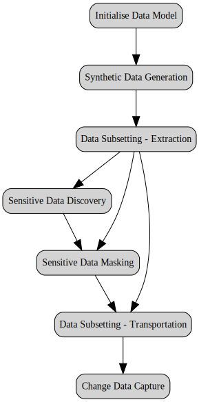

Each capability is detailed in its own dedicated chapter.

## 2. Foreword

Before showcasing the tool's functionalities, it is essential to provide an explanation of both its internal data model and the data model utilised for the demonstration.

### 2.1. Internal Data Model

It is important to look at the tool's internal data model not only to understand underlying concepts but also to be able to perform queries on its data.

This sections gives only an overview of the internal data model. For a more detailed description, please see the *Data Set Utility Reference Guide*.

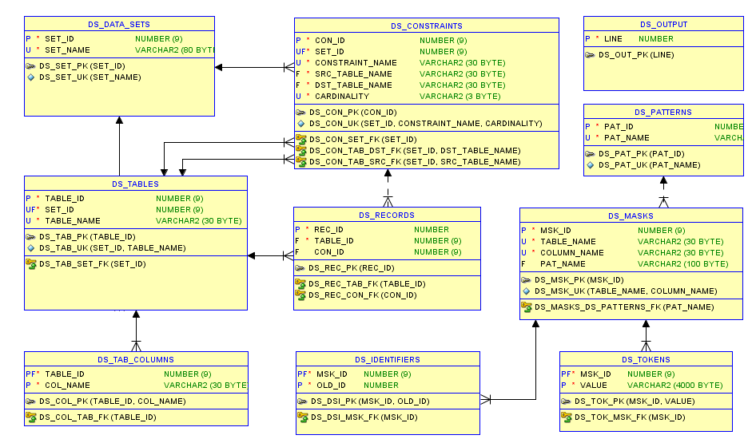

#### 2.1.1. Data sets

*Data_sets* may be created for the following purposes (*set_type*):

- SUB: for data subsetting (i.e., extraction and transportation).
- GEN: for data generation.
- CAP: for change data capture (CDC)
- CSV: for reference data stored as CSV in a CLOB.
- SQL: for reference data expressed with a SQL statement.

Data sets are uniquely identified by a *set_id* and a *set_name*. Some reference data sets are provided with the tool and created during its installation.

#### 2.1.2. Tables

A data set may be used to extract data from or generate data into one or several tables. Tables are uniquely identified by a *table_id* or by the *set_id* and *table_name* pair. A table has an *extract_type* (one of its most important properties described later).

#### 2.1.3. Constraints

A data set may use one or several constraints to extract or generate data (e.g., in the context of a one-to-many master/detail relationship), or to enforce referential integrity (many-to-one relationship). The *cardinality* of a constraint (1-N or N-1) indicates the direction in which it is walked through. It is therefore important to note that a constraint can be stored twice in a data set, once for each direction.

A constraint is uniquely identified by a *con_id* or by the *set_id*, *constraint_name*, and *cardinality* triple. A constraint always link a *src_table_name* (source) with a *dst_table_name* (destination). A constraint also has an *extract_type* (see later).

#### 2.1.4. Columns

Data sets used for synthetic data generation (GEN type) must have table columns (*tab_columns*) that describe how to generate their values. This is indicated by their "gen_type" (generation type), whose value can be *SQL*, *SEQ* (sequence) or *FK* (foreign key). They are identified by the *table_id* and *col_name* (column name) pair.

#### 2.1.5. Records

The *rowid* of *records* that are extracted or generated during data subsetting or synthetic data generation are recorded. Records belong to a table (*table_id*) and are uniquely identified by a *rec_id*. They may be the result of an extraction or a generation via a constraint (*con_id*). This table is also used for Change Data Capture to record captured operations and their data.

#### 2.1.6. Patterns

Sensitive data discovery is performed by searching for *patterns* in table/column names and comments, and in the data themselves. Alternatively, they could have been named *sensitive data types*. They are uniquely identified by a *pat_id* and by a *pat_name*. As the sensitivity nature of data does not depend on how they are extracted, they are not linked to data sets. The tool comes with a library of pre-defined patterns. Patterns also provide default masks that can be applied to discovered sensitive data types.

#### 2.1.7. Masks

*Masks* may be applied on-the-fly (i.e., during transportation) to anonymise columns of any data set. The default masks created during sensitive data discovery can be adapted or complemented by end-user. Masks based on random functions can also be used as a starting point for synthetic data generation. For the same reasons as patterns, they are not linked to any data set. Masks are identified by a *msk_id* and by the *table_name* and *column_name* pair.

#### 2.1.8. Identifiers

When numeric unique *identifiers* are masked, the mapping between old and new ids is stored in this table to be able to propagate their masking to foreign keys. Identifiers are uniquely identified by the *msk_id* and *old_id* pair.

#### 2.1.9. Tokens

When columns are masked using the tokenisation technique, the mapping between values and *tokens* is recorded in this *token store*. Tokens are uniquely identified by the *msk_id* and *value* pair. Values may be protected via encryption exactly as in a *token vault*.

#### 2.1.10. Output

The *output* table is used as an alternative to dbms_output to store large amount of data like e.g., SQL scripts to transport large data sets. Each line is uniquely identified by a *line* number.

#### 2.1.11. Extraction types

The concept of the *extraction type*, which applies to both tables and constraints, is key and must therefore be explained in detail. It is used during data subsetting and, equally, during synthetic data *generation* (in which case the word *extraction* must be read as or replaced with *generation*).

Tables can be qualified with the following extraction types:

- **B**)ase (denoted B-table): a table whose records are extracted first.
- **P**)artial (denoted P-table): a table that is partially extracted because of a direct or an indirect relationship with a base table (e.g., a child table, a grand-child table, etc.).
- **F**)ull (denoted F-table): a table whose content is fully extracted without any other condition (usually, reference tables that do not exist in the target schema and that you want to transfer in full).
- **N**)one (denoted N-table): a table that is not extracted at all (usually, reference tables that exist already in the target schema and which therefore do not need to be transferred).
- e**X**)cluded (denoted X-tables): a table that is not in the data set (it is used only on diagrams to show tables that are not part of the data set at stake).

By analogy, constraints can be qualified with a sub-set of the same extraction types:

- **B**)ase (denoted B-cons): a driving constraint used to extract records related directly or indirectly with base records (i.e., records of the base tables); most of them are 1-N constraints (i.e., parent/child relationships) although N-1 constraints can also be driving to cross intersection tables (i.e., tables implementing many-to-many relationships).
- **P**)artial (denoted P-cons): a non-driving constraint (usually N-1) used only to enforce referential integrity.
- **N**)one (denoted N-cons): a constraint not used during the extraction process (e.g., a foreign key to a reference table that is not extracted).

Extracting records refers to the process of storing their *rowid*s (the unique identifier of a row in Oracle databases) in one of the internal tables of the tool (namely `ds_records`) in such a way that they can subsequently be manipulated (previewed, deleted, anonymised, transported, etc.). As an exception, as there is no need but also to save space, *rowid*s of fully extracted tables are never stored.

### 2.2. Demo Data Model

This section explains the data model used to demonstrate all capabilities (data generation, subsetting, masking, etc.). While it may not mirror the data model of a real-world application, it is sufficiently complex and realistic to illustrate the challenges faced by data management tools in general. All database objects and tables, in particular, carry a *DEMO* prefix, which is often omitted for brevity when referenced.

The data model described below can be generated by executing the `10_demo_data_model.sql` script located in the `demo` directory. This script creates tables, indexes, and constraints. Additionally, it populates reference tables (*entity_types*, *credit_card_types*, and *countries*) which, for the purpose of the demo, are expected to exist in all environments and, therefore, do not need to be generated or extracted (although they could very well be).

#### 2.2.1. Diagrams

The data model is split into two diagrams for better document layout.

##### 2.2.1.1. Part 1

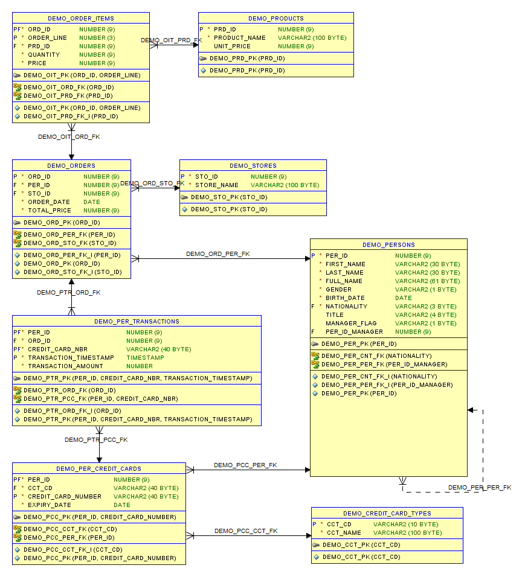

A ***person*** may own one or several ***credit cards*** that are of a given ***credit card type*** (MasterCard, Visa, etc.). A ***person*** may place ***orders*** in ***stores***. ***orders*** must be composed of one or several ***order items*** or lines, one per ordered ***product***. Furthermore, a ***person*** who placed ***orders*** may pay for them in one or several ***transactions*** using its ***credit cards***.

##### 2.2.1.2. Part 2

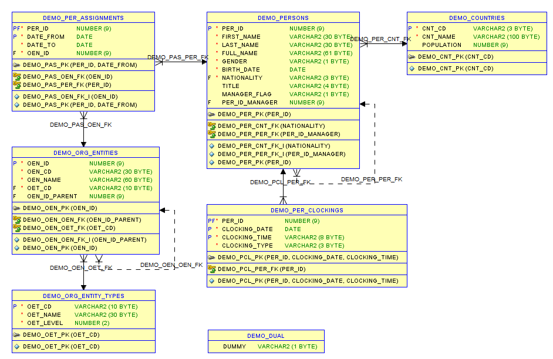

A ***person*** is a national of a ***country*** (nationality). A ***person*** may hold the role of a manager or a staff member. A staff member is supervised by one manager, and a manager may supervise several staff members (recursive relationship). ***Clockings*** of ***persons*** coming in and out of the office are recorded. ***Persons*** are assigned to ***entities***, and a history of their ***assignments*** is recorded (many-to-many relationship). ***Entities*** are organised in a hierarchy (recursive relationship) and have an ***entity_type*** (Institution, Directorate General, Directorate, Unit, or Sector) that reflects their level in the hierarchy.

#### 2.2.2. Data classification

The following terms used throughout this document need to be well understood.

- **Reference data** (also known as static data): These are values or codes that provide context or categorisation for other data. They are relatively stable over time and don't change frequently. In our data model: *countries*, *entity_types*, *credit_card_types*.

- **Master data** (also referred to as core data): These represent the foundational and critical business entities shared across an organisation. Master data are relatively stable but can change over time. In our data model: *persons*, *org_entities*, *per_credit_cards*, *products*, *stores*.

- **Transactional data**: These are records of day-to-day business activities and operations. They represent individual transactions or events within an organisation and are highly dynamic and frequently changing. In our data model: *per_assignments*, *per_clockings*, *orders*, *order_items*, *per_transactions*.

## 3. Synthetic Data Generation

### 3.1. Introduction

Synthetic data generation involves creating artificial data that mimics the statistical properties and patterns of real data. This synthetic data can be used for various purposes, such as testing and development, training machine learning models, and sharing data with third parties, all while safeguarding the privacy and confidentiality of sensitive information.

It is important to note that both synthetic data generation and data masking have their own use cases and considerations. The choice between them depends on the specific needs of the organisation, the nature of the data, and the intended use of the generated or masked data.

Synthetic data generation and data masking can also be complementary approaches, and they are often used in conjunction to enhance data privacy and utility.

### 3.2. Requirements

#### 3.2.1. Persons

- *Persons* (alias *per*) is a driving table (i.e., a starting point) of the data generation.
- *per_id* is the unique identifier of a *person*; it must be generated using an Oracle sequence (*per_seq*).
- *gender* must be *M*ale or *F*emale, generated at random with a uniform distribution.
- *first_name* must be realistic (e.g., generated from a list of most common first names) and must be coherent with *gender*.
- *last_name* must be realistic (e.g., generated from a list of most common last names).
- *full_name* is the concatenation of *first_name* and *last_name* (denormalised column).
- *birth_date* must be generated at random in such a way that person’s current age is between 21 and 65 (active staff).
- *nationality* must be selected at random from *countries* (EU member states only) following a non-uniform distribution proportional to its *population*.
- *title* (which is optional and missing in 20% of the cases) depends on *gender* (e.g., Mr for Male, Mrs or Miss for Female).
- *manager_flag* must be set to Y for 10% of the staff.
- For non-management staff, *per_id_manager* must reference a manager (a person identified as such via the above flag). To keep it simple, managers do not have a manager.

#### 3.2.2. Organisational entities

- Organisational entities (or *entities* to keep it short, alias *oen*) are organised in a hierarchy (via a recursive relationship) to form the organisation chart. Each level corresponds to an *entity type* (alias *oet*) that reflects the way EU institutions are organised (usually: Institution, Directorate General, Directorate, Unit, and Sector).
- The organisation chart must be generated for a certain number of institutions (so it is not a tree but rather a forest) and a given number of levels. The number of sub-entities of each entity (i.e., siblings) must be generated at random between a certain range of numbers.
- *oen_id* is the unique identifier of an *entity*; it must be generated using an Oracle sequence (*oen_seq*).
- Entity acronym or a code (*oen_cd*) must be generated at random following a format that depends on its level (e.g., 1/ EC, 2/ DIGIT, 3/ DIGIT.B, 4/ DIGIT.B.4, 5/ DIGIT.B.4.001). As of level 3, the acronym of an entity is prefixed with the one of its parent.
- *name* must be generated randomly while still being meaningful.
- Entity type (*oen_cd*) must be selected from *org_entity_types* depending on its level (from 1 to 5) in the hierarchy.
- Each entity must be linked to its parent entity via *oen_id_parent*.

#### 3.2.3. Person’s assignments

- A person may be assigned during its career to one or several entities (of any type). The history of its assignments is recorded in *per_assignments* (alias *pas*).
- A history must be made up of random number of periods (date ranges), starting from a given date in the past, each period having a random duration.
- *date_from* must be set to the start date of the assignment period.
- *date_to* must be set to the end date of the assignment period (not included).
- Assignment periods must be consecutive (no hole) i.e., *date_from* of a period must be equal to *date_to* of the previous period (except for the first one).
- For active staff, last period must be opened i.e., *date_to* must be set to 31/12/9999. This rule does not apply to retired staff or staff who left the company.
- *per_id* and *oen_id* are foreign keys to respectively *persons* and *entities*.

#### 3.2.4. Person’s clockings

- *Clockings* (alias *pcl*) of persons coming in and out of the office on working days (excluding weekends) are recorded. Normally, there are four clockings a day per person (1/ arrival in the office, 2/ departure for lunch, 3/ return from lunch, 4/ back home). No clocking is allowed during morning and afternoon core time periods, though exceptions may occur.
- *Clocking_date* is the date of the clocking.
- *Clocking_time* is the clocking time.
- *Clocking_time* must be IN or OUT.
- *Per_id* is the foreign key towards *persons*.

#### 3.2.5. Person’s orders

- *Persons* may place one or several *orders* (alias *ord*).
- *Ord_id* is the unique identifier of an order; it must be generated using an Oracle sequence (*ord_seq*).
- *Per_id* and *Sto_id* are foreign keys to respectively *persons* and *stores*.
- *Order_date* is the date of the order; it must be generated at random in the past (≤ current date).
- *Total_price* is the price of the order; it must be equal to the sum of *price* of its *order_lines*.

#### 3.2.6. Order’s lines

- *Orders* (alias *ord*) must have at least one *order_line* but may have more.
- *Ord_id* and *Prd_id* are foreign keys to respectively *orders* and *products*.
- *Order_line* is a sequential number starting with 1 (sequence within parent).
- *Quantity* must be a random number greater or equal to 1.
- *Price* must be equal to the ordered quantity multiplied by the unit price of the *product*.
- An *order_line* is uniquely identified by its *ord_id* and *order_line*.

#### 3.2.7. Products

- *Products* (alias *prd*) is a master table that must be entirely generated.
- *Prd_id* is the unique identifier of the *product*; it must be generated using an Oracle sequence (*prd_seq*).
- *Product_name* must be generated at random while still being meaningful (e.g., can be generated from a list of objects).
- *Unit_price* is an integer ≥1 that must be generated at random.

#### 3.2.8. Stores

- *Stores* (alias *sto*) is a master table that must be entirely generated.
- *Sto_id* is the unique identifier of the *store*; it must be generated using an Oracle sequence (*sto_seq*).
- *Store_name* must be generated at random while still being meaningful.

#### 3.2.9. Person’s credit cards

- A person may have one or several *credit_cards* (alias *pcc*) that are of a given *credit_card_type* (alias *cct*) e.g., MasterCard, Visa, etc.
- *Per_id* and *Cct_cd* are foreign keys to respectively *persons* and *credit_card_types*.
- *Credit_card_number* must be generated as valid (i.e., its checksum must be correct); its first digit(s) must be equal to those specified by its *credit_card_type* (e.g., 5 for MasterCard, 4 for Visa, etc.).
- *Expiry_date* must be generated as a date in the future and must be valid (last day of a month).

#### 3.2.10. Person’s transactions

- A *person* placing an *order* may pay via one or two credit card *transactions* (alias *ptr*). An *order* may be fully paid via one or two *transactions* (e.g., 30% when placing the order, remaining i.e., 70% upon delivery or receipt).
- *Per_id* and *Ord_id*, *Credit_card_nbr* are foreign keys to respectively *persons* and *transactions*.
- *Transaction_timestamp* (date and time) must be equal or posterior to the date of the related *order*.
- The sum of *Transaction_amount* must be equal to the *total_price* of the related *order*.
- Inclusion constraint: *Credit cards* used in a *transaction* must belong to the *person* that placed the *order*.

#### 3.2.11. Other requirements

- The figures given above are just examples; they must be configurable.
- For master tables (*persons*, *entities*, *stores*, and *products*), a fixed number of records to generate must be specified.
- For master/detail relationships, a minimum and maximum number of detail records to generate per master must be specified.
- For recursive one-to-many relationships (e.g., from *entities* to *entities*), the number of levels to generate in the hierarchy must be specified.
- For foreign keys (many-to-one relationships), an optional condition that must be fulfilled may be specified (e.g., the supervisor of a staff must have its *manager_flag* equal to *Y*).
- It is up to the tool to determine the order in which tables and relationships must be processed, based on their dependencies. However, when two tables have the same priority, a decision may be needed on which one must be generated first (e.g., *order_items* before *transactions*).
- Some tables may require several rounds of processing. For example, *orders* must be created before *order_lines* (to ensure referential integrity), but the *total_price* of an *order* cannot be computed before the generation of its *order_items*. So, the *total_price* must be updated in a second step.
- For tables implementing an intersection entity (*assignments*, *order_items*), only one of their two master/detail relationships may be used to drive their generation. For example, for *order_items*, *orders* should be driving, not *products*.
- For tables that are part of the current data set, only records generated in this context can be referenced by other generated records. In other words, records generated by other data sets cannot be referenced. Pre-existing records (e.g., in reference tables) that are not part of the current data set can be referenced without any restriction.

### 3.3. Solution

This section provides an overview of how to generate a data set that meets the previously described requirements, using the `20a_demo_data_generation.sql` and `20b_demo_data_generation.sql` scripts (located in the `demo` directory). The first script is based only on APIs, while the second script makes use of the DEGPL language.

For more details, please consult the *Synthetic Data Generation User's Guide* and the *Reference Manual*.

#### 3.3.1. Algorithm

The data generation algorithm is as follows:

- The order in which tables are populated is computed based on table dependencies (if table *A* references table *B*, table *B* must obviously be populated before table *A*).
- Driving/master/base tables (B-tables) are populated first, in the above-defined order.
- Recursive foreign-keys columns (like *per_id_manager*) are set to *NULL* initially and generated in a second step.
- For all tables (driving or not), processed in the above-defined order, master-detail (one-to-many) relationships (B-cons) are followed to generate child records from parents.
- Foreign keys (many-to-one) are generated by selecting records at random from referenced tables.

#### 3.3.2. Procedure

Here are the steps that must be followed:

##### 3.3.2.1. Create a data set

Create a data set of type *GEN* by invoking the `create_data_set_def()` procedure or function of the `ds_utility_krn` main package.

##### 3.3.2.2. Include master and detail tables

Include driving/master/base tables in the data set by invoking the `include_tables()` procedure. For our use case, base tables are `persons`, `products`, `stores`, and `entities`. At the same time and when requested, detail tables linked via one-to-many relationships can be included recursively.

##### 3.3.2.3. Include referential constraints

To ensure referential integrity, many-to-one (N-1) foreign keys or constraints must also be included by invoking the `include_referential_cons()` procedure. Referenced tables will be added at the same time.

##### 3.3.2.4. Review included tables and constraints

To get a graphical representation of the data set configuration, invoke the `graph_data_set()` function of the extension package (`ds_utility_ext`). Here is the diagram that you get when you paste the generated DOT code into an on-line Graphviz editor (e.g., [GraphvizOnline](https://dreampuf.github.io/GraphvizOnline)).


Here are the color conventions used (as shown on the legend):

- Green tables: base/master/driving tables (populated first).
- Blue tables: detail tables (populated from master tables via one-to-many relationships).
- Red tables: not generated tables (e.g., reference tables that are already filled).
- Grey tables: tables that are not part of the data set, i.e., excluded tables.
- Green arrows: one-to-many relationships used to generate detail tables from master.
- Red arrows: one-to-many relationships that must NOT be used for the generation.
- Crowded arrows: foreign keys for some of which referenced records are generated at random.

For each table, the following information is shown:

- Table name.
- Table alias (@alias).
- Order of processing (#order, sub-order).

The order of processing is automatically computed during the generation process. If you want to display it at this stage, you must request its computation by invoking the `define_walk_through_strategy()` procedure of the main package. The sub-order is defined by the end-user to prioritize tables having the same processing order.

##### 3.3.2.5. Include table columns

Columns of generated tables must also be included in the data set by invoking the `insert_table_columns()` procedure. This will allow you to later specify how to generate their value. During this step, foreign key columns are identified, and a default SQL expression to generate a random value may even be proposed for columns identified as sensitive (as a result of a prior sensitive data discovery run).

##### 3.3.2.6. Update table properties

For each base table, you must specify how many records to generate by invoking the `update_table_properties()` procedure. You may also need to change the sequence in which tables are processed (in our use case, *order items* must be generated before *transactions* so as to know the *total_amount* to be paid).

##### 3.3.2.7. Update constraint properties

For one-to-many relationships, you may or must specify the following properties:

- The number of child records to generate per parent record.
- For hierarchies (recursive relationships), the number of levels and the number of siblings per parent.
- For complex/historical tables, the so-called generation view that must be used to generate records.
- For denormalized fields, the post-generation PL/SQL code that must be invoked to compute them.
- For intersection tables, which of the 2 relationships must be used.

For many-to-one relationships, you may specify a filter that restricts the allowed values when generated at random.

To proceed, invoke the `update_constraint_properties()` procedure of the main package.

##### 3.3.2.8. Update column properties

For each column (at least for mandatory ones), you must specify its generation type i.e., how to generate its value, amongst the following:

- SQL: any valid SQL expression.
- SEQ: an Oracle sequence (to generate surrogate keys).
- FK: a value generated at random from a foreign/look-up table.

The tool comes with the `ds_masker_krn` package, a library of random functions that can be used in the SQL expressions. Some pseudo-columns like *RECORD*, *PARENT*, *ROWNUM*, *ROWCOUNT*, *SEED*, *LAG*, *PRIOR*, and *LEVEL* can also be used.

To proceed, invoke the `update_column_properties()` procedure of the main package.

##### 3.3.2.9. Review the whole configuration

The following diagram can be used to check most of the data set configuration:

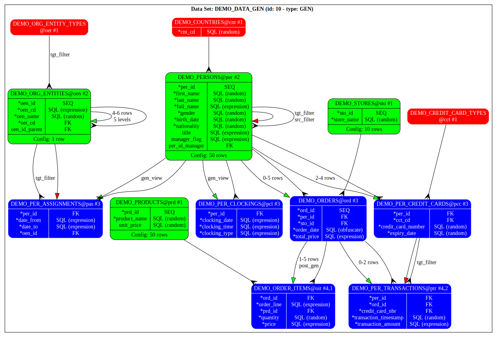

Compared to the previous diagram, the following information is now shown:

- Columns with their type of generation (SQL, SEQ, FK).
- Masking function used in SQL expression if any (random, obfuscate, encrypt, etc.)
- Number of records to generate in base tables (xx rows).
- Min/max number of child records to generate for 1-N relationships (min-max rows).
- Number of levels to generate in hierarchies i.e., 1-N recursive relationships (x levels).
- Whether a filter is applied on source or target tables of N-1 relationships (src/tgt filter).
- Whether pre/post generation PL/SQL code must be executed (pre/post gen).

Other configuration details (e.g., SQL expressions, sequence names, filter conditions, etc.) that cannot be easily displayed on the diagram are shown in table and constraint tooltips displayed when you pass the mouse over a table box or a constraint arrow. Tooltips are also available in diagrams saved as SVG (Scalable Vector Graphics) images.

##### 3.3.2.10. Generate the data set

The data set can be generated by invoking the `generate_data_set()` procedure of the main package.

##### 3.3.2.11. Check statistics

The following diagram can be used to get and check some statistics:

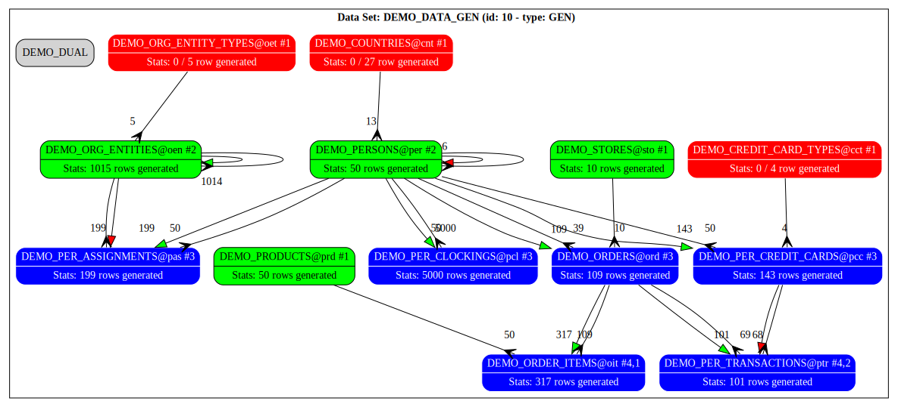

The following statistics are displayed:

- For all tables: number of rows generated vs number of existing rows (if different).
- For 1-N constraints (coloured arrows): number of records generated via this constraint.
- For N-1 constraints (crowded arrows): number of records referenced by this constraint.

##### 3.3.2.12. Check generated data via ad-hoc views

Generated data can be consulted via ad-hoc views that you can create by invoking the `create_views()` procedure of the main package. To drop these views after consultation, invoke the `drop_views()` procedure.

## 4. Data Subsetting

### 4.1. Introduction

Data subsetting involves selecting and extracting specific portions or subsets of data from a larger dataset based on defined criteria or conditions. This process is valuable in data analysis, management, and various development and testing scenarios.

In development and testing environments, data subsetting is a common practice to feed non-production databases. It allows developers to work with smaller, representative datasets for coding and debugging, supports quality assurance by creating test environments with relevant data subsets, and populates staging environments for final testing before deployment.

### 4.2. Requirements

For our demo use case, here follow the specifications of the data subset that we want to extract:

- Extract 10 *persons* out of the 50 existing ones (let's say those whose *per_id* is between 1 and 10).
- Extract all detail data related to those persons with one exception: only extract 50% of their *orders*.
- Extract all *stores*, whether they are referenced or not.
- Extract only the *products* referenced by extracted *order lines*.
- Do not extract reference tables (*countries*, *credit card types*, and *organisational entity types*) as they exist in all environments already.

This data subset will subsequently be anonymised before being transported into another schema or environment.

### 4.3. Solution

This section gives an overview of how to extract the data that meet the above requirements, using the `30a_demo_data_subsetting.sql` and `30b_demo_data_subsetting.sql` scripts located in the `demo` directory. The first script is based only on APIs, while the second script makes use of the DEGPL language.

#### 4.3.1. Algorithm

The extraction algorithm is the following:

- Tables are processed in an order that is based on their dependencies (if table *A* references table *B*, records of table *B* must be extracted before those of table *A*)
- Records of all base/driving tables are extracted first; they are filtered, if requested; they are processed in the order previously mentioned.
- Driving/base constraints (1-N or N-1) are followed to extract child or dependent records; this is repeated for any new record found until no more new record is found.
- Non-driving referential constraints (N-1) are followed to extract referenced records (to enforce referential integrity); this is repeated for any new record found until no more record is found.

#### 4.3.2. Procedure

Here are the steps that must be followed.

##### 4.3.2.1. Create a data set

Create a data set of type *SUB* by invoking the `create_data_set_def()` procedure or function of the `ds_utility_krn` main package.

##### 4.3.2.2. Include base tables and their details

Include driving/master/base tables (B-tables) in the data set by invoking the `include_tables()` procedure. For our use case, `persons` is the only base table. At the same time, detail tables (P-tables) linked via one-to-many relationships (B-cons) will also be included recursively.

##### 4.3.2.3. Include referential constraints

Include referential constraints to make sure that referential integrity will be enforced by invoking the `include_referential_cons()` procedure. Tables referenced by these many-to-one constraints (P-cons) will be included at the same time.

##### 4.3.2.4. Update table properties

Update properties of base tables by invoking the `update_table_properties()` procedure. For our use case, we need to filter the *per_id*s of the *persons* table. We also need to specify which table to exclude (N-tables) and which one to fully extract (F-tables) by updating their *extract_type* property.

##### 4.3.2.5. Update constraint properties

Update constraint properties by invoking the `update_constraint_properties()` procedure. For our use case, we need to extract only 50% of the *orders*. You may also need to update their *extract_type*.

##### 4.3.2.6. Count table records

The number of records in each table (important to know if you want to extract only a percentage) is inherited from Oracle statistics but can be computed if missing by invoking the `count_table_records()` procedure.

##### 4.3.2.7. Review configuration

The following diagram can be used to check the configuration of your data subset:

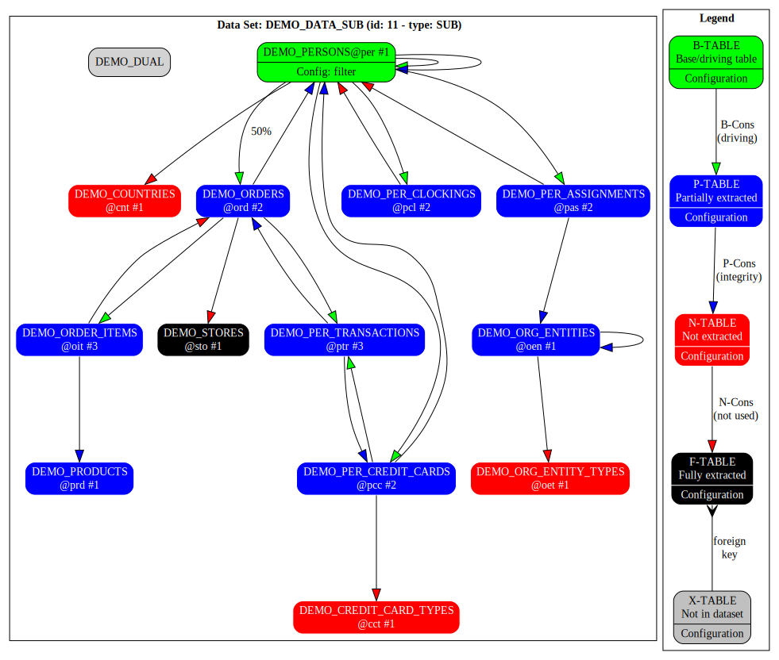

The following information is shown:

- Tables and constraints in the data set.
- Their extract type based on color code (see legend).
- Table configuration (e.g., whether a filter is applied).
- Constraints configuration (e.g., rows percentage).
- The order in which tables are extracted (#n).

Configuration details (e.g., where clause, order by clause, etc.) cannot be easily displayed on the diagram and, therefore, can only be checked by querying the internal tables of the tool.

##### 4.3.2.8. Extract data set rowids

Extraction of records (which means their identification and the storage of their rowids in the *ds_records* table) can be launched by invoking the *extract_data_set_rowids()* procedure.

##### 4.3.2.9. Review statistics

After extraction, statistics can be shown on the following diagram:

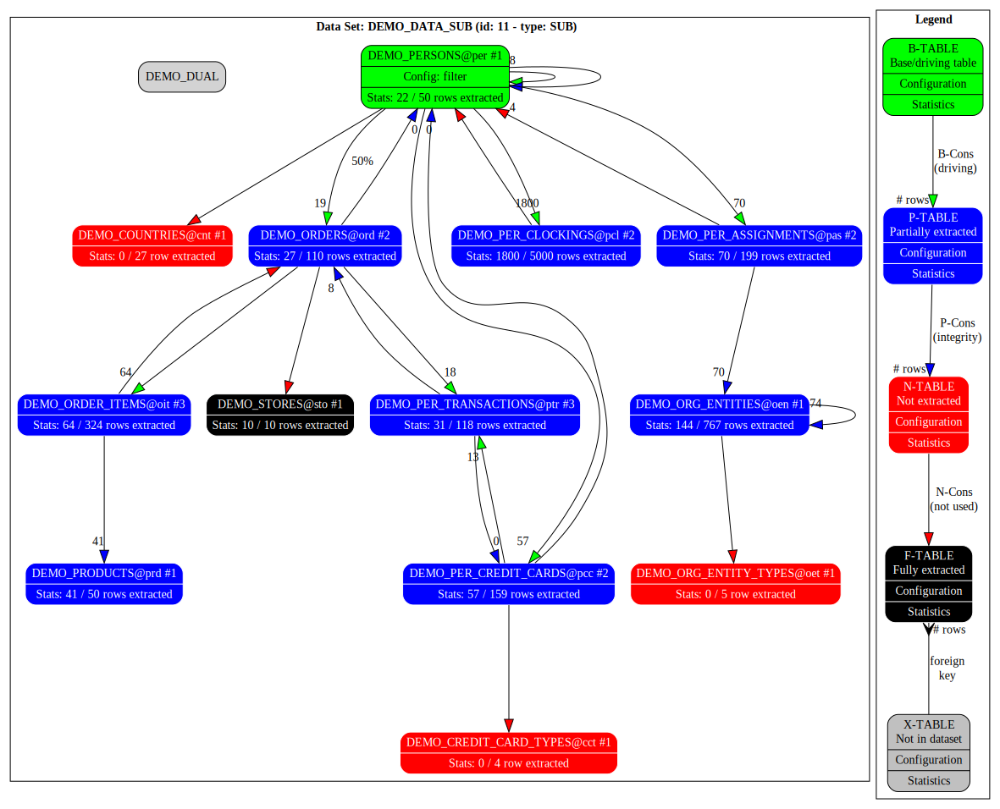

Compared to the previous diagram, the following statistics have been added:

- For tables, the number of records extracted compared to the total number of records.
- For constraints, the number of records extracted by using them.

Note that about 20 persons have been extracted with their details compared to the 10 initially requested. This is because the staff members of one manager have been extracted too, due to the driving 1-N recursive constraint on *persons*. This constraint was added while including recursively detail tables of *persons* table.

##### 4.3.2.10. Mask data set

Optionally, sensitive data can be masked (i.e., anonymised) in various ways.

See chapter dedicated to sensitive data masking.

##### 4.3.2.11. Preview data set

Before transporting the data set, you can preview extracted (and anonymised) records via ad-hoc views, created by invoking the *create_views()* procedure. After preview, these views can be deleted by invoking the *drop_views()* procedure.

##### 4.3.2.12. Transport data set

Finally, data set can be transported to another schema in various ways.

See chapter dedicated to data transportation.

## 5. Sensitive Data Discovery

Sensitive data discovery refers to the process of identifying and locating sensitive or personally identifiable information (PII) within a dataset or a system. This is an important step in data privacy and security, as it helps organizations identify and protect sensitive information from unauthorized access or disclosure.

Sensitive data are discovered by searching for specific keywords or patterns that indicate the presence of sensitive data. For example, searching for terms like "social security number," "credit card number," or "date of birth" can help identify relevant data.

This tool allows to discover sensitive data by searching for patterns in column names, column comments, and/or in the data themselves. Patterns are based on regular expressions. Data can also be searched in look-up data sets (e.g., lists of countries, cities, currencies, etc.) to determine their types.

The tool comes with a collection of pre-defined look-up data sets as well as search patterns which cover the following categories: address, banking, internet, large text, national identifiers, personal information, and vehicle. Both can be adapted and complemented with user-defined ones. Each sensitive data type comes with a default mask that can be applied during the next data masking stage.

For more details, please consult the sensitive data discovery and masking guide.

### 5.1. Requirements

For our use case, we just want to discover the sensitive data of our data model that might need to be masked or anonymised i.e., personally identifiable information (PII) and banking data (*credit cards)*. We also need to understand how the sensitive columns have been discovered in order to potentially identify false positives (data reported as sensitive while being not).

### 5.2. Solution

This section gives an overview of how to perform a sensitive data discovery with this tool, using the `40a_demo_data_discovery.sql` script located in the `demo` directory.

#### 5.2.1. Algorithm

The sensitive data discovery algorithm is the following:

- All tables of the data set or whose name is matching are considered in turn.
- All column names and/or comments are matched against all keyword patterns.
- The compatibility of column data types is verified.
- A sample set of records is fetched from each table.
- All selected column values are matched against all data patterns.
- All selected column values are searched in all look-up data sets.
- Patterns not meeting the minimum hit criteria are discarded.
- The best matching patterns are finally retained.
- A sensitive data discovery report is produced on-the-fly.

#### 5.2.2. Procedure

##### 5.2.2.1. Review and adapt search patterns

You must perform the following:

- Review and understand pre-defined search patterns
- Disable those that are not needed to speed-up the discovery e.g., based on their category.
- Adapt patterns to your specific needs if necessary (e.g., translate into your language).
- Create your own user-defined patterns if necessary.

Note that pre-defined patterns and look-up data sets have been designed with the assumption that your database object names and comments, and your data are in English.

Properties of search patterns can be updated by invoking the *update_pattern_properties()* procedure. New patterns can be created via the *insert_pattern()* procedure. Existing pattern can be deleted via the *delete_pattern()* procedure.

##### 5.2.2.2. Review and adapt look-up data sets

You must perform the following:

- Review the pre-defined look-up data sets referenced in the patterns.
- Adapt them to your specific needs (e.g, translate into another language).
- Create your own if necessary (e.g., family/given names specific to your country).

To create a new look-up data set, put your CSV formatted data in a CLOB and invoke the *create_data_set_def()* procedure or function. To update an existing look-up data set, replace it using the *create_or_replace_data_set_def()" procedure or function. See one of the SQL scripts in the `install` directory as a source of inspiration.

##### 5.2.2.3. Launch data discovery

The sensitive data discovery can be launched by invoking the *discover_sensitive_data()* procedure of the main package. It can be launched for the whole schema or just for the tables involved in a specific data set. Some parameters like sample size and minimum hit can also be passed. To generate the data discovery report, enable *dbms_output* and information messages via the *set_message_filter()* procedure.

##### 5.2.2.4. Check data discovery report

The data discovery report shows the result of the pattern matching exercise. It is particularly useful to understand why a specific pattern has been discarded or, in case of multiple matches, why a specific pattern has been preferred over another one. It also shows a sample of matching values that may help in detecting wrong matches.

For each column, are indicated:

- Which pattern is matching which criteria (name, comment, or data regular expression; lookup data set; data type).
- For sample records, the number and percentage of matching values + sample values.
- Which patterns were discarded (+ reason), retained but not the best, and the best.

Based on this report, you may need to adapt search patterns and launch a new sensitive data discovery process.

##### 5.2.2.5. Check sensitive columns

In addition to the report, discovered sensitive columns can be checked by querying the *ds_masks* table and filtering on *sensitive_flag='Y'*, or visually using the following diagram:

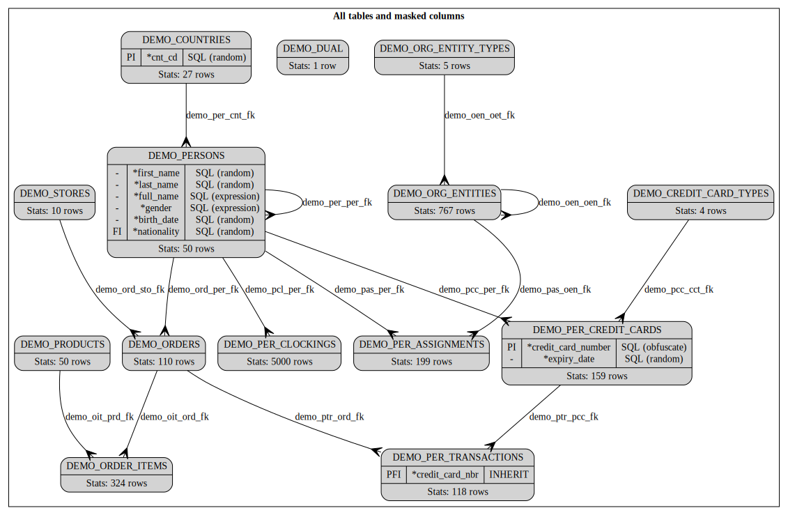

This diagram can be generated by invoking the *graph_data_set()* function with *NULL* passed as data set id. It shows the following:

- All tables matching table name pattern + their relationships.
- Some statistics on their number of records.
- Columns that are marked as sensitive and their proposed default masking (SQL, INHERIT).
  
To be noted that the proposed default masks may not be entirely satisfactory (as an example, the tool cannot detect dernomalised fields like the *full_name*). You will therefore need to review and adapt them during the next data masking stage.

## 6. Sensitive Data Masking

### 6.1. Introduction

Data masking, also known as data obfuscation or data anonymisation, is a technique used to protect sensitive or confidential information by replacing real data with fictional or modified data while preserving the data's format and usability for non-sensitive purposes. The primary goal of data masking is to minimize the risk of unauthorized access to sensitive data while still allowing organizations to use the data for various non-production purposes such as software testing, analytics, or outsourcing.

The most common data masking techniques, all supported by this tool, are substitution, shuffling, masking, perturbation, encryption, and tokenisation. They can be applied individually or combined. Users should carefully choose the appropriate technique based on their specific use case and compliance requirements.

Data masking can be implemented using different approaches amongst which: on-the-fly data masking, static data masking, dynamic data masking. This tool performs sub-setting and data masking on-the-fly i.e., during data transportation. It has the advantage that it does not require the creation of a copy of the production database, which can be resource-intensive and time-consuming

This tool implements the following mask types:

- SQL: any valid SQL expression (which can use any masking function of the supplied library).
- SHUFFLE: shuffles a group of columns with optional partitioning.
- SEQUENCE: generate a value from a sequence (in-memory or Oracle, local or remote).
- INHERIT: masked foreign keys values are inherited from masked primary key values.
- TOKENIZE: values are replaced with tokens stored in a token store or vault.

The tool comes with a library (implemented in the *ds_masking_krn* package) that offers the following types of masking functions:

- random_xxx: generate a random value.
- obfuscate_xxx: obfuscate a given value (i.e., replace it in part or in full).
- mask_xxx: mask a given value (i.e., hide it in part or in full).
- encrypt_xxx: encrypt a value with a private key (format is preserved).
- decrypt_xxx: decrypt a value with the same private key.

These functions are available for numbers, integers, strings, names, dates, times, credit card numbers, BBANs, IBANs, data sets, etc. Most of them accept a seed parameter that makes their result deterministic (i.e., the same output value is produced for the same input values).

For more details, please consult the *Sensitive Data Discovery and Masking Guide*.

### 6.2. Requirements

#### 6.2.1. Scenario 1

In the first scenario, we will mask the sensitive columns discovered in the previous stage. Since the default masks proposed are not entirely satisfactory (e.g., because the tool is not capable of detecting dependencies between columns and because we want to demonstrate several masking techniques), they must be changed in the following way:

- First names must be shuffled while staying coherent with the person's gender.
- Last names must be tokenized using existing family names as tokens (i.e., a family name carried by several persons will consistently be replaced with another existing and different one).
- Full names must be denormalized as the concatenation of first and last names.
- Nationalities must be generated at random from existing nationalities.
- The title (by the way, not detected as sensitive) must be obfuscated with the *XXXX* value.
- Credit card numbers must be encrypted while remaining valid.

#### 6.2.2. Scenarios 2 to 7

For the other scenarios, we will only mask person's identifiers (*per_id*s), which, like the *gender*, were not detected as sensitive. This will demonstrate the various techniques that can be used to mask primary keys and how masking is propagated to foreign keys.

- **Scenario 2:** Generate *per_id*s using an in-memory sequence or a local/remote Oracle sequence.
- **Scenario 3:** Shuffle *per_id*s.
- **Scenario 4:** Encrypt *per_id*s using FPE.
- **Scenario 5:** Tokenize *per_id*s with random tokens or *per_id*s encryption.
- **Scenario 6:** Differ masking of *per_ids* using a remote non-accessible Oracle sequence.
- **Scenario 7:** Shift *per_id*s by a constant value.

### 6.3. Solution

This section provides an overview of how to mask the subset of data extracted previously, using the `50a_demo_data_masking.sql` and `50b_demo_data_masking.sql` scripts located in the `demo` directory. The first script is based only on APIs, while the second script makes use of the DEGPL language.

It is important to note that all internal tables of the tool involved in data masking are NOT linked to any data set. This ensures that data are masked consistently across all data sets, meaning multiple masked subsets of the same data can be transported and merged into the same target schema. Shuffling, however, is data set-specific and is therefore an exception.

#### 6.3.1. Algorithms

Shuffling is implemented by randomly exchanging records of the same partition. Shuffled *rowid*s are stored in the *ds_records* table, together with the original *rowid*s. Shuffling is usually not deterministic.

Tokenization is implemented by generating tokens using a user-defined SQL expression and storing them with their encrypted value in the *ds_tokens* table (which therefore plays the role of a token store or vault). The following tokenization techniques are supported: format-preserving, secure-hash, random, deterministic, FPE.

Sequence-based masking, which consists of generating new numeric identifiers, is implemented by storing the mapping between old and new values in the *ds_identifiers* table. When deferred, the remote mapping table is populated on-the-fly while the import script is executed.

The Format Preserved Encryption (FPE) algorithm used in this tool is proprietary and implemented in the *ds_encrypt_krn* package. It consists of making several rounds of random permutations and substitutions (based on substitutions tables generated at random). The encryption is symmetric, i.e., the same key is used to encrypt and decrypt. The encryption key is not persisted and must, therefore, be saved somewhere by the end-user to make decryption possible.

In all cases, masks are applied to data on-the-fly, i.e., only during data set preview and transportation (i.e., original data remain unchanged).

#### 6.3.2. Procedure

For each scenario, follow these steps to proceed with data masking.

##### 6.3.2.1. Review and adapt column masks

If a sensitive data discovery was run before, review the default masks that were generated and adapt them as necessary by invoking the *update_mask_properties()* procedure. You can also create new or delete existing masks using *insert_mask()* and *delete_mask()* procedure. The DEGPL language can also be used as an alternative.

##### 6.3.2.2. Check masking configuration

Once reviewed and adapted, check that your masking configuration meets your requirements. Most of it can be checked visually using the following graphviz diagram:

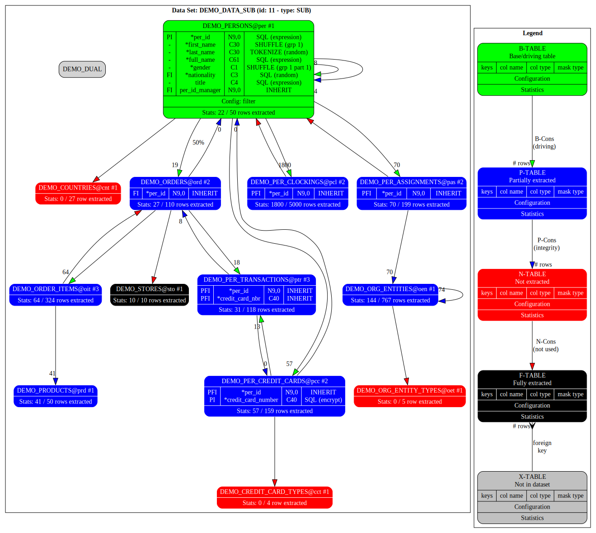

The above diagram, which relates to the first scenario, can be generated by invoking the *graph_data_set()* function with *NULL* passed as the data set id. You will note the following:

- Only masked columns are displayed (although all columns can also be shown if requested).
- Mask types have been adapted (updated, created, and deleted) as required.
- The encryption of *credit card number* is cascaded from *credit cards* to *transactions* (i.e., foreign keys *INHERIT* the masking of their corresponding primary key).

##### 6.3.2.3. Apply data masking

Shuffling, tokenization, and sequence-based masking techniques require a formal step, which consists of shuffling *rowid*s, generating new identifiers (surrogate keys), and/or generating tokens into the internal tables of tools. You can perform this step by invoking the *mask_data_set()* procedure. When encryption is involved, you must pass your encryption key as a parameter.

You can check the generated data by querying the following internal tables of the tool: *ds_records*, *ds_identifiers*, and *ds_tokens*. In this latest table, you will note that the original *value*s associated with tokens are, by default, encrypted.

Note that generated identifiers and tokens are shared across multiple data sets while shuffling is data set specific.

##### 6.3.2.4. Check masked data

It is recommended to check that your data are correctly masked before transporting them. For this purpose, you need to create 2 views per table: one that shows original data and one that shows masked data. You must request to add a *rowid#* column in each of those views to allow joining and comparing original and masked records when querying them.

## 7. Data Transportation

### 7.1. Introduction

Data transportation refers to the process of moving or transferring data from one schema to another. Database objects (tables and constraints) are supposed to be pre-created in the target schema and fully aligned with those of the source schema. Source and target schemas can be in the same database or not. With this solution, data masking is applied during data transportation (i.e., on-the-fly).

This tool supports the following transportation methods:

- Direct execution of DML statements through a database link.
- Generation of a SQL script followed by its execution through a database link.
- Generation of a SQL script to be executed manually in the target schema.
- Extraction of the data as XML into the internal tables of the tools.
- Export/Import by filtering the data using security policies (without data masking).

Records are, by default, inserted in the target schema, but the tool can also *upsert* or refresh the data i.e., update records when they exist and create them when they are not found.

The following special use cases are also supported:

- Deletion of a data set from the source schema (e.g., after it was copied).
- Clone a data set by inserting data in the source schema (i.e., target = source).

### 7.2. Requirements

We want to transfer the data sets made in the previous stages, with or without data masking, from one schema to another, possibly through a database link. Source and target schemas can be hosted in the same or in different databases. The first four transportation techniques will be demonstrated (the last one being more theoretical than practical).

### 7.3. Solutions

This section gives an overview of how to transport the data subset made in the previous stages, using the `60a_demo_data_transport.sql`script located in the `demo` directory.

#### 7.3.1. Algorithm

A smart algorithm is used to transport the data in such a way that constraints do not need to be disabled in the target schema. Simply said, records must be created in the right order to avoid referential constraints from being violated. Be careful, however, that some database triggers that implement business logic may need to be disabled to avoid side effects.

The algorithm used to transport the data is the following:

- Tables are processed one by one, in an order that depends on table dependencies (exactly as when extracting or generating records e.g., if table *A* references table *B*, table *B* must be processed before table *A*).
- Records of tables without recursive constraints are processed in any order, in a single operation.
- Records of tables that do have a recursive relationship are processed in the reverse order of their extraction i.e., records extracted last (those that do not depend on others) are inserted first and vice-versa; several iterations are needed, as many as the number of levels in your hierarchy.
- In case of deletion, the order of processing of both tables and records is just reversed.

#### 7.3.2. Procedure

##### 7.3.2.1. Prepare the target schema

As already explained, database objects must exist in the target schema and be aligned with the source schema. Reference tables that are not part of the data set must also be populated with the same data. Upgrade your target schema if necessary.

For the demo, you must execute the `10a_demo_data_model.sql` script in the target schema before each transportation (i.e., for each scenario). This script will drop and recreate all tables and will populate some reference tables.

##### 7.3.2.2. Transport Data to Destination

To transport data either via direct DML operation or through a script, use the *transport_data_set()*`* procedure of the main package. Specify, as a parameter, which of the three transportation methods you want to use (direct execution, prepare script, or execute script). When applicable, provide the database link pointing to the target schema.

For the *prepare script* method, the generated script is stored in the *ds_output* table (which must be truncated beforehand) and can be saved to a file using spooling.

You can globally override the export mode (insert, update, upsert, or delete) defined at the table level. By default, data masking is applied during transportation, but you can also disable it. The transportation is performed in a single transaction, which must be committed in the end.

Note that when source and target schemas are hosted in different databases, an Oracle restriction imposes that your database link must have the same name as your target database.

##### 7.3.2.3. Export/Import Data from/to XML

Exporting your data set as XML into the internal tables of the tool (specifically, *ds_tables* and *ds_records*) can be done by invoking the *export_data_set_as_xml()* procedure. Subsequently, the internal tables holding your data set as XML can be transferred to the target schema using tools such as Oracle Export/Import or DataPump utilities.

For the reverse operation, importing your data from XML into the target schema, you can use the *import_data_set_as_xml()* procedure. Note that this requires installing the tool in the target schema as well.

This method is also useful if you intend to import your data set back into the source schema. For instance, this could be done to perform in-place subsetting and masking (i.e., in the same schema) or if you wish to clone specific data.

## 8. Change Data Capture

This chapter gives an overview of the CDC functionality. Please consult the *Reference Manual* for more details.

### 8.1. Introduction

Change Data Capture (CDC) is a technique used in databases to identify and capture changes made to the data so that downstream systems can be updated with the modified information. The primary goal of CDC is to track and capture changes to the data in near real-time or at scheduled intervals, enabling efficient and timely synchronization of data between different systems.

CDC is commonly used in scenarios where it's crucial to keep multiple databases, applications, or data warehouses in sync without having to replicate entire datasets each time an update occurs. This approach helps reduce the amount of data transferred and improves the efficiency of data integration processes.

Change Data Capture is commonly used in data warehousing, business intelligence, and data integration scenarios where maintaining synchronized and up-to-date data across different systems is essential. It helps in avoiding unnecessary data transfers and reduces the overall processing time, making data integration processes more efficient.

Another valuable use case for Change Data Capture (CDC) is its application in swiftly restoring a schema to its original state following the execution of a destructive test. In scenarios where a test results in permanent alterations to the data, CDC facilitates the rapid rollback of changes, ensuring a quick and efficient restoration of the database schema to its pre-test condition. This capability enhances the resilience and ease of managing test environments, providing a reliable mechanism for undoing modifications made during testing processes.

Finally, CDC can contribute to gaining insights into the data logic of an application by revealing the operations submitted to the database and the specific data that undergo modifications.

This tool employs a log-based Change Data Capture (CDC) approach, which involves capturing and logging all changes (including inserts, updates, and deletes) made to the tables within a data set in XML format. These recorded operations can then be rolled back or rolled forward to another schema, either synchronously or asynchronously (in near real-time). Additionally, the tool enables the generation of redo and undo scripts to further enhance flexibility in managing and reverting data modifications.

### 8.2. Requirements

To showcase the CDC functionalities, we aim to capture every change applied to the demo tables, including operations like the generation of synthetic data that involves inserts and updates. Subsequently, we plan to propagate these changes to another schema synchronously and asynchronously, through a database link, generate redo and undo scripts, and ultimately roll back the generated data.

### 8.3. Solution

The approach employed in this tool involves creating an "*after each row*" database trigger on all tables within the data set. This trigger captures insert, update, and delete operations, storing the details in the *ds_records* table. Additionally, the data as it existed both before and after the operation is stored in XML format, allowing for subsequent redo or undo actions.

#### 8.3.1. Algorithm

To apply changes or create redo scripts, the recorded operations are replayed in their original execution sequence using the data stored in the XML.

For rolling back changes or generating undo scripts, the stored operations are traversed in the reverse order of their original execution. Records that were initially inserted are deleted, those that were deleted are re-inserted, and the old values of updated records are reinstated.

Any modification to a primary key is executed through a two-step process involving deletion followed by insertion.

To enable asynchronous rollforwarding or replication, a *dbms_job* is dynamically created when the first operation of a transaction is captured. All operations within the same transaction are subsequently rolled forward by the job just after the commit, ensuring near real-time processing.

#### 8.3.2. Procedure

##### 8.3.2.1. Create a data set

To create a data set for CDC, invoke the *create_or_replace_data_set_def()* procedure of the main package and set its *set_type* to'CAP'.

Specify one of the following replication mode (*capture_mode* property):

- *NONE*: no replication mode i.e., operations are just recorded as XML in *ds_records* table; rollback or rollforward must be performed manually (via APIs or through generated scripts).
- *ASYN*: asynchronous replication mode (using *dbms_jobs*) with operations recorded temporarily in *ds_records* table as XML and deleted after their async replication.
- *SYNC*: synchronous replication mode i.e., operations are rolled forward immediately and therefore not stored in *ds_records* table.

Additionally, you can specify which field in your table contain user information that can be utilised to filter transactions. For instance, an audit field such as *inserted_by* or *updated_by* can be employed for this purpose.

##### 8.3.2.2. Include tables

Tables for which you intend to capture changes can be incorporated into the data set using the *include_tables()* procedure. To rollforward table changes to another schema, specify the *target_schema* (if in the same db) or the *target_db_link* (if in another db).

##### 8.3.2.3. Create triggers

To create the capturing triggers on the tables of your data set, invoke the *create_triggers()* procedure.

##### 8.3.2.4. Check configuration

To check tables included in your data set and the capturing triggers just created, invoke the *graph_data_set()* pipeline function from a SELECT statement. Here is the diagram that you will get.

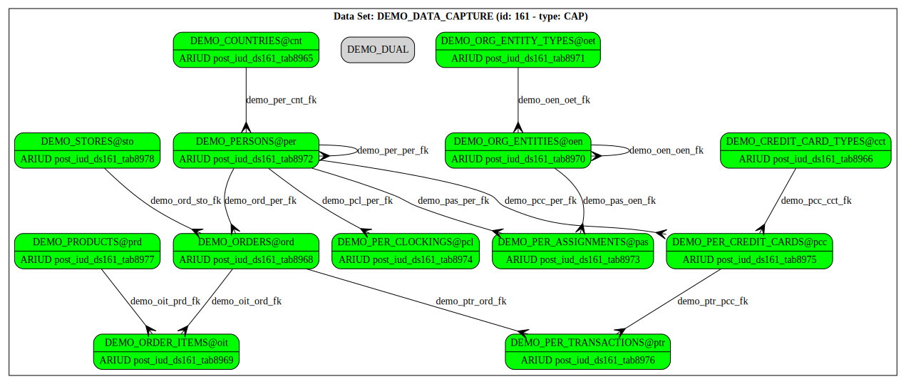

##### 8.3.2.5. Enable and disable CDC

Data capture is by default immediately enabled when triggers are created. To disable or re-enable CDC, update the *capture_flag* property of your data set using the *update_data_set_def_properties()* procedure. *Y* means enabled and *N* means disabled.

##### 8.3.2.6. Manual Rollback or rollforward

To rollback or rollforward operations captured in the NONE replication mode, invoke the *rollback_captured_data_set()* or *rollforward_captured_data_set()* procedure. You may decide to keep or delete recorded operations after their rollback or rollforward. They are deleted by default.

Alternatively, you can also invoke *undo_captured_operations()* and *redo_captured_operations()* procedures which accept additional parameters. You can filter on the *username* who performed the transactions and limit the number of operations to redo or undo.

##### 8.3.2.7. Automatic replication

Operations captured in the SYNC or ASYN replication mode are automatically rolled forward to another local or remote schema, without any end-user intervention.

While synchronous replication offers the benefit of immediacy, it comes with the drawback that if it encounters any failure, the entire transaction fails, thereby impacting the transactional system. Additionally, it may affect system performance.

It is important to note that, as of now, no logs are provided for asynchronous replication.

##### 8.3.2.8. Generate scripts

To generate redo or undo scripts, invoke the *gen_captured_data_set_script()* pipelined function from a SELECT statement, with the appropriate parameters.

##### 8.3.2.9. Drop triggers

Once you are done, you can drop the capturing triggers from the tables of your data set by invoking the *drop_triggers()* procedure.

## 9. Graph Visualisation using GraphViz

This chapter gives an overview of the graph visualisation functionality offered by the Data Set Utility. For more details, please consult the *Data Set Utility Reference Manual*.

### 9.1. Introduction

The Data Set Utility incorporates Graphviz functionality, allowing users to visually represent and analyze the configuration of their data sets. This feature employs Graphviz, an open-source graph visualization software, to generate diagrams illustrating the relationships, constraints, and configurations within a data set. Users can leverage these diagrams to gain insights into the structure of their data sets, understand interconnections between tables and constraints, and verify the accuracy of their configurations.

### 9.2. Invocation

To generate the DOT code, invoke the *graph_data_set()* function of the extension package (*DS_UTILITY_EXT*) and pass in parameter the *set_id* of the data set that you want to visualise. Passing a NULL reference for the data set means that you want to get the data masking configuration (which is independent of any data set). An example is provided in the *80_demo_data_graphviz.sql* script provided in the *demo* directory.

The information that is shown also depends on the type of data set (SUB, GEN or none).

To visualize the diagram, copy/paste the code into your favourite online GraphViz editor. I recommend using the following: [GraphvizOnline](https://dreampuf.github.io/GraphvizOnline) although you can find many others on the internet.

### 9.3. Parameters

You can decide to show only tables and constraints of your data set or those of your whole schema, with the possibility to filter on table names.

You can decide to show or not:

- A legend.
- Table aliases.
- GEN/SUB configuration information.
- Statistics on total/extracted/generated records.
- All, configured, indexed and/or constraint table columns.
- Key constraints (PK/UK/FK) and their details (columns).
- Indexes and their details (column).
- All or some properties in tooltips.

Default graph, node, edge, and subgraph attributes can also be overwritten to customise the generated layout. Configuration properties that do not fit on the diagram (e.g., SQL expressions) can be consulted using tooltips.

### 9.4. Diagram Examples

Here follow a few examples of generated diagrams.

#### 9.4.1. Synthetic Data Generation Diagram

This diagram shows the data generation configuration used in the demo.


#### 9.4.2. Sensitive Data Masking Diagram

This diagram shows the default data masking configuration resulting from a sensitive data discovery and applicable to all data sets.


#### 9.4.3. Data Subsetting Diagram

This diagram shows the data subsetting and (adapted) data masking configurations used in the demo.


#### 9.4.4. Change Data Capture Diagram

This diagram shows tables and triggers of the capture data set used in the demo.


#### 9.4.5. Data Structure Diagram

This tool can also generate the data structure diagram of your schema (or a subset of it) similar to those generated by database design engineering tools like SQL*Developer Data Modeler.

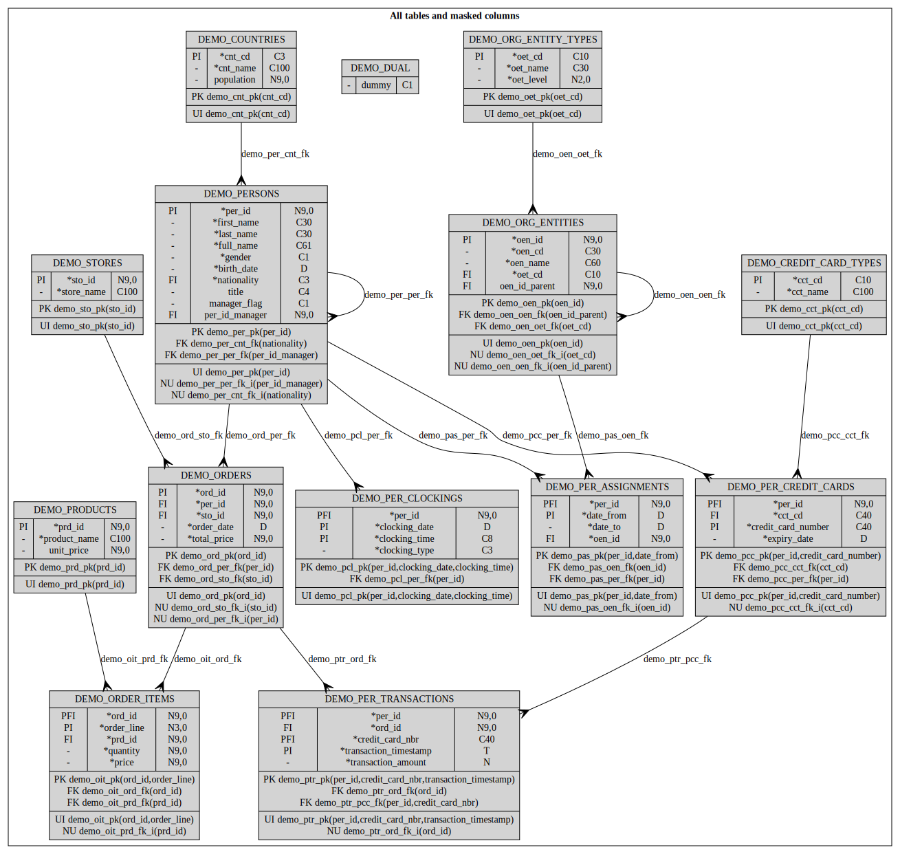

## 10. DEGPL Language

This chapter provides a brief overview of DEGPL's features, syntax, and includes a few examples. For a more detailed description of the language, please refer to the *Data Set Utility Reference Manual*.

### 10.1. Introduction

The Data Extraction and Generation Path Language (DEGPL) is presented as an alternative or complementary approach to APIs for achieving data subsetting (SUB), synthetic data generation (GEN), and sensitive data masking. Notably, DEGPL adopts a syntax reminiscent of the GraphViz DOT language.

### 10.2. Key features

- **Easy and Concise Description:** DEGPL provides a straightforward and concise way to describe the path for extracting or generating data within a data model.
- **Easy and Concise Description:** DEGPL provides a straightforward and concise way to describe the path for extracting or generating data within a data model.
- **Syntax Similarity to GraphViz DOT Language:** The language's syntax is inspired by and closely resembles the syntax of the GraphViz DOT language, making it intuitive for those familiar with DOT.
- **Support for Data Subsetting and Generation:** DEGPL is versatile, allowing configuration for both data subsetting (SUB) and synthetic data generation (GEN), offering flexibility for different use cases.
- **Handling of Sensitive Data Masking:** DEGPL includes support for sensitive data masking, contributing to enhanced data security by allowing users to specify how data should be masked during the subsetting process.
- **Extraction Paths and Relationships:** Users can define extraction paths between tables, specifying relationships and constraints. The language supports one-to-many and many-to-one relationships, providing a comprehensive way to navigate data models.
- **Recursion and Cardinality Specification:** DEGPL allows the specification of recursion levels and cardinality for constraints, ensuring a flexible and precise definition of the data extraction or generation process.
- **Table and Constraint Aliases:** Users can employ aliases for tables, enhancing readability and simplifying the representation of complex data models.
- **Property and Default Value Configuration:** DEGPL enables users to set properties and default values for tables, constraints, columns, and masks, offering fine-grained control over the configuration.
- **Wildcard Usage:** Wildcards such as '?' and '*' can be used in table, constraint, and column names, facilitating the inclusion or exclusion of multiple elements at once.
- **Scope Specification:** Users can define the scope, indicating whether to consider only elements already included in the data set or those that are not yet included.
- **Recommendations for Structuring and Testing:** The reference manual provides recommendations for structuring and testing the code using DEGPL, emphasising best practices for an organised and effective configuration.

These features collectively contribute to DEGPL's effectiveness in configuring data extraction, generation, and masking processes in a user-friendly and versatile manner.

### 10.3. Syntax Overview

This section only gives an overview of the DEGPL language syntax. For a more in-depth description of the syntax, please consult the *Data Set Utility Reference Manual*.

#### 10.3.1. Data set

A data set can be retrieved, deleted, created or replaced using its name or id (*set_id*). Its properties can be set or modified as explained in the properties section below.

Examples:

```DEGPL
set demo_data_gen/d[set_type=GEN, capture_mode=SYNC]; -- delete and create
set demo_data_sub/r[set_type=GEN, capture_mode=SYNC]; -- create or replace
set demo_data_cap[set_type=CAP, capture_mode=SYNC];   -- retrieve and update
set demo_data_cap/d;                                  -- just delete
```


#### 10.3.2. Tables

A table can be included in a data set by specifying its name or its alias. When no alias is defined, it is generated by the tool based on your (configurable) naming conventions. When both are specified, table alias is modified as indicated. Standard wildcards *\** and *?* can be used for multiple matches. Extraction type can also be specified with a slash after table name or alias. All statements are separated with a semi-colon. Comments must be enclosed between */\** and *\*/*.

Examples:

```DEGPL
demo*;           /*include all demo tables*/
demo_persons/b;  /*includes persons as a driving table (B-table)*/
prd/f;           /*fully extract table with alias prd (i.e., products)*/*
demo_orders ord; /*includes orders table and sets its alias to ord*/
```

#### 10.3.3. Constraints

Constraints are specified and included in the data set using directed arrows between two tables. The arrow shape indicates the cardinality, and the body denotes the extraction type of the constraint. Wildcards can be employed for tables.

Examples:

```DEGPL
A -> B;  /*include any constraint from table A to B (P-cons)*/
A => B;  /*idem + define constraint as driving (B-cons)*/
A -< B;  /*include 1-N constraint from table A to B*/
A >- B;  /*include N-1 constraint from table A to B*/
A +> B;  /*don't use constraints from table A to B (N-cons)*/
A <-> B; /*include all constraints between A and B (in both directions)*/
A #> B;  /*excluded constraints from A to B*/
A ~> B;  /*keep extraction type of constraints from A to B as is*/
A -> *;  /*include any constraint from A to any table*/
```

A shortcut syntax is provided for specifying extraction paths between tables. This syntax allows users to express relationships in a more concise and readable manner.

```DEGPL
A -> B -> C; /* equivalent to A -> B; B -> C */
A -> B , C ; /* equivalent to A -> B, A -> C */
A , B -> C ; /* equivalent to A -> C, B -> C*/
```

#### 10.3.4. Properties

Properties of data sets, tables, constraints, columns, masks, and default values can be modified by specifying them within square brackets, separating with a comma (preferred), semi-colon, or space. Property names, aligning with the internal data model column names of the tool, may be abbreviated for brevity. Values must be enclosed in double quotes, except for positive integers and identifiers (mix of letters, digits and underscore).

Examples:

```DEGPL
demo_persons[where="per_id<=10"]; /*extract persons with defined filter*/
per/b[row_count=10]; /*generate 10 rows in persons table*/
per->[percentage="50%"]ord; /*extract 50% of person's orders*/
per=>[min_rows=0,max_rows=5]ord; /*generate between 0 and 5 orders per person*/
```

#### 10.3.5. Columns

Properties for generated or masked columns can be specified following the column name. Column names are separated from table names by a dot. It is unnecessary to repeat table name for each column. Wildcards *\** and *?* can also be used.

Examples:

```DEGPL
/* set properties of per_id columns*/
per.per_id[gen_type="SQL", params=DEMO_PER_SEQ];
per.gender[msk_type=SHUFFLE, shuffle_group=1] /*statement continue on next line*/
   .first_name[msk_type=SHUFFLE, shuffle_group=1]; /*table name not repeated*/
```

#### 10.3.6. Default values

Default values can be specified for table, constraint, column, and mask properties. Utilize the table syntax with *table*, *constraint*, *column*, or *mask* as the table name.

Examples:

```DEGPL
table[source_schema="..."]; /*default property for all subsequent tables*/
constraint[batch=1000]; /*default property for all subsequent constraints*/
column[gen_type=SQL]; /*default property for all subsequent columns*/
mask[msk_type=SQL], locked=Y; /*default properties for all subsequent masks*/
```

A scope can also be specified allowing to overwrite non-NULL values or ignore any subsequent setting of a property.

#### 10.3.7. Recursion

You can include constraints and tables recursively by specifying a number of recursions just after the constraint name (or properties if any).

Example:

```DEGPL
per/b=<3*; /*extract persons and all its child tables (using 1-nN constraints) down to 3 levels*/
```

#### 10.3.8. Scope

You can specify whether a referenced object (table or constraint) is in the data set, outside of the data set, or if it doesn't matter, by prefixing it with an exclamation mark, a caret, or nothing, respectively.

Example:

```DEGPL
!*^>-0* /*include recursively any N-1 constraint not in the data set yet, from tables already included to any table*/
```

#### 10.3.9. Invocation

Your DEGPL code or configuration can be submitted to the *include_path()* procedure available in the extension package (*DS_UTILITY_EXT*). It will apply to any existing configuration, so you may need to reset (create or replace) your data set if you want to start from a clean slate.

### 10.4. Examples

Here follow some commented (partial) examples of DEGPL code used in the demo:

#### 10.4.1. Data Generation Example

```DEGPL
/*1. define driving and detail tables + parent/child and referential constraints*/
demo*>-demo* /*include all demo tables and their fks, isolated tables excluded*/;
sto/b[row_count=10]; /*generate 10 stores (alias sto)*/
oen/b[row_count=1];  /*generate 1 org. entity (alias oen)*/
prd/b[row_count=50]; /*generate 10 products (alias prd)*/
per/b[row_count=50]; /*generate 50 persons (alias per)*/
oet/r;cct/r;cnt/r;   /*declare not generated reference tables*/
oit[tab_seq=1];      /*generate order items (alias oit) before...*/
ptr[tab_seq=2];      /*...transactions (alias ptr)*/
per=>[min_rows=0,max_rows=5]ord; /*generate between 0 and 5 orders per person*/
per≠<per; /*don't generate staff members from members */
per=>[gen_view_name=demo_random_date_history]pas; /*generate person assignments using a view*/
per=>[min_rows=2,max_rows=4]pcc; /*generate between 2 and 4 credit cards per person*/
pcc+>ptr; /*don't generate transactions (alias ptr) from credit cards (alias pcc)*/
∃*∄>-0* /*Add recursively missing referential constraints (N-1) for all data set tables*/;
...
/*2. define how to generate column values*/
per.per_id[params=DEMO_PER_SEQ]; /*generate per_id using a sequence/
column[gen_type=SQL]; /*Use a SQL expression for all subsequent columns*/
per.first_name[params="ds_masker_krn.random_value_from_data_set(...)"];
per.last_name[params="ds_masker_krn.random_value_from_data_set(...)"];
per.full_name[params=":first_name||' '||:last_name"]; /*full name is dernomalised*/
ord.order_date[params="ds_masker_krn.obfuscate_date(sysdate,'YY')"] /*random date this year*/
   .total_price[params="0/*computed with post_gen_code*/"];
sto.store_name[params="ds_masker_krn.random_company_name"];
prd.unit_price[params="ds_masker_krn.random_integer(10,100)"];
...
```

#### 10.4.2. Data Subsetting Example

With comments (hence one line per instruction):

```DEGPL
set demo_data_sub/r[set_type=SUB];
demo*; /*include all demo tables and generate aliases*/
demo_dual/x; /*exclude dual table*/
sto/f; /*fully extract stores (alias sto)*/
cnt/n; /*don't extract countries (alias cnt)*/
cct/n; /*don't extract credit card types (alias cct)*/
oet/n; /*don't extract org entity types (alias oet)*/
per/b[where="per_id<=10"]=<3*; /*extract filtered persons + all child tables (3 levels)*/
per~>[percent=50]ord; /*only extract 50% of orders*/
!*^>-0*; /*include missing referential constraints (N-1) for tables already in the data set*/
```

The same without comments, all on a single line:

```DEGPL
demo*;demo_dual/x;sto/f;cnt/n;cct/n;oet/n;per/b[where="per_id<=10"]=<3*;per~>[percent=50]ord;!*^>-*;
```

#### 10.4.3. Data Masking Example

```DEGPL
set demo_data_gen/r[set_type=GEN];
/*Define how to mask table columns*/
mask[locked=Y]; /*default value for all masked column below*/
per.gender[msk_type=SHUFFLE, shuffle_group=1, partition_bitmap=1]
   .first_name[msk_type=SHUFFLE, shuffle_group=1]
   .last_name[msk_type=TOKENIZE, params="ds_utility_krn.random_value_from_table(...)]
             [options="enforce_uniqueness=true"];
mask[msk_type=SQL]; /*all columns below will be masked with a SQL expression*/
per.full_name[params=":first_name||' '||:last_name"]
   .nationality[params="ds_utility_krn.random_value_from_table(...)"]
   .title[params="'XXXX'", options="mask_null_values=true"];
pcc.credit_card_number[params="ds_masker_krn.encrypt_credit_card_number(credit_card_number)"];
```

#### 10.4.4. Data Capture Example

```DEGPL
   set demo_data_cap/r[set_type=CAP, capture_mode=SYNC];
   demo*/b[target_db="DBCC_DIGIT_01_T.CC.CEC.EU.INT"];
   demo_dual/x;
```