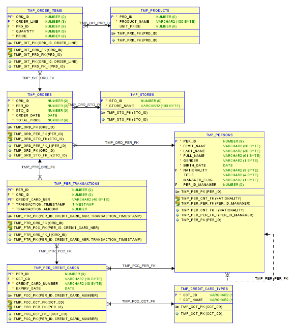
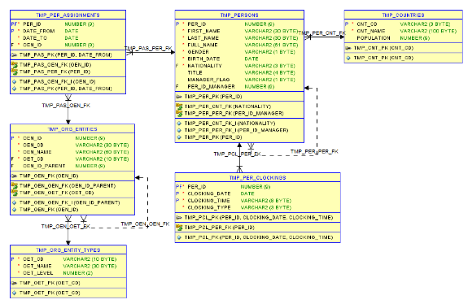
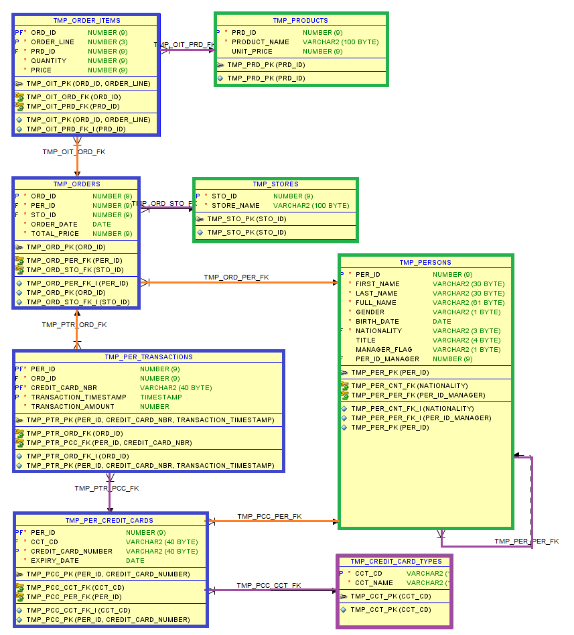
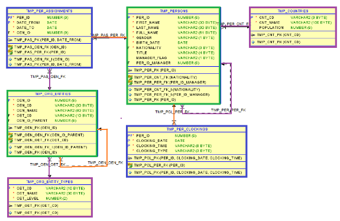
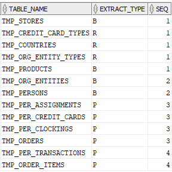
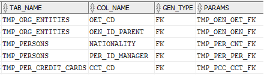
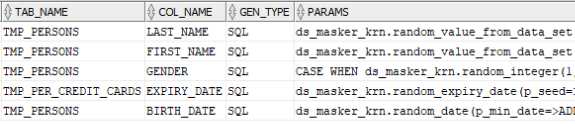
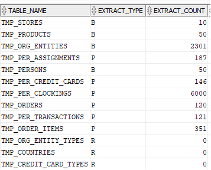
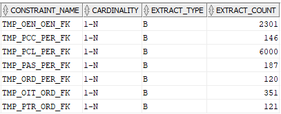
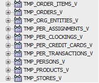

<!-- omit in toc -->
# Data Set Utility - Synthetic Data Generation - User's Guide v24.1

<!-- omit in toc -->
## Author: Philippe Debois (European Commission)

<!-- omit in toc -->
# Table of Contents
- [1. Synthetic Data Generation](#1-synthetic-data-generation)
  - [1.1. Introduction](#11-introduction)
  - [1.2. Overview](#12-overview)
  - [1.3. Properties](#13-properties)
    - [1.3.1. Data set properties](#131-data-set-properties)
    - [1.3.2. Table properties](#132-table-properties)
    - [1.3.3. Table column properties](#133-table-column-properties)
    - [1.3.4. Constraint properties](#134-constraint-properties)
    - [1.3.5. Record properties](#135-record-properties)
  - [1.4. Generation types](#14-generation-types)
    - [1.4.1. SEQ – Sequence](#141-seq--sequence)
    - [1.4.2. FK – Foreign key](#142-fk--foreign-key)
    - [1.4.3. SQL – Expression](#143-sql--expression)
      - [1.4.3.1. Random functions](#1431-random-functions)
      - [1.4.3.2. Reference to other columns](#1432-reference-to-other-columns)
      - [1.4.3.3. Pseudo columns](#1433-pseudo-columns)
  - [1.5. Generation view](#15-generation-view)
  - [1.6. Procedure](#16-procedure)
    - [1.6.1. Get a print-out of your data model](#161-get-a-print-out-of-your-data-model)
    - [1.6.2. Create a data set](#162-create-a-data-set)
    - [1.6.3. Include base tables](#163-include-base-tables)
    - [1.6.4. Include referential constraints](#164-include-referential-constraints)
    - [1.6.5. Review included tables and constraints](#165-review-included-tables-and-constraints)
    - [1.6.6. Insert table columns](#166-insert-table-columns)
    - [1.6.7. Update table properties](#167-update-table-properties)
    - [1.6.8. Update constraint properties](#168-update-constraint-properties)
    - [1.6.9. Update column properties](#169-update-column-properties)
    - [1.6.10. Generate data set](#1610-generate-data-set)
    - [1.6.11. Check statistics](#1611-check-statistics)
    - [1.6.12. Create views](#1612-create-views)
    - [1.6.13. Drop views](#1613-drop-views)
- [2. Tutorial](#2-tutorial)
  - [2.1. Data Model](#21-data-model)
    - [2.1.1. Diagrams](#211-diagrams)
      - [2.1.1.1. Part 1](#2111-part-1)
      - [2.1.1.2. Part 2](#2112-part-2)
    - [2.1.2. Narrative](#212-narrative)
      - [2.1.2.1. Part 1](#2121-part-1)
      - [2.1.2.2. Part 2](#2122-part-2)
    - [2.1.3. Data classification](#213-data-classification)
  - [2.2. Requirements](#22-requirements)
    - [2.2.1. Persons](#221-persons)
    - [2.2.2. Entities](#222-entities)
    - [2.2.3. Person’s assignments](#223-persons-assignments)
    - [2.2.4. Person’s clockings](#224-persons-clockings)
    - [2.2.5. Person’s orders](#225-persons-orders)
    - [2.2.6. Order’s lines](#226-orders-lines)
    - [2.2.7. Products](#227-products)
    - [2.2.8. Stores](#228-stores)
    - [2.2.9. Person’s credit cards](#229-persons-credit-cards)
    - [2.2.10. Person’s transactions](#2210-persons-transactions)
    - [2.2.11. Other requirements](#2211-other-requirements)
  - [2.3. Solution](#23-solution)
    - [2.3.1. Get a print-out of your data model](#231-get-a-print-out-of-your-data-model)
      - [2.3.1.1. Part 1](#2311-part-1)
      - [2.3.1.2. Part 2](#2312-part-2)
    - [2.3.2. Create a data set](#232-create-a-data-set)
    - [2.3.3. Include base tables](#233-include-base-tables)
    - [2.3.4. Include referential constraints](#234-include-referential-constraints)
    - [2.3.5. Review included tables and constraints](#235-review-included-tables-and-constraints)
    - [2.3.6. Insert table columns](#236-insert-table-columns)
    - [2.3.7. Update table properties](#237-update-table-properties)
    - [2.3.8. Update constraint properties](#238-update-constraint-properties)
    - [2.3.9. Update column properties](#239-update-column-properties)
    - [2.3.10. Generate data set](#2310-generate-data-set)
    - [2.3.11. Check statistics](#2311-check-statistics)
    - [2.3.12. Create views](#2312-create-views)
    - [2.3.13. Drop views](#2313-drop-views)
- [3. Annexes](#3-annexes)
  - [3.1. Regular Expressions](#31-regular-expressions)
    - [3.1.1. Metacharacters](#311-metacharacters)
    - [3.1.2. Shorthand character classes](#312-shorthand-character-classes)
    - [3.1.3. Character class ranges](#313-character-class-ranges)
    - [3.1.4. Negated character classes](#314-negated-character-classes)
    - [3.1.5. POSIX character classes](#315-posix-character-classes)
    - [3.1.6. POSIX collating sequences](#316-posix-collating-sequences)
    - [3.1.7. POSIX character equivalent classes](#317-posix-character-equivalent-classes)
    - [3.1.8. Character class subtraction](#318-character-class-subtraction)
    - [3.1.9. Non-capturing groups](#319-non-capturing-groups)

# 1. Synthetic Data Generation

## 1.1. Introduction

Synthetic data generation involves creating artificial data that mimics the statistical properties and patterns of real data. This synthetic data can be used for various purposes, such as testing and development, training machine learning models, and sharing data with third parties, all while safeguarding the privacy and confidentiality of sensitive information.

Synthetic data generation offers some advantages compared to data masking:

- **Preservation of Privacy**: With synthetic data, sensitive information from the original dataset is not exposed at all. Data masking, on the other hand, involves altering the original data to preserve privacy, which can sometimes still carry a risk of re-identification.
- **Statistical Integrity**: Synthetic data is generated to retain the statistical characteristics and patterns of the original data. This ensures that the generated data closely resembles the real data distribution, which can lead to more accurate and robust model training compared to masked data, where the statistical properties may be altered.
- **Data Utility**: Synthetic data can provide a higher level of data utility because it maintains the structure and relationships present in the original dataset. This can lead to more effective testing, model validation, and analysis compared to data masking, where some of these relationships might be distorted.
- **Regulatory Compliance**: Synthetic data can help organisations comply with data protection regulations (such as GDPR) by ensuring that no real personal information is present in the generated dataset. This can simplify compliance efforts compared to data masking, which might require careful management of masked data.
- **Reduced Risk of Insider Threats**: Since synthetic data is artificially generated, there is a reduced risk of insider threats as there is no real sensitive information to be leaked or misused by employees or other insiders.
- **Generalisation**: Synthetic data can help improve the generalisation ability of machine learning models. Models trained on synthetic data may be less prone to over-fitting to the specifics of the original dataset, leading to better performance on new and unseen data.
- **Easier Data Sharing**: Sharing synthetic data with external parties, such as research collaborators or third-party vendors, is often simpler and safer since the risk of exposing real sensitive information is eliminated.

It's important to note that both synthetic data generation and data masking have their own use cases and considerations. The choice between them depends on the specific needs of the organisation, the nature of the data, and the intended use of the generated or masked data.

Synthetic data generation and data masking can also be complementary approaches, and they are often used in conjunction to enhance data privacy and utility.

Here's how they can work together:

- **Enhancing Masked Data**: Synthetic data can be used to enrich masked datasets. While data masking helps protect sensitive information in the original dataset, it might also distort some of the statistical properties or relationships in the data. Synthetic data can be generated to fill in the gaps, ensuring that the masked dataset still retains its original statistical integrity and relationships.
- **Augmenting Small Datasets**: In cases where the original dataset is small, synthetic data can be generated to augment the dataset before applying masking techniques. This can help improve the utility of the masked data, as well as ensure that any machine learning models trained on it have sufficient examples to generalize well.
- **Simulating Rare Events**: Synthetic data can be used to simulate rare or extreme events that might be present in the original dataset but are unlikely to be captured in the masked data. This can help ensure that models trained on masked data are robust enough to handle such events.
- **Third-Party Sharing**: When sharing data with third parties, synthetic data can be provided alongside masked data. This allows the recipient to work with data that maintains the original data distribution while having no access to the real sensitive information.
- **Balancing Utility and Privacy**: In some cases, data masking might overly compromise data utility. Synthetic data can be introduced to strike a better balance between preserving privacy and maintaining the usefulness of the data.
- **Testing and Development**: Synthetic data can be valuable for testing and development purposes where realistic data is required. By combining masked and synthetic data, developers and testers can work with data that closely resembles the original while still being privacy compliant.

It's important to carefully consider the specific goals, risks, and requirements of your data privacy strategy when deciding how to combine synthetic data generation and data masking. The aim is to achieve a balance between data privacy, data utility, and regulatory compliance.

## 1.2. Overview

The main steps for defining and generating a synthetic data set are the following:

- Create a data set of type `GEN` (which stands for generation).
- Identify the base (=driving) tables, usually the ones that contain your master data (i.e., data that are referenced by transactional data like clients, products, stores, etc.).
- Identify the master/detail foreign keys (one-to-many relationships) that must be successively followed to generate child records from parent records, starting from base tables.
- Identify the referential constraints (many-to-one relationships) that must be enforced.
- For each table, define how the values of its columns must be generated.
- Review all table, column, and constraint properties and adapt them as needed.
- Generate the data set following the process described below.
- Create ad-hoc views to check generated records.

The process for generating the data set is the following:

- Define the walk-through strategy i.e., based on table dependencies, identify the order in which tables must be generated (this allows to avoid disabling referential constraints).
- First, generate records in base (i.e., driving and reference) tables.
- Second, recursively generate records in child tables (following parent/child relationships).
- For hierarchic tables, first generate root records, then lower-level records down to leaves.
- For recursive many-to-one relationships, generate their values in a second iteration.
- Register the `ROWID` of all generated records to remind which ones are part of the data set.

Column values can be generated in one of the following ways:

- From an Oracle sequence
- From a SQL expression
- From a foreign key table

## 1.3. Properties

This section describes the data set, table, column, and constraint properties that are used for synthetic data generation.

### 1.3.1. Data set properties

The following properties are used for synthetic data generation:

|**Property**|**Description**|
| - | - |
|SET_NAME|Name of the data set.|
|SET_TYPE|Type of the data set; must be set to GEN for data generation.|

***Table 1 - Data set properties***

### 1.3.2. Table properties

The following properties are used for synthetic data generation:

|**Property**|**Description**|
| - | - |
|TABLE_NAME|Name of the table.|
|EXTRACT_TYPE<sup>(\*)</sup>|B)ase (for driving tables), P)artial (for child tables) or R)eference (for reference tables whose content is not generated).|
|EXTRACT_COUNT<sup>(\*)</sup>|Number of generated records (statistics reported by the tool).|
|ROW_COUNT|Number of records to be generated in this table.|
|SEQ|Order of processing determined (by the tool) from table dependencies.|
|TAB_SEQ|Sub-order of processing (user-defined) to prioritize SEQ ex-aequo.|
|BATCH_SIZE|Number of records to be inserted/updated in a once (bulk DMLs), for performance reason, 1000 records by default.|
|GEN_VIEW_NAME|Name of the view used to generate records (instead of using the dual view).|
|PRE_GEN_CODE|PL/SQL code to be executed before the generation of records in this table.|
|POST_GEN_CODE|PL/SQL code to be executed after the generation of records in this table (e.g., to compute denormalised fields).|

***Table 2 - Table properties***

<sup>(\*)</sup> **Note**: synthetic data generation reuses columns created for sub-setting (extraction), reason why the name is misleading; "extraction" should be read "generation" for `GEN` data sets.

### 1.3.3. Table column properties

The following properties are used for synthetic data generation:

|**Property**|**Description**|
| - | - |
|TABLE_ID|Unique id of the table.|
|TAB_NAME|Table name (denormalised).|
|COL_NAME|Column name.|
|COL_SEQ|Column sequence (order of processing).|
|GEN_TYPE|Type of generation; allowed values are: SEQ for Sequence, SQL for SQL expression, FK for Foreign Key.|
|PARAMS|Generation parameters (sequence name, SQL expression, or FK name).|
|NULL_VALUE_PCT|Percentage of NULL values to generate (for optional columns only).|
|NULL_VALUE_CONDITION|Condition under which a NULL value must be generated (for optional columns only).|

***Table 3 - Table column properties***

### 1.3.4. Constraint properties

The following properties are used for synthetic data generation:

|**Property**|**Description**|
| - | - |
|CONSTRAINT_NAME|Name of the FK.|
|SRC_TABLE_NAME|Name of the table owning the FK (many side).|
|TGT_TABLE_NAME|Name of the referenced table (one side).|
|CARDINALITY|Direction of the constraint (1-N or N-1).|
|EXTRACT_TYPE<sup>(\*)</sup>|Ttype of generation (B for 1-N, P for N-1, N for “Not to be used”).|
|EXTRACT_COUNT<sup>(\*)</sup>|Number of records generated via this FK (system statistic).|
|MIN_ROWS|Minimum number of child records to be generated per parent.|
|MAX_ROWS|Maximum number of child records to be generated per parent.|
|LEVEL_COUNT|Number of levels to be generated in hierarchies (recursive FK).|
|WHERE_CLAUSE|Filter applied to target table (for N-1 constraints only).|
|CON_SEQ|Order of processing (user-defined) between all constraints of the table.|
|GEN_VIEW_NAME|Name of the view used to generate records via this FK (instead of using the dual view).|
|PRE_GEN_CODE|PL/SQL code to be executed before the generation of records via this FK.|
|POST_GEN_CODE|PL/SQL code to be executed after the generation of records via this FK (e.g., to compute denormalised fields)|
|SRC_FILTER|Filter applied to source table (for 1-N and recursive N-1 constraints).|

***Table 4 - Constraint properties***

<sup>(\*)</sup> **Note**: synthetic data generation reuses columns created for sub-setting (extraction), reason why the name is misleading; "extraction" should be read "generation" for `GEN` data sets.

### 1.3.5. Record properties

The following record properties are set by the tool for all generated records:

|**Property**|**Description**|
| - | - |
|TABLE_ID|Unique identifier (for internal use).|
|RECORD_ROWID|ROWID of the generated record.|
|SEQ|Sequential number of the generated record.|
|PASS_COUNT|Level in the hierarchy of the generated record.|

***Table 5 - Record properties***

## 1.4. Generation types

The following generation types define how column values are generated:

|**Generation type**|**Description**|
| - | - |
|SEQ|ORACLE Sequence|
|SQL|SQL Expression|
|FK|Foreign key|

***Table 6 - Generation types***

When creating table columns, the tool can determine whether a column is involved in a foreign key but nothing more. However, if a sensitive data discover process was launched on the schema beforehand, the tool is capable of reusing SQL expressions (but only those that generate random values).

In any case, default column settings must be revised and complemented where necessary.

### 1.4.1. SEQ – Sequence

To generate a value based on an Oracle sequence, set:

- `GEN_TYPE` to `SEQ`.
- `PARAMS` to the name of the sequence.

### 1.4.2. FK – Foreign key

For fields that are involved in a foreign key, the following settings is generated:

- `GEN_TYPE` is set to `FK`.
- `PARAMS` is set to the name of the foreign key.

These default values can be overwritten by end-user when necessary, meaning that the foreign key will no more be used to generate the column value. This can be used e.g., to generate non-uniform distribution or if you want to define some conditional logic (based on a SQL expression).

A condition can be specified on the foreign key to restrict the set of records that can be referenced (see `WHERE_CLAUSE` on `CONSTRAINTS`).

If the referenced or foreign table is not part of the data set (`EXTRACT_TYPE = 'R'`), any existing record can be selected at random. If the referenced table is part of the data set (`extract_type = 'B' OR 'P'`), only records generated in the current data set can be selected at random.

For each foreign key, all column values of the referenced record selected at random are available and can be used in a SQL expression using the following syntax:

`RECORD <foreign_key_name>.<field> `

### 1.4.3. SQL – Expression

To generate a value based on a SQL expression, set:

- `GEN_TYPE` to `SQL`.
- `PARAMS` to the SQL expression.

The SQL must be any expression that is valid when executed against the dual view.

**Warning**: syntax is not checked when the SQL expression is defined; any invalid syntax will result in an exception raised at runtime; it his therefore strongly advised to test the SQL expression before defining it.

#### 1.4.3.1. Random functions

The tool comes with a library of random functions (provided through the `DS_MASKER_KRN` package). Here follows a short description of available random functions:

|**Function**|**Purpose**|
| - | - |
|random_value|As dbms_random.value but with a seed.|
|random_integer|Returns a random integer within a given range.|
|random_value_from_regexp|Returns a value that matches a given regular expression.|
|random_string|Returns a random string whose length is within a given range; case may be specified.|
|random_name|Returns a random name whose length is within a given range; case may be specified.|
|random_number|Returns a random number with a given precision and scale.|
|random_date|Returns a random date within a given range.|
|random_time|Returns a random date and time within a given date range and time range.|
|random_expiry_date|Returns a valid random credit card expiry date in the future within a given months range.|
|random_value_from_table|Returns a column value of a random row from a database table, with a uniform distribution.|
|random_value_from_data_set|Returns a random value from a data set with a uniform distribution or user-defined distribution (based on a column of weights).|
|random_number_with_mod97|Returns a valid random number with a modulo 97 checksum.|
|random_bban|Returns a valid random basic bank account number for a given country and format.|
|random_credit_card_number|Returns a valid random credit card number for a given prefix (card issuer) and format.|
|random_ip_v4|Returns a random IP v4 internet address.|
|random_ip_v6|Returns a random IP v6 address.|
|random_value_from_list|Returns a random value from a list of hardcoded values with a uniform distribution or user-defined distribution (based on a list of weights).|
|random_company_name|Returns a random company name made up of 4 components (a prefix, an adjective, a name, and a suffix).|

***Table 7 - Random functions***

All functions accept a `P_SEED` parameter that can be passed to make the function deterministic (the same value is always returned for the same set of input values).

For the function returning a random value from a (hardcoded) list of values, a list of corresponding weights can be specified to generate a specific (non-uniform) statistical distribution.

For the function returning a random value from a data set, the name of a column containing weights can be specified to generate a specific (non-uniform) statistical distribution.

The following data set are provided by default:

|**Data set**|**Purpose**|
| - | - |
|EU6_FAMILY_NAMES_217|Most common family name in EU6 (Germany, France, Italy, Netherlands, Belgium, Luxembourg).|
|EU_MAJOR_CITIES_590|Major European cities.|
|INT_COUNTRIES_250|Countries (worldwide).|
|INT_CURRENCIES_170|Currencies (worldwide).|
|INT_GIVEN_NAMES_250|Most common given names (worldwide).|
|EU_COUNTRIES_27|27 Member states of the EU.|
|COLORS|A list of 147 colours.|
|OBJECTS|A list of 200 common objects.|
|FOOD|A list of 162 fruits, vegetables, or seafood.|

***Table 8 - Provided data sets***

You can easily create your own.

The function that generates a value compliant with a given regular expression is described more in detail in section [3.1. Regular Expressions](#31-regular-expressions).

#### 1.4.3.2. Reference to other columns

A SQL expression may reference generated values of other columns of the same table by prefixing their name with a colon i.e., using the following syntax:

`:<column_name>`

This is useful to build the value of denormalised columns. As an example, `FULL_NAME`, which is the concatenation of `FIRST_NAME` and `LAST_NAME`, can be generated with the following SQL expression:

`:FIRST_NAME || ’ ’ || :LAST_NAME`

**Warning**: if the referenced column value is generated using a random function, a `SEED` parameter must be passed to make the result deterministic! The value of the denormalised column will otherwise be incorrect.

**Warning**: no direct or indirect loop in the column dependencies is allowed (e.g., A references B, B references C, and C references A => loop => error).

#### 1.4.3.3. Pseudo columns

The following pseudo-columns can be used in a SQL expression:

|**Pseudo-column**|**Description**|
| - | - |
|LAG <col_name>|The column value of the previously generated record of the current table; this is the syntax used in analytic functions to reference a previous record.|
|RECORD <fk_name>.<col_name>|The column value of the record selected at random for the given foreign key; can also be used to access other records of the generated PL/SQL block (e.g., src (parent record), tgt (child record), lag (previous record), gen (generation view)).|
|SOURCE <col_name>|Column value of the source/parent/master record.|
|PARENT <col_name>|Synonym of SOURCE in the context of a parent/child relationship.|
|MASTER <col_name>|Synonym of SOURCE in the context of a master/detail relationship.|
|PRIOR <col_name>|Synonym of SOURCE in the context of a hierarchical relationship. (same syntax as in CONNECT BY).|
|LEVEL|The level being currently generated in a hierarchy (starting from 1; same syntax as in CONNECT BY).|
|ROWNUM|The sequence number of the records currently generated (starting from 1; standard SQL syntax).|
|ROWCOUNT|The total number of records that will be generated while processing a table or a constraint; this is not available (i.e., NULL) if a generation view that returns a random number of records is used instead of the dual view.|
|SEED|A seed value that can be passed in parameter to random functions to make them deterministic.|

***Table 9 - Pseudo-columns***

## 1.5. Generation view

Records are generated via the following query which returns the desired number of records:

`SELECT * FROM dual CONNECT BY LEVEL <= <row-count>`

For some specific use cases (e.g., to generate historic tables), it is easier to encapsulate the complexity into a view that is used to generate the records. The tool offers the possibility to define a generation view for tables and constraints (see `GEN_VIEW` property) that can be used instead of the above query on dual.

There is one pre-requisite: the view must contain at least one column named ROW# which returns a sequential number for each record (like `ROWNUM`). It is mainly used to limit the number of records fetched when necessary and for sorting. It also gives its value to the `ROWNUM` pseudo column.

The view can contain any other column that can be referenced in a SQL expression via the following syntax:

`RECORD gen.<column_name>`

A randomisation of the number of returned records can be implemented in the generation view itself or not (at your discretion).

## 1.6. Procedure

The following steps must be repeated for each data set that you want to generate (e.g., one per test case). All procedures referenced below belong to the `DS_UTILITY_KRN` package and should therefore been prefixed by this package when invoked. Also, they all accept a `P_SET_ID` parameter that identifies the data set being worked on.

### 1.6.1. Get a print-out of your data model

Having a print-out of your ERD or relational data model at hand will help a lot to identify the tables for which you want to generate content as well as which parent/child or master/detail relationships you want to follow.

### 1.6.2. Create a data set

Create a data set of type `GEN` by calling the `create_or_replace_data_set_def()` procedure or function. Data sets are identified by a name that must be unique.

### 1.6.3. Include base tables

Identify the base tables i.e., the table whose content must be generated first, usually:

- Reference tables (i.e., tables that do not depend on any other)
- Master tables (containing master data i.e., data that transactional data reference)

Include those tables in the data set by calling the `include_tables()` procedure with the following parameters:

- `p_extract_type => 'B'`: base table (driving the process)
- `p_recursive_level => <integer>`: number of levels to search to find detail tables through master/detail (one-to-many) relationships; not applicable to reference tables!

Don’t include in the data set tables for which the content must not be generated (e.g., reference tables with predefined content)!

### 1.6.4. Include referential constraints

Include in the data set referential constraints (many-to-one relationships) for all tables that are part of the data set by calling the `include_referential_cons()` procedure with the following parameters:

- `p_extract_type => 'R'`: referenced table

Tables referenced by these foreign keys that are not part of the data set yet will be added with an extract type R, indicating that their records will be referenced but not generated.

Note that one foreign key may generate 2 constraints, once for each direction (one 1-N, one N-1), that may have different properties (you may want a constraint to be used in one direction but not in the other one).

### 1.6.5. Review included tables and constraints

Check tables and constraints that have been included in the data set so far by querying the `DS_TABLES` and `DS_CONSTRAINTS` internal tables for your data set. Make sure their EXTRACT_TYPE is correct. Identify any missing table and iterate as necessary.

### 1.6.6. Insert table columns

Call the `include_table_columns()` procedure to generate the columns of all tables in your data set. Default properties will be generated for columns involved in a foreign key and for columns identified as sensitive during a previous sensitive data discovery run. You will have to explicitly define the properties of other columns.

When invoked several times, this procedure does not modify or overwrite existing data. It only adds missing columns if any.

### 1.6.7. Update table properties

Review table properties by querying the `DS_TABLES` internal table and adapt them as necessary by calling the` update_table_properties()` procedure. Only specify in parameters the properties that need to be modified.

The following properties may need to be changed:

- `ROW_COUNT`: the number of records that you want to generate (applicable to base tables only); for tables that have a recursive foreign key representing a hierarchy, this number must correspond to the number of root records (one for a tree, several for a forest).
- `TAB_SEQ`: some situations require to process one table before another; for tables having the same order of processing (computed based on table dependencies and indicated by the `SEQ` property), you can force one table to be processed before another by setting their `TAB_SEQ` property (kind of sub-order).
- `PRE_GEN_CODE`: PL/SQL code to execute before generating base records in this table.
- `POST_GEN_CODE`: PL/SQL code to execute after generating base records in this table.
- `BATCH_SIZE`: batch size when bulk inserting/updating this table.

### 1.6.8. Update constraint properties

Review constraint properties by querying the `DS_CONSTRAINTS` internal table and adapt them as necessary by calling the `update_constraint_properties()` procedure. Only specify in parameters the properties that need to be modified.

**Warning**: don’t forget to indicate the direction of the constraint that you want to modify by specifying its cardinality parameter (1-N or N-1)!

The following properties may need to be changed:

- `EXTRACT_TYPE`: type of generation; may need to be reset to N to ignore one specific direction of a constraint; as an example, for referential constraints, the N-1 direction is used while the 1-N direction must usually be ignored (a reference table does not have child records so generating them would be a mistake).
- `GEN_VIEW`: the name of a view that must be used to generate records instead of a hierarchical (connect by) query on the dual view.
- `MIN_ROWS`: minimum number of rows to generate (0 by default); applicable to 1-N only.
- `MAX_ROWS`: maximum number of rows to generate (= minimum by default); applicable to 1-N only.
- `LEVEL_COUNT`: number of levels to generate in the hierarchy (applicable to 1-N recursive foreign keys)
- `WHERE_CLAUSE`: to filter the records that can be referenced (applicable to N-1 only).
- `PRE_GEN_CODE`: PL/SQL code to execute before generating records via this constraint.
- `POST_GEN_CODE`: PL/SQL code to execute after generating records via this constraint; may be useful to compute denormalised fields.
- `SRC_FILTER`: to filter source records for 1-N or N-1 relationships.
- `BATCH_SIZE`: batch size when bulk fetching FK records (N-1 relationship).

### 1.6.9. Update column properties

Review column properties by querying the `DS_TAB_COLUMNS` internal table and adapt them as necessary by calling the` update_table_column_properties()` procedure. Only specify in parameters the properties that need to be modified.

The following properties may need to be changed:

- `GEN_TYPE`: type of generation (`SEQ`, `SQL`, `FK`).
- `PARAMS`: parameters (sequence name, SQL expression, foreign key name).
- `NULL_VALUE_PCT`: percentage of `NULL` value to generate (optional columns only).
- `NULL_VALUE_CONDITION`: condition under which a `NULL` value is generated (optional columns only); this expression may contain reference to other columns and/or pseudo-columns.

To use simple quotes within your SQL expression, it is recommended to use quoted strings like:

`q'#This is a 'quoted' string #'`

**Note**: all mandatory fields must have an expression that is obviously not evaluated to `NULL`; if a field is derived and cannot be computed immediately, a temporary default value must be defined.

For fields that are referenced by others, make sure to use a `SEED` when calling a random function (the `SEED` pseudo-column provides a seed value for you).

### 1.6.10. Generate data set

Generate records in the tables of the data set by calling the `generate_data_set()` procedure. When the `P_COMMIT` optional parameter is set to `TRUE`, a `COMMIT` is performed at the end.

This procedure performs the following:

1) Delete records generated in the data set by a previous run if any; these records can be identified via their `ROWID` registered in the `DS_RECORDS` table; delete records from this latest table as well.
1) Reset statistics (`EXTRACT_COUNT` in `DS_TABLES` and `DS_CONSTRAINTS`).
1) Define the walk-through strategy (i.e., determine the order in which tables must be populated).
1) For each base table (in the above order), generate records.
1) For those having a recursive foreign key, update records with a random key in a second iteration.
1) For each parent/master table, generate records in the child/detail/foreign table via the one-to-many relationship.
1) Commit the transaction if requested.

For steps 4, 5 and 6, a separate PL/SQL block is generated and executed (one per table). Any syntax error made in one of your SQL expressions will result in an exception being raised. For an easy debugging, it is possible to request not to execute the code (test mode) and generate it in `DBMS_OUTPUT`, then execute it yourself manually, step by step.

To proceed, enable `DBMS_OUTPUT` and execute the following code:

```sql
exec ds_utility_krn.set_message_filter('ES');
exec ds_utility_krn.set_test_mode(TRUE);
exec ds_utility_krn.generate_data_set(…);
exec ds_utility_krn.set_message_filter('E');
exec ds_utility_krn.set_test_mode(FALSE);
```

Message filter S means: send SQL statements to `DBMS_OUTPUT`.

### 1.6.11. Check statistics

check the statistics to see how many records have been generated for each table and for each master/detail relationship. To proceed, select the `EXTRACT_COUNT` from `DS_TABLES` and `DS_CONSTRAINTS` internal tables.

### 1.6.12. Create views

Create views on the tables of your data set to check that records have been generated according to your specifications. To proceed, invoke the `create_views()` procedure and specify a suffix for your views (e.g., ‘`_v`’) via the `p_view_suffix` parameter. You can also request not to create views for empty tables via the `p_non_empty_only` parameter.

These views only show the records that have been generated in the current data set.

### 1.6.13. Drop views

To terminate, drop the views by invoking the `drop_views()` procedure, with the same parameters as those passed to `create_views()`.

# 2. Tutorial

## 2.1. Data Model

This section explains the data model that is used in the tutorial of the synthetic data generation tool. Although it is not the data model of a real application, it is sufficiently realistic and complex to demonstrate the challenges that data generation tools are facing. All database objects has a TMP prefix that is omitted in this document for the sake of its conciseness.

### 2.1.1. Diagrams

The data model is split into two diagrams to fit the document.

#### 2.1.1.1. Part 1



***Figure 1- Data Model - Part 1***

#### 2.1.1.2. Part 2



***Figure 2- Data Model - Part 2***

### 2.1.2. Narrative

#### 2.1.2.1. Part 1

A `PERSON` may own one or several `CREDIT_CARDS` that are of a given `CREDIT_CARD_TYPE` (MasterCard, Visa, etc.). A `PERSON` may place `ORDERS` in `STORES`. `ORDERS` are made up of (at least) one or several `ORDER_ITEMS` or lines, one per ordered `PRODUCT`. A `PERSON` who placed `ORDERS` may pay them in one or several `TRANSACTIONS` using its `CREDIT_CARDS`.

#### 2.1.2.2. Part 2

A `PERSON` has a nationality (link to `COUNTRY`). A `PERSON` may be a manager or a staff. A staff is supervised by one manager and a manager may supervise several staff (recursive relationship). `CLOCKINGS` of `PERSONS` coming in and out of the office are registered. `PERSONS` are assigned to `ENTITIES` and a history of their `ASSIGNMENTS` is kept. `ENTITIES` are organised in a hierarchy (recursive relationship). `ENTITIES` have an `ENTITY_TYPE` (Institution, Directorate General, Directorate, Unit, or Sector) that reflects their level in the hierarchy.

### 2.1.3. Data classification

**Reference data** (also known as static data, are values or codes that provide context or categorisation for other data; they are relatively stable over time and doesn't change frequently).

In our data model: `COUNTRIES`, `ENTITY_TYPES`, `CREDIT_CARD_TYPES`.

**Master data** (also referred to as core data, represents the foundational and critical business entities that are shared across an organisation; they are relatively stable but can change over time).

In our data model: `PERSONS`, `ORG_ENTITIES`, `PER_CREDIT_CARDS`, `PRODUCTS`, `STORES`.

**Transactional data** (records of day-to-day business activities and operations; they represent the individual transactions or events that occur within an organisation; they are highly dynamic and frequently changing).

In our data model: `PER_ASSIGNMENTS`, `PER_CLOCKINGS`, `ORDERS`, `ORDER_ITEMS`, `PER_TRANSACTIONS`.

## 2.2. Requirements

Although shown on the data model, the following (pre-filled) reference tables are not generated and therefore not part of the generated data set: `ENTITY_TYPES`, `CREDIT_CARD_TYPES`, and `COUNTRIES`.

### 2.2.1. Persons

`PERSONS` is the driving table of the data generation.

`PER_ID` is the unique identifier of a `PERSON`; it must be generated using an Oracle sequence (`PER_SEQ`).

`GENDER` must be `M` for Male or `F` for Female, generated at random with a uniform distribution.

`FIRST_NAME` must be realistic (e.g., generated from a list of most common first names) and must be coherent with `GENDER`.

`LAST_NAME` must be realistic (e.g., generated from a list of most common last names).

`FULL_NAME` is the concatenation of `FIRST_NAME` and `LAST_NAME` (denormalised column).

`BIRTH_DATE` must be generated at random in such a way that person’s current age is between 21 and 65 (active staff).

`NATIONALITY` must be selected at random from `COUNTRIES` (containing EU member states) following a non-uniform distribution based on its `POPULATION`.

`TITLE` (which is optional and missing in 20% of the cases) depends on `GENDER` (e.g., Mr for Male, Mrs or Miss for Female).

`MANAGER_FLAG` must be set to Y for 10% of the staff.

For non-management staff, `PER_ID_MANAGER` must reference a manager (a person identified as such via the above flag). To keep it simple, managers do not have a manager.

### 2.2.2. Entities

Organisational entities (or `ENTITIES` to keep it short) are organised in a hierarchy (via a recursive relationship) to form the organisation chart. Each level corresponds to an `ENTITY TYPE` that reflects the way EU institutions are organised (usually: Institution, Directorate General, Directorate, Unit and Sector).

The organisation chart must be generated for a certain number of institutions (so it is not a tree but rather a forest) and a given number of levels. The number of sub-entities of each entity (i.e., siblings) must be generated at random between a certain range of numbers.

`OEN_ID` is the unique identifier of an `ENTITY`; it must be generated using an Oracle sequence (`OEN_SEQ`).

Entity acronym or code (`OEN_CD`) must be generated at random following a format that depends on its level (e.g., 1/ EC, 2/ DIGIT, 3/ DIGIT.B, 4/ DIGIT.B.4, 5/ DIGIT.B.4.004). As of level 3, the acronym of an entity is prefixed with the one of its parent.

`NAME` must be generated randomly while still being meaningful.

Entity type (`OEN_CD`) must be selected from `ORG_ENTITY_TYPES` depending on its level (from 1 to 5) in the hierarchy.

Each entity must be linked to its parent entity via `OEN_ID_PARENT`.

### 2.2.3. Person’s assignments

A `PERSON` may be assigned during its career to one or several entities (of any type). The history of its assignments is registered in `PER_ASSIGNMENTS`.

A history must be made up of random number of periods (date ranges), starting from a given date in the past, each period having a random duration.

`DATE_FROM` must be set to the start date of the assignment period.

`DATE_TO` must be set to the end date of the assignment period (not included).

Assignment periods must be consecutive (no hole) i.e., `DATE_FROM` of a period must be equal to `DATE_TO` of the previous period (except for the first one).

For active staff, last period must be opened i.e., `DATE_TO` must be set to 31/12/9999. This rule does not apply to retired staff or staff who left the company.

`PER_ID` and `OEN_ID` are foreign keys to respectively `PERSONS` and `ENTITIES`.

### 2.2.4. Person’s clockings

Clockings of persons coming in and out of the office on working days (so weekend excluded) are registered in `CLOCKINGS`. Normally, 4 clockings are registered per day and per person (1/ arrival in the office, 2/ departure for lunch, 3/ return from lunch, 4/ back to home). No clocking is normally allowed during morning and afternoon core time periods (but exceptions may occur).

`CLOCKING_DATE` is the date of the clocking.

`CLOCKING_TIME` is the clocking time.

`CLOCKING_TIME` must be `IN` or `OUT`.

`PER_ID` is the foreign key towards `PERSONS`.

### 2.2.5. Person’s orders

A `PERSON` may place one or several `ORDERS`.

`ORD_ID` is the unique identifier of an order; it must be generated using an Oracle sequence (`ORD_SEQ`).

`PER_ID` and `STO_ID` are foreign keys to respectively `PERSONS` and `STORES`.

`ORDER_DATE` is the date of the order; it must be generated at random in the past (<= current date).

`TOTAL_PRICE` is the price of the order; it must be equal to the sum of `PRICE` of its `ORDER_LINES`.

### 2.2.6. Order’s lines

An `ORDER` must have at least one `ORDER_LINE` but it may have more.

`ORD_ID` and `PRD_ID` are foreign keys to respectively `ORDERS` and `PRODUCTS`.

`ORDER_LINE` is a sequential number starting with 1 (sequence within parent).

`QUANTITY` must be a random number greater or equal to 1.

`PRICE` must be equal to the ordered quantity multiplied by the unit price of the `PRODUCT`.

An `ORDER_LINE` is uniquely identified by its `ORD_ID` and `ORDER_LINE`.

### 2.2.7. Products

`PRODUCTS` is a master table that must be entirely generated.

`PRD_ID` is the unique identifier of the `PRODUCT`; it must be generated using an Oracle sequence (`PRD_SEQ`).

`PRODUCT_NAME` must be generated at random while still being meaningful (e.g., can be generated from a list of objects).

`UNIT_PRICE` is an integer >=1 that must be generated at random.

### 2.2.8. Stores

`STORES` is a master table that must be entirely generated.

`STO_ID` is the unique identifier of the `STORE`; it must be generated using an Oracle sequence (`STO_SEQ`).

`STORE_NAME` must be generated at random while still being meaningful.

### 2.2.9. Person’s credit cards

A `PERSON` may have one or several `CREDIT_CARDS` that are of a given `CREDIT_CARD_TYPE` (MasterCard, Visa, etc.).

`PER_ID` and `CCT_CD` are foreign keys to respectively `PERSONS` and `CREDIT_CARD_TYPES`.

`CREDIT_CARD_NUMBER` must be generated valid (i.e., its checksum must be correct); its first digit(s) must be equal to those specified by its `CREDIT_CARD_TYPE` (e.g., 5 for MasterCard, 4 for Visa, etc.).

`EXPIRY_DATE` must be generated as a date in the future and must be valid (last day of a month).

### 2.2.10. Person’s transactions

A `PERSON` placing an `ORDER` may pay via one or two credit card `TRANSACTIONS`. An order may be fully paid via a single transaction or may be paid in two transactions (e.g., 30% when placing the order, remaining i.e., 70% upon delivery or receipt).

`PER_ID` and `ORD_ID`, `CREDIT_CARD_NBR` are foreign keys to respectively `PERSONS` and `TRANSACTIONS`.

`TRANSACTION_TIMESTAMP` (date and time) must be equal or posterior to the date of the related `ORDER`.

The sum of `TRANSACTION AMOUNT` must be equal to the `TOTAL_PRICE` of the related `ORDER`.

Inclusion constraint: credit cards used in a transaction must belong to the person that placed the order.

### 2.2.11. Other requirements

The figures given above are just examples; they must be configurable.

For master tables (`PERSONS`, `ENTITIES`, `STORES` and `PRODUCTS`), a fixed number of records to generate must be specified.

For master/detail relationships, a minimum and maximum number of detail records to generate per master must be specified.

For recursive one-to-many relationships (e.g., from `ENTITIES` to `ENTITIES`), the number of levels to generate in the hierarchy must be specified.

For foreign keys (many-to-one relationships), an optional condition that must be fulfilled may be specified (e.g., the supervisor of a staff must have its `MANAGER_FLAG` equal to `Y`).

It is up to the tool to determine the order in which tables and relationships must be processed, based on their dependencies. It may however be necessary to decide, when 2 tables have the same priority, which one must be generated first (e.g., `ORDER_ITEMS` before `TRANSACTIONS`).

Some tables may require several rounds of processing. As an example, `ORDERS` must be created before `ORDER_LINES` (to ensure referential integrity) but the `TOTAL_PRICE` of an `ORDER` cannot be computed before the generation of `ORDER_ITEMS`. So, the `TOTAL_PRICE` must be updated as a second step.

For tables implementing an intersection entity (`ASSIGNMENTS`, `ORDER_ITEMS`), only one of their two master/detail relationships may be used to drive their generation. As an example, for `ORDER_ITEMS`, `ORDERS` should be driving, not `PRODUCTS`.

For tables that are part of the current data set, only records generated in this context can be referenced by other generated records. In other words, records generated by other data sets cannot be referenced. Pre-existing records (e.g., in reference tables) that are not part of the current data set can be referenced without any restriction.

## 2.3. Solution

This section describes how the data set is created and configured to generate the data according to the requirements described in the previous section. The steps followed are those described in section [1.6. Procedure](#16-procedure).

You will find the tutorial files is in the following directory: `tutorial\scripts`.

|**File**|**Description**|
| - | - |
|`ds_fake_data_gen_model.sql`|Script to create the data model.|
|`ds_fake_data_gen_dataset.sql`|Script to generate the data set.|

### 2.3.1. Get a print-out of your data model

Execute the script ds_fake_data_gen_model.sql to create the tutorial database objects.

Here follows the same diagrams as in section [2.1.1. Diagrams](#211-diagrams) but with some colours added with the following conventions:

|**Colour**|**Meaning**|
| - | - |
|Green tables|Base tables (driving the generation).|
|Blue tables|Child/detail tables.|
|Purple tables|Reference tables (content not generated).|
|Orange foreign keys|One-to-many relationships used to generate child/detail records from parent/master ones.|
|Purple foreign keys|Many-to-one relationships used to ensure referential integrity.|

#### 2.3.1.1. Part 1



***Figure 3 - Coloured Data Model - Part 1***

#### 2.3.1.2. Part 2



***Figure 4 - Coloured Data Model - Part 2***

### 2.3.2. Create a data set

A data set named `DS_GEN_TUTORIAL` of type `GEN` is created as follows:

```sql
exec ds_utility_krn.create_or_replace_data_set_def(p_set_name=>'DS_GEN_TUTORIAL', p_set_type=>'GEN');
select * from ds_data_sets where set_name='DS_GEN_TUTORIAL';
```

### 2.3.3. Include base tables

Reference tables and master tables that drive the generation must be populated first. They are highlighted in green on the diagrams. To proceed, execute the following code:

```sql
exec ds_utility_krn.include_tables(p_set_id=>ds_utility_krn.get_data_set_def_by_name('DS_GEN_TUTORIAL'),p_table_name=>'TMP_STORES',p_extract_type=>'B');
exec ds_utility_krn.include_tables(p_set_id=>ds_utility_krn.get_data_set_def_by_name('DS_GEN_TUTORIAL'),p_table_name=>'TMP_PRODUCTS',p_extract_type=>'B');
exec ds_utility_krn.include_tables(p_set_id=>ds_utility_krn.get_data_set_def_by_name('DS_GEN_TUTORIAL'),p_table_name=>'TMP_ORG_ENTITIES',p_recursive_level=>1,p_extract_type=>'B');
exec ds_utility_krn.include_tables(p_set_id=>ds_utility_krn.get_data_set_def_by_name('DS_GEN_TUTORIAL'),p_table_name=>'TMP_PERSONS', p_recursive_level=>3,p_extract_type=>'B');
```

For tables that have a master/detail relationship with other tables (`PERSONS` and `ORG_ENTITIES`), the `p_recursive_level` parameter is used to include them recursively.

As a result, all child/detail tables highlighted in blue will be included in the data set (with an `extract_type` set to `P`, i.e., they are not driving the process), as well as the 1-N constraints highlighted in orange.

### 2.3.4. Include referential constraints

To ensure referential integrity, many-to-one (N-1) foreign keys or constraints (those highlighted in purple) must also be included by executing the following code:

```sql
exec ds_utility_krn.include_referential_cons(p_set_id=>ds_utility_krn.get_data_set_def_by_name('DS_GEN_TUTORIAL'),p_extract_type=>'R');
```

Referenced tables not already in the data set will get an extract type R meaning that their content will not be generated. They are highlighted in purple on the diagrams.

### 2.3.5. Review included tables and constraints

Check tables and constraints now included in the data set and their `extract_type` with the following code:

```sql
select * from ds_tables where set_id=ds_utility_krn.get_data_set_def_by_name('DS_GEN_TUTORIAL') order by seq, table_name;
select * from ds_constraints where set_id=ds_utility_krn.get_data_set_def_by_name('DS_GEN_TUTORIAL');
```

For tables, you should get:



The meaning of the `EXTRACT_TYPE` is:

- B=Base: base/driving table (i.e., generated first)
- P=partial: child/detail table (generated from others)
- R=Reference: referenced table (not generated)

The `SEQ` column indicates the order of processing determined based on table dependencies. To get it set, you need to execute the following:

```sql
exec ds_utility_krn.define_walk_through_strategy(p_set_id=>ds_utility_krn.get_data_set_def_by_name('DS_GEN_TUTORIAL'));
```

### 2.3.6. Insert table columns

For tables that will be generated (`extract_type` `B` and `P`), create their columns to be able to specify later how to generate their value, via the following code:

Here is a sample of columns involved in a foreign key:

```sql
exec ds_utility_krn.insert_table_columns(p_set_id=>ds_utility_krn.get_data_set_def_by_name('DS_GEN_TUTORIAL'));
```



Here is a sample of columns whose SQL expression is inherited from the results of a data discovery run:

```sql
select * from ds_tab_columns where table_id in (select table_id from ds_tables where set_id=ds_utility_krn.get_data_set_def_by_name('DS_GEN_TUTORIAL'));
```



### 2.3.7. Update table properties

For each base table, we must specify how many records we want to generate, via the following code:

```sql
   -- Set row count for base tables
   ds_utility_krn.update_table_properties(p_set_id=>l_set_id, p_table_name=>'TMP_PERSONS', p_row_count=>50);
   ds_utility_krn.update_table_properties(p_set_id=>l_set_id, p_table_name=>'TMP_STORES', p_row_count=>10);
   ds_utility_krn.update_table_properties(p_set_id=>l_set_id, p_table_name=>'TMP_PRODUCTS', p_row_count=>50);
   ds_utility_krn.update_table_properties(p_set_id=>l_set_id, p_table_name=>'TMP_ORG_ENTITIES', p_row_count=>3);
```

Note that for `ORG_ENTITIES`, which implement a hierarchy, this figure represents the number of root records. The figures used above can of course be changed according to your needs.

You may also need to change the order of processing of tables that are considered on an equal footing (i.e., having the same `SEQ`). That’s the purpose of the `TAB_SEQ` property (kind of sub-order).

```sql
   -- Set order of processing for some tables
   ds_utility_krn.update_table_properties(p_set_id=>l_set_id, p_table_name=>'TMP_ORDER_ITEMS', p_tab_seq=>1);      -- order amounts needed to generate...
   ds_utility_krn.update_table_properties(p_set_id=>l_set_id, p_table_name=>'TMP_PER_TRANSACTIONS', p_tab_seq=>2); -- ...coherent transaction amounts
```

In our use case, order items – which determine the total amount to be paid – must be generated before the transactions.

### 2.3.8. Update constraint properties

For one-to-many (1-N) constraints, you must specify how many child records to generate per parent record. More precisely, you must specify a range (min/max) and the tool will generate a number at random within that range. This is the purpose of the following code:

```sql
ds_utility_krn.update_constraint_properties(p_set_id=>l_set_id, p_constraint_name=>'TMP_PCC_PER_FK', p_cardinality=>'1-N', p_min_rows=>2, p_max_rows=>4); -- 2-4 credit cards per person
ds_utility_krn.update_constraint_properties(p_set_id=>l_set_id, p_constraint_name=>'TMP_ORD_PER_FK', p_cardinality=>'1-N', p_min_rows=>0, p_max_rows=>5); -- 0-5 orders per person
ds_utility_krn.update_constraint_properties(p_set_id=>l_set_id, p_constraint_name=>'TMP_OIT_ORD_FK', p_cardinality=>'1-N', p_min_rows=>1, p_max_rows=>5); -- 1-5 lines per order
ds_utility_krn.update_constraint_properties(p_set_id=>l_set_id, p_constraint_name=>'TMP_PTR_ORD_FK', p_cardinality=>'1-N', p_min_rows=>0, p_max_rows=>2); -- 0-2 transactions per order
```

Note that the cardinality of the constraint must be specified. A minimum of zero means that no child record may be generated.

For tables that implement a hierarchy (like `ORG_ENTITIES`), this represents the number of siblings per parent, and you must also specify the number of levels in the following way:

```sql
ds_utility_krn.update_constraint_properties(p_set_id=>l_set_id, p_constraint_name=>'TMP_OEN_OEN_FK', p_cardinality=>'1-N', p_min_rows=>4, p_max_rows=>6, p_level_count=>5); -- 5 levels, 4-6 siblings
```

For complex/historical tables like `ASSIGNMENTS` and `CLOCKINGS`, we specify that we want to use a view that generate records, in the following way:

```sql
ds_utility_krn.update_constraint_properties(p_set_id=>l_set_id, p_constraint_name=>'TMP_PAS_PER_FK', p_cardinality=>'1-N', p_gen_view_name=>'TMP_RANDOM_DATE_HISTORY'); -- all rows from view
ds_utility_krn.update_constraint_properties(p_set_id=>l_set_id, p_constraint_name=>'TMP_PCL_PER_FK', p_cardinality=>'1-N', p_gen_view_name=>'TMP_RANDOM_TIME_CLOCKINGS'); -- all rows from random view
```

The `tmp_random_date_history` view generates between 3 and 5 date periods of maximum 12 months starting from 01/01/2000.

The `tmp_random_time_clockings` view generates 4 clocking per day, for the last 25 working days (so weekend excluded) i.e., 100 records in total per person. Hours are generated at random outside of core time, however with a few exceptions generated on purpose.

Some PL/SQL code is sometimes needed to compute denormalised fields. As an example, to set the total price of an order, the price of its order lines must be summed up. This is implemented with a post-generation code as what follows:

```sql
ds_utility_krn.update_constraint_properties(p_set_id=>l_set_id, p_constraint_name=>'TMP_OIT_ORD_FK', p_cardinality=>'1-N', p_post_gen_code=>
q'#UPDATE tmp_orders ord SET total_price = (SELECT SUM(oit.price) FROM tmp_order_items oit WHERE oit.ord_id = ord.ord_id)#'
);
```

For intersection tables (i.e., those that implement a many-to-many relationship), only one of the 2 relationships can be used to generate records meaning that we must prevent the other relationship from being used by setting its `extract_type` to N, as what follows:

```sql
-- Exclude 1-N constraints from base tables not to be used for master/detail generation
ds_utility_krn.update_constraint_properties(p_set_id=>l_set_id, p_constraint_name=>'TMP_PAS_OEN_FK', p_cardinality=>'1-N', p_extract_type=>'N'); -- assignments not generated from entities
ds_utility_krn.update_constraint_properties(p_set_id=>l_set_id, p_constraint_name=>'TMP_PTR_PCC_FK', p_cardinality=>'1-N', p_extract_type=>'N'); -- transactions not generated from credit cards
```

For recursive relationships, the same applies i.e., only one of the 2 side can be used. For persons, the N-1 direction is chosen to set the manager so the 1-N direction must be disabled. For entities, the 1-N direction is used to generate the hierarchy so the N-1 direction must be disabled.

```sql
ds_utility_krn.update_constraint_properties(p_set_id=>l_set_id, p_constraint_name=>'TMP_PER_PER_FK', p_cardinality=>'1-N', p_extract_type=>'N'); -- staff not generated from managers
ds_utility_krn.update_constraint_properties(p_set_id=>l_set_id, p_constraint_name=>'TMP_OEN_OEN_FK', p_cardinality=>'N-1', p_extract_type=>'N'); -- N-1 not used as 1-N is used
```

For referential/look-up constraints, you may need to specify a filter to implement some business rules. Here follow the filters that must be defined for our use case:

```sql
-- Set filter for look-up (N-1) constraints
ds_utility_krn.update_constraint_properties(p_set_id=>l_set_id, p_constraint_name=>'TMP_PAS_OEN_FK', p_cardinality=>'N-1', p_where_clause=>q'#oet_cd != 'INST'#'); -- no assignment to INST
ds_utility_krn.update_constraint_properties(p_set_id=>l_set_id, p_constraint_name=>'TMP_PTR_PCC_FK', p_cardinality=>'N-1', p_where_clause=>q'#per_id=PARENT per_id#'); -- credit card must belong to the order's person
ds_utility_krn.update_constraint_properties(p_set_id=>l_set_id, p_constraint_name=>'TMP_PER_PER_FK', p_cardinality=>'N-1', p_where_clause=>q'#manager_flag='Y'#', p_src_filter=>'manager_flag IS NULL'); -- only managers manage
ds_utility_krn.update_constraint_properties(p_set_id=>l_set_id, p_constraint_name=>'TMP_OEN_OET_FK', p_cardinality=>'N-1', p_where_clause=>q'#oet_level=LEVEL#'); -- entity type of the right level
```

Here is the explanation for the rules implemented above:

- No person may be assigned to an institution.
- Only the credit cards of the person who placed the order may be used (inclusion constraint).
- The supervisor of a staff must be flagged as a manager.
- Only entity types of the level being currently generated may be used.

### 2.3.9. Update column properties

Column properties that define how to generate their value must be reviewed, updated, or complemented as necessary. Here below are some examples for each generation type (`SEQ`, `SQL`, `FK`).

A sequence is used to generate the unique identifier of 5 tables:

```sql
ds_utility_krn.update_table_column_properties(p_set_id=>l_set_id, p_table_name=>'TMP_ORG_ENTITIES', p_col_name=>'OEN_ID', p_gen_type=>'SEQ', p_params=>'TMP_OEN_SEQ');
ds_utility_krn.update_table_column_properties(p_set_id=>l_set_id, p_table_name=>'TMP_PERSONS', p_col_name=>'PER_ID', p_gen_type=>'SEQ', p_params=>'TMP_PER_SEQ');
ds_utility_krn.update_table_column_properties(p_set_id=>l_set_id, p_table_name=>'TMP_ORDERS', p_col_name=>'ORD_ID', p_gen_type=>'SEQ', p_params=>'TMP_ORD_SEQ');
ds_utility_krn.update_table_column_properties(p_set_id=>l_set_id, p_table_name=>'TMP_STORES', p_col_name=>'STO_ID', p_gen_type=>'SEQ', p_params=>'TMP_STO_SEQ');
ds_utility_krn.update_table_column_properties(p_set_id=>l_set_id, p_table_name=>'TMP_PRODUCTS', p_col_name=>'PRD_ID', p_gen_type=>'SEQ', p_params=>'TMP_PRD_SEQ');
```

One FK generation type is overwritten with a SQL expression to force the distribution of nationalities to be aligned with the percentage of population of the member state:

```sql
ds_utility_krn.update_table_column_properties(p_set_id=>l_set_id, p_table_name=>'TMP_PERSONS', p_col_name=>'NATIONALITY', p_gen_type=>'SQL', p_params=>
  q'#ds_masker_krn.random_value_from_data_set(p_set_name=>'EU_COUNTRIES_27',p_col_name=>'CODE_A3',p_col_len=>30,p_seed=>SEED,p_weight=>'POPULATION')#'
);
```

SQL expression of other columns are based on the following random functions of the library:

- `random_integer`
- `random_value_from_data_set` (e.g., for first/last name)
- `random_value_from_list` (e.g., for title)
- `random_date`
- `random_time`
- `random_credit_card_number`
- `random_expiry_date`
- `random_company_name`

The following data sets are used:

- `COLORS` and `FOOD` to generate entity names.
- `INT_GIVEN_NAMES_250` to generate given names.
- `EU6_FAMILY_NAMES_217` to generate family names.
- `EU_COUNTRIES_27` to generate country codes.
- `COLORS` and `OBJECTS` to generate product names.

The usage of the following pseudo-columns is also demonstrated:

- `RECORD` to get access to columns of a foreign table (e.g., `unit_price`).
- `RECORD` to get access to columns of a generation view (e.g., clocking, assignments).
- `PARENT` to get access to columns of the parent record (e.g., the person of an order).
- `ROWNUM` to give a sequential number to order items/lines.
- `ROWCOUNT` to get the number of generated records (e.g., the number of transactions).
- `SEED` to generate columns involved in a denormalisation (e.g., first/last name).
- `LAG` to access values of the previous record (e.g., to get the amount paid in the first transaction while generating the second one).
- `PRIOR` to get access to an ancestor (e.g., to get the acronym of the parent entity).
- `LEVEL` to get the level being currently generated for a hierarchy (e.g., entity).

### 2.3.10. Generate data set

The data set is generated in the following way:

```sql
exec ds_utility_krn.generate_data_set(p_set_id=>ds_utility_krn.get_data_set_def_by_name('DS_GEN_TUTORIAL'),p_middle_commit=>TRUE,p_final_commit=>TRUE);
```

### 2.3.11. Check statistics

Statistics can be obtained in the following way:

```sql
REM Check statistics
select * from ds_tables where set_id=ds_utility_krn.get_data_set_def_by_name('DS_GEN_TUTORIAL') order by seq, tab_seq, table_name;
select * from ds_constraints where set_id=ds_utility_krn.get_data_set_def_by_name('DS_GEN_TUTORIAL');
```

Here follows the statistics for tables:



Note that:

- No record was generated in 3 reference tables (as expected).
- You will get different figures (although the same degree of magnitude) for some tables as the number of generated records is random for master/detail relationships.

Here are the statistics for constraints (only those having an `extract_count` > 0):



### 2.3.12. Create views

Here is how to create views for tables containing generated records:

```sql
REM Create views to look at generated data set
exec ds_utility_krn.create_views(p_set_id=>ds_utility_krn.get_data_set_def_by_name('DS_GEN_TUTORIAL'),p_view_suffix=>'_V',p_non_empty_only=>TRUE);
```

The following views are created:



### 2.3.13. Drop views

Here is how to drop the views previously created:

```sql
REM Drop views
exec ds_utility_krn.drop_views(p_set_id=>ds_utility_krn.get_data_set_def_by_name('DS_GEN_TUTORIAL'),p_view_suffix=>'_V',p_non_empty_only=>TRUE);
```

Note that parameter values for dropping views must be the same as the ones used for creating them.

# 3. Annexes

## 3.1. Regular Expressions

The `gen_value_from_regexp()` function returns a random value that matches a given regular expression. This section describes the regular expression features that are supported by this function and highlights the differences with those supported by Oracle REGEXP functions. Features that are not used for the sake of data generation are indicated as **NOT USED**.

More information on regular expressions features can be found at: <https://www.regular-expressions.info/>. More information on Oracle specific implementation can be found at: <https://www.regular-expressions.info/oracle.html>.

### 3.1.1. Metacharacters

The following metacharacters are supported:

|**Metacharacter**|**Name**|**Description**|
| :- | :- | :- |
|.|Any Character -- Dot|Matches any character|
|+|One or More -- Plus Quantifier|Matches one or more occurrences of the preceding subexpression|
|?|Zero or One -- Question Mark Quantifier|Matches zero or one occurrence of the preceding subexpression|
|\*|Zero or More -- Star Quantifier|Matches zero or more occurrences of the preceding subexpression|
|{*m*}|Interval--Exact Count|Matches exactly *m* occurrences of the preceding subexpression|
|{*m*,}|Interval--At Least Count|Matches at least *m* occurrences of the preceding subexpression; **unspecified maximum default to 3**|
|{,n}|Interval--Maximum Count|Matches no more than *n* occurrences of the preceding subexpression; **unspecified minimum defaults to 0**|
|{*m*,*n*}|Interval--Between Count|Matches at least *m*, but not more than *n* occurrences of the preceding subexpression|
|[...]|Matching Character List|Matches any character in list ...|
|[^...]|Non-Matching Character List|Matches any character not in list ...|
|\||Or|'a\|b' matches character 'a' or 'b'.|
|(...)|Subexpression or Grouping|Treat expression ... as a unit. The subexpression can be a string of literals or a complex expression containing operators.|
|`\n`|Backreference|Matches the n<sup>th</sup> preceding subexpression, where *n* is an integer from 1 to 9.|
|`\`|Escape Character|Treat the subsequent metacharacter in the expression as a literal.|
|^|Beginning of Line Anchor|Match the subsequent expression only when it occurs at the beginning of a line. **NOT USED**|
|$|End of Line Anchor|Match the preceding expression only when it occurs at the end of a line. **NOT USED**|
|[:*class*:]|POSIX Character Class|Match any character belonging to the specified character *class*. Can be used inside any list expression.|
|[.*element*.]|POSIX Collating Sequence|Specifies a collating sequence to use in the regular expression. The *element* you use must be a defined collating sequence, in the current locale. **NOT USED**|
|[=*character*=]|POSIX Character Equivalence Class|Match characters having the same base character as the *character* you specify.|

***Table 10 - Metacharacters***

### 3.1.2. Shorthand character classes

The following shorthand character classes are supported:

|**Shorthand**|**Description**|**Equivalent class**|
| - | - | - |
|\d|Digit|[0-9]|
|\w|Word character|[A-Za-z0-9_]|
|\s|Space|[ \t\r\n\f]|
|\t|Tab (\*)|\x09|
|\n|Line feed (\*)|\x0A|
|\f |Form feed (\*)|\x0C|
|\r|Carriage return (\*)|\x0D|
|\x00|Hexadecimal character (\*)|Character with hexadecimal value 00|
|\A|Anchor|Matches the beginning of a string or matches at the end of a string before a newline character. **NOT USED**|
|\D|Not digit|[^\d]|
|\W|Not word character|[^\w]|
|\S|Not space (\*)|[^\s]|
|\T|Not tab (\*)|[^\t]|
|\N|Not line feed (\*)|[^\n]|
|\F|Not form feed (\*)|[^\f]|
|\R|Not carriage return (\*)|[^\r]|
|\Z|End of string|Matches at the end of a string. **NOT USED**|

***Table 11 - Shorthand character classes***

(\*) *Not supported by Oracle.*

### 3.1.3. Character class ranges

The following character class ranges are supported:

|**Range**|**Description**|
| - | - |
|[A-Z]|Any uppercase character in the specified range.|
|[a-z]|Any lowercase character in the specified range.|
|[0-9]|Any digit in the specified range.|
|[\x00-\FF]|Any character whose hexadecimal value is in the specified range.|

***Table 12 - Character class ranges***

In the above table, lower and upper limits are given as examples. Any character or digit is allowed if the range is valid (e.g., `[A-Fa-f0-9]` matches any hexadecimal character).

### 3.1.4. Negated character classes

Typing a caret (`^`) after the opening square bracket (`[`) negates the character class. For instance, `[^0-9]` matches all characters (of the given or default character set) except digits. The character set can be specified using the `p_charset` parameter. When not specified, all printable ASCII characters are used (156 out of 256).

### 3.1.5. POSIX character classes

The following standard POSIX character classes are supported:

|**POSIX**|**Description**|**Equivalent class**|
| :- | :- | :- |
|[:alnum:]|Alphanumeric characters|[a-zA-Z0-9]|
|[:alpha:]|Alphabetic characters|[a-zA-Z]|
|[:ascii:]|ASCII characters|[\x00-\x7F]|
|[:blank:]|Space and tab|[ \t]|
|[:cntrl:]|Control characters|[\x00-\x1F\x7F]|
|[:digit:]|Digits|[0-9]|
|[:graph:]|Visible characters (anything except spaces and control characters)|[\x21-\x7E]|
|[:lower:]|Lowercase letters|[a-z]|
|[:print:]|Visible characters and spaces (anything except control characters)|[\x20-\x7E]|
|[:punct:]|Punctuation (and symbols)|`...`|
|[:space:]|All whitespace characters, including line breaks|[ \t\r\n\v\f]|
|[:upper:]|Uppercase letters|[A-Z]|
|[:word:]|Word characters (letters, numbers, and underscores)|[A-Za-z0-9_]|
|[:xdigit:]|Hexadecimal digits|[A-Fa-f0-9]|

***Table 13 - POSIX character classes (standard)***

The following non-standard character classes are also supported (not by Oracle):

|**POSIX**|**Description**|**Equivalent class**|
| :- | :- | :- |
|[:vowel:]|Vowels (lowercase and uppercase)|[aeiouyAEIOUY]|
|[:lvowel:]|Lowercase vowels|[aeiouy]|
|[:uvowel:]|Uppercase vowels|[AEIOUY]|
|[:conso:]|Consonants (lowercase and uppercase)|[bcdfghjklmnpqrstvwxz BCDFGHJKLMNPQRSTVWXZ]|
|[:lconso:]|Lowercase consonants|[bcdfghjklmnpqrstvwxz]|
|[:uconso:]|Uppercase consonants|[BCDFGHJKLMNPQRSTVWXZ]|

***Table 14 - POSIX character classes (non-standard)***

### 3.1.6. POSIX collating sequences

POSIX collating sequences (syntax: `[.element.]`) are **not implemented**. When specified, the element itself is returned.

### 3.1.7. POSIX character equivalent classes

The following character equivalent classes are supported:

|**Class**|**Equivalent class**|
| - | - |
|[=a=]|[aàáâãäå]|
|[=e=]|[eèéêë]|
|[=i=]|[iìíîï]|
|[=o=]|[oòóôõö]|
|[=u=]|[uùúûü]|
|[=y=]|[yýÿ]|
|[=c=]|[cç]|
|[=n=]|[nñ]|
|[=A=]|[AÀÁÂÃÄÅ]|
|[=E=]|[EÈÉÊË]|
|[=I=]|[IÌÍÎÏ]|
|[=O=]|[OÒÓÔÕÖ]|
|[=U=]|[UÙÚÛÜ]|
|[=Y=]|[YÝ]|
|[=C=]|[CÇ]|
|[=N=]|[NÑ]|

***Table 15 - POSIX character equivalent classes***

### 3.1.8. Character class subtraction

A character class subtraction matches any single character present in one list (the character class), but not present in another list (the subtracted class). The syntax is: `[class-[subtract]]`.

**Example**: `[A-Z-[AEIOUY]]` matches a single uppercase letter that is not a vowel i.e., a consonant.

**Note**: nesting like `[0-9-[0-6-[0-3]]]` is supported and equivalent to `[0-37-9]`.

*This syntax is not supported by Oracle regular expressions.*

### 3.1.9. Non-capturing groups

Parenthesis `(…)` create numbered capturing groups which can later be back referenced via `\n` where `n` is the group number. In case of nesting, groups are numbered while parsing from left to right (i.e., the outer group is number 1 and the inner group is number 2). This is the same as Oracle.

**Example**: for expression (AB(CD)), \1 evaluates to ABCD while \2 evaluates to CD.

If you do not need a group to capture its match, you can create a non-capturing group to optimize the regular expression by putting a question mark (`?`) and a colon (`:`) just after the opening parenthesis like `(?:value)`.

**Example**: for expression `(?:AB(CD))`, `\1` evaluates to `CD`.

*This syntax is not supported by Oracle regular expressions.*
