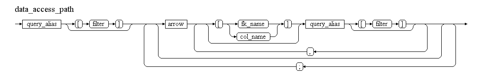
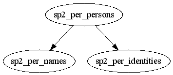
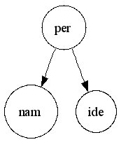
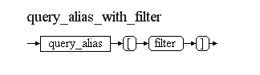
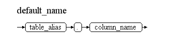
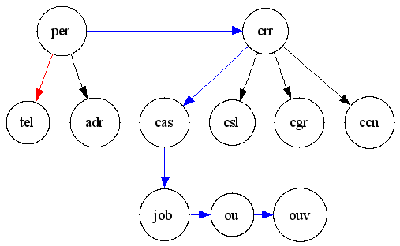

<!-- omit in toc -->
# DOC Utility - User's Guide v24.0

<!-- omit in toc -->
## Author: Philippe Debois (European Commission)

<!-- omit in toc -->
# Table of Contents
- [1. Introduction](#1-introduction)
- [2. Data Access Path Language (DAPL)](#2-data-access-path-language-dapl)
  - [2.1. Introduction](#21-introduction)
  - [2.2. General Syntax](#22-general-syntax)
  - [2.3. Simple Example](#23-simple-example)
    - [2.3.1. Purpose](#231-purpose)
    - [2.3.2. Data Diagram](#232-data-diagram)
    - [2.3.3. Data Access Path Described in DAPL](#233-data-access-path-described-in-dapl)
    - [2.3.4. Generated Query](#234-generated-query)
    - [2.3.5. Comments](#235-comments)
  - [2.4. The Language Explained](#24-the-language-explained)
    - [2.4.1. Table Alias](#241-table-alias)
    - [2.4.2. Query alias](#242-query-alias)
    - [2.4.3. Table Filter](#243-table-filter)
    - [2.4.4. Arrow](#244-arrow)
    - [2.4.5. Qualified Arrow](#245-qualified-arrow)
    - [2.4.6. Access Path Explained](#246-access-path-explained)
  - [2.5. Query Generation](#25-query-generation)
  - [2.6. Default Values](#26-default-values)
    - [2.6.1. Purpose](#261-purpose)
    - [2.6.2. Example](#262-example)
    - [2.6.3. Syntax](#263-syntax)
- [3. Template form](#3-template-form)
  - [3.1. Simple Example](#31-simple-example)
    - [3.1.1. PL/SQL source code](#311-plsql-source-code)
    - [3.1.2. SQL source code (alternate solution)](#312-sql-source-code-alternate-solution)
    - [3.1.3. Results](#313-results)
    - [3.1.4. Generated query](#314-generated-query)
    - [3.1.5. Comments](#315-comments)
  - [3.2. Directives](#32-directives)
    - [3.2.1. Data Access Path Definition](#321-data-access-path-definition)
      - [3.2.1.1. #from Directive](#3211-from-directive)
      - [3.2.1.2. #select Directive](#3212-select-directive)
      - [3.2.1.3. #where Directive](#3213-where-directive)
      - [3.2.1.4. #orderby Directive](#3214-orderby-directive)
    - [3.2.2. Repetitive Block](#322-repetitive-block)
      - [3.2.2.1. #foreach Directive](#3221-foreach-directive)
      - [3.2.2.2. #next Directive](#3222-next-directive)
    - [3.2.3. Future Extensions](#323-future-extensions)
  - [3.3. Variables](#33-variables)
    - [3.3.1. Syntax](#331-syntax)
    - [3.3.2. Format Mask](#332-format-mask)
  - [3.4. Parameters](#34-parameters)
    - [3.4.1. Syntax](#341-syntax)
    - [3.4.2. Usage](#342-usage)
    - [3.4.3. Instantiation](#343-instantiation)
  - [3.5. Descriptors](#35-descriptors)
    - [3.5.1. Usage](#351-usage)
    - [3.5.2. Syntax](#352-syntax)
    - [3.5.3. Example](#353-example)
  - [3.6. Merge Engine Invocation](#36-merge-engine-invocation)
    - [3.6.1. PL/SQL Invocation](#361-plsql-invocation)
    - [3.6.2. SQL Invocation](#362-sql-invocation)
- [4. More Complex Example](#4-more-complex-example)
  - [4.1. Purpose](#41-purpose)
  - [4.2. Data Model and Access Path](#42-data-model-and-access-path)
  - [4.3. Invocation from PL/SQL](#43-invocation-from-plsql)
  - [4.4. Generated Queries](#44-generated-queries)
    - [4.4.1. Query “per”](#441-query-per)
    - [4.4.2. Query “tel”](#442-query-tel)
  - [4.5. Comments](#45-comments)
  - [4.6. Result (Partial)](#46-result-partial)
- [5. Miscellaneous](#5-miscellaneous)
  - [5.1. Dependencies](#51-dependencies)
  - [5.2. Debugging](#52-debugging)
  - [5.3. Future Enhancements](#53-future-enhancements)
- [6. ChatGPT's opinion about this tool](#6-chatgpts-opinion-about-this-tool)
  - [6.1. Strengths](#61-strengths)
  - [6.2. Considerations](#62-considerations)
  - [6.3. Conclusion](#63-conclusion)

# 1. Introduction

Many information systems have a mail merge module that permits generating emails, letters, or documents from a single template and a structured data source. Templates consist of boilerplate text, which is identical in each generated document, and variables (also known as keywords or fields), which act as placeholders replaced by text from a data source.

A mail merge solution has three main components:

- **An editor**: This allows for editing the templates (e.g., MS Word).
- **A data source**: This provides the values for the variables (e.g., Oracle, Excel).
- **An engine**: This generates the documents from the templates and the data source.

When developing a mail merge solution, the most frequent problems arise from the data source:

- How to display the list of available variables in the editor (or how to validate them)?
- How to retrieve the data necessary to replace the variables during the merge operation?
- How to minimize the work needed to add extra variables?
- How to display repetitive information (e.g., rows in a table)?

This tool is an attempt to provide solutions to most of these issues. Its cornerstone is the underlying DAPL language, which has been specifically designed to describe easily and concisely how to retrieve the data necessary to replace the variables during the merge.

It takes the form of an Oracle package that provides a mail merge service that can be invoked from PL/SQL or from a SQL query. It transforms any input stream, composed of a template form and a description of how to extract data, into an output stream. Three types of streams are currently supported: pure text, XML, and MS Word documents (.docx).

The second chapter describes the DAPL language, which is designed to outline data access paths. In the third chapter, the focus shifts to the template form, the variables, and the directives that provide the necessary instructions to the mail merge engine. A concrete example is presented in the fourth chapter to illustrate these concepts in action. Finally, the last chapter groups all other important information that users need to know about the utility.

# 2. Data Access Path Language (DAPL)

## 2.1. Introduction

This language permits to describe, in an easy and concise way, how to navigate through a data model to extract data (e.g. for doing mail merge or for any other purpose). During parsing, the access path is transformed into a single-query made up of one or several joins which is then executed to retrieve necessary data.

## 2.2. General Syntax

Here is the general syntax of a data access path described in EBNF (Extended Backus Naur Form).



## 2.3. Simple Example

### 2.3.1. Purpose

Retrieve the name and birth date of the person with `per_id` 48016 (from history tables).

### 2.3.2. Data Diagram



A person has a history of names of different types (birth, usual, official, etc.) and a history of identity information (e.g., birth date, gender, etc.).

### 2.3.3. Data Access Path Described in DAPL

```plain
per[per_id=48016]->nam[oth_id_nametype=20021],ide
```



### 2.3.4. Generated Query

```sql
SELECT nam.given_name,
       ide.birth_date
  FROM sp2_per_persons per
  LEFT OUTER JOIN sp2_per_identities ide
    ON ide.per_id = per.per_id
   AND ide.pet_seq_nbr_to IS NULL -- latest version
   AND TRUNC(SYSDATE) BETWEEN ide.date_from
                          AND NVL(ide.date_to, TRUNC(SYSDATE)) -- today
   AND ide.pef_id IS NULL -- from personal profile only
   AND NVL(ide.closure_flag, 'N') = 'N' -- not a closure record
  LEFT OUTER JOIN sp2_per_names nam
    ON nam.per_id = per.per_id
   AND TRUNC(SYSDATE) BETWEEN nam.date_from
                          AND NVL(nam.date_to, TRUNC(SYSDATE)) -- today
   AND nam.pet_seq_nbr_to IS NULL -- latest version
   AND nam.pef_id IS NULL -- from personal profile only
   AND NVL(nam.closure_flag, 'N') = 'N' -- not a closure record
   AND nam.oth_id_nametype = 20021
 WHERE per.per_id = 48016
```

### 2.3.5. Comments

Various filters have been automatically added in addition to the join conditions. The ratio between the length of the definition and the length of the generated query is between 5% and 10%, depending on whether comments and white spaces are counted or not.

## 2.4. The Language Explained

### 2.4.1. Table Alias

Navigation consists of starting from a specific table and accessing successive nearby tables by following foreign keys. For the sake of conciseness, tables are referenced by their official alias (always in lowercase) instead of their name. The official alias of each table is derived from the name of its primary key.


**Example**: If `PER_PK` is the primary key of `SP2_PER_PERSONS`, "per" (in lowercase) is considered the official table alias.

### 2.4.2. Query alias

When the same table is involved several times in the access path, a qualifier (a number or a suffix) can be added to the table alias in order to make it unique (as requested by SQL when joining multiple times with the same table). Such an alias is called a "query alias" as it will end-up "as is" in the final query.


Examples of valid query aliases for the "SP2_PER_PERSONS" table: 
"per" (just a person)
"per2" (a second person)
"per_benef" (a person qualified as a beneficiary)
"per$jh" (a person qualified as a job holder)

### 2.4.3. Table Filter

To start the navigation from a specific record, a filter enclosed in square brackets can be specified after the query alias. Any valid SQL expression can be used, which can include function calls or references to parameters. All table columns referenced in the expression will be automatically prefixed with the query alias in the generated query. Table filters can be defined for all tables involved in the access path.



**Examples:**

- **Table filters**:
  - `per[per_id=48016]`: Person with a given `per_id` value.
  - `per[per_id=:per_id]`: Person with a given `per_id` whose value is a parameter.
  - `per[usual_family_name="DEBOIS" AND usual_given_name="Philippe"]`: Person with a specific family name and given name.

- **Resulting expressions in the final query**:
  - `per.per_id = 48016`
  - `per.per_id = :per_id`
  - `per.usual_family_name = 'DEBOIS' AND per.usual_given_name = 'Philippe'`

**Note:**
- The double quotes surrounding string values in the filter have been replaced with single quotes in the final query.
- Column names have been prefixed with the query alias in the final query.

### 2.4.4. Arrow

The navigation from one table to another is indicated via an arrow, which signifies that a foreign key must be followed. The type of arrow provides an indication of the type of foreign key that can be followed and the type of join generated in the final query.

- A single dash (`-`) is used to generate a **left outer join**.
- A double dash (`=`) is used for an **inner join**.

The type of arrow indicates the kind of foreign keys that can be followed:
- `>-` for **many-to-one**
- `-<` for **one-to-many**
- `->` for **any type** (many-to-one or one-to-many)

The combination of these two characteristics leads to the following six possibilities:


The first two arrows (`->` and `=>`) are the most frequently used.

### 2.4.5. Qualified Arrow

When several foreign keys of the specified type exist between two tables, the system selects the one involving the earliest columns of the table. It is possible to force the system to use a specific foreign key by adding some information enclosed in square brackets just after the arrow.


The arrow qualifier can be:
- The name of the desired foreign key
- The name of a column involved in the desired foreign key (this is, in most cases, sufficient to uniquely identify such a foreign key)

**Examples**:

An individual right ("rig") is linked to an assignee and to a beneficiary, both of them being persons. The following qualifiers can be used to force the system to get the beneficiary of a given right:
- The foreign key name: `rig->[rig_per_benef_fk]per_benef`
- The column name: `rig->[per_id_benef]per_benef`

### 2.4.6. Access Path Explained

The data model from which information must be retrieved can be considered a graph made up of nodes (the tables) and edges (the foreign keys). An access path is a sub-graph of the data model describing, from a particular starting node, how edges are successfully crossed to access nearby nodes.

- An edge crossing from node "a" to node "b" is denoted: `a->b`
- An access path is a succession of edge crossings; from a notational point of view, they are separated with a semicolon (`;`). For example, an access path going from "a" to "b" and then from "b" to "c" is denoted: `a->b;b->c`

When the nodes to the left and right of the semicolon are the same (i.e., when a node is crossed by an access path, as the "b" node in the above example), the following equivalent shortcut notation can be used: `a->b->c` (equivalent to `a->b;b->c`).

When two nodes are reached from the same source node, the following equivalent shortcut notation can be used: `a->b,c` (equivalent to `a->b;a->c`).

The following restrictions apply:
- A node cannot be a target more than once. For example, `a->b->c;a->c` is invalid and should be defined as: `a->b->c1;a->c2`.
- The starting node cannot be a target, meaning `a->b->a` is invalid and should be defined as: `a1->b->a2`.
- There is only one starting node, so `a->b;c->d` is invalid (as "c" is a second starting node). In other words, the node mentioned after a semicolon must already be known.

**Example:**


Here are some possible access paths (all equivalent):
- `a->b;b->c1;a->c2`
- `a->b->c1;a->c2` (preferred)
- `a->c2,b->c1`

## 2.5. Query Generation

The first alias defines the table that will be used in the `FROM` clause. Any filter defined on the first alias will be included in the `WHERE` clause. Each arrow results in an (inner or left outer) join between the two involved tables with the specified query aliases. Unless explicitly qualified, the foreign key is chosen by the system to limit the number of resulting records as much as possible. As such, any existing many-to-one foreign key is selected first. If none is found, one-to-many foreign keys are considered, with priority given to those having the greatest number of columns in common with the primary key of the target table. Once the foreign key to be used is identified, the join condition is automatically generated.

Filters specified for the source and/or target aliases are added to the join conditions and/or to the `WHERE` clause (with table columns automatically prefixed by the query alias), if any. Extra filters are also generated for historic tables and versioned tables.

For history tables (those containing "date_from"/"date_to" columns), a filter is automatically generated to get the current situation (`SYSDATE BETWEEN date_from AND date_to`). For versioned tables (those containing "pet_seq_nbr_from"/"pet_seq_nbr_to" columns), a filter is automatically added to get the latest version (`pet_seq_nbr_to IS NULL`). For historic tables with closure records (those containing a "closure_flag" column), a filter is automatically added to exclude closure records (`closure_flag != 'Y'`). For tables used for both files and profiles (those containing a "pef_id" or "cef_id" column), a filter is automatically added to exclude records stored in a file (`pef_id IS NULL`).

However, these filters are not added if the mentioned columns are already referenced in a table filter. To prevent these default filters from being generated, a dummy condition can be added in the table filter. For example, `date_from=date_from` will permit retrieval of the whole history instead of just the current record.

It is also possible to filter on a date different from `SYSDATE` by setting the `sysdate` variable to a specific date. Similarly, filtering on an event (version) different from the last one can be done by setting the `pet_seq_nbr` variable to a specific event number.

The selected columns depend on the variables used in the template form. When no variable is found, a `SELECT *` is performed, meaning all columns of all tables are retrieved (which can be extensive).

## 2.6. Default Values

### 2.6.1. Purpose

Extra filters or default values can be defined to make the data access path even smaller. For instance, when a table contains multiple dimensions, it is possible to define a default one. 

For example, the "sp2_per_names" table contains several types of names (at birth, official, usual, etc.) as indicated by the "oth_id_nametype" column. It is possible to declare that the official name should be used by default when no type of name is specified by using the "set_default" method of the "doc_utility" package.

### 2.6.2. Example 

```sql
BEGIN
   -- official name by default
   doc_utility.set_default('nam.oth_id_nametype','20021');
   -- normal grade by default
   doc_utility.set_default('cgr.oth_id_purpose','8000'); 
   -- normal assignment by default
   doc_utility.set_default('cas.jot_cd','"AFF"');
END;
```

Data access path with explicit name type:  
`per[per_id=48016]->nam[oth_id_nametype=20021],ide`  

Data access path with default name type:  
`per[per_id=48016]->nam,ide`  

Both are equivalent.

### 2.6.3. Syntax

The syntax of a default name is the following:



**Note:** Table alias must be specified and not query alias; it clearly means that this default value will apply to all query aliases defined for this table (in all queries).
# 3. Template form

The template form is made up of text lines that contain variables that will be substituted with extracted data at run-time. It also contains directives (special lines starting with a cross character) that give some instructions to the engine. These special lines are not copied to the output stream.

## 3.1. Simple Example

### 3.1.1. PL/SQL source code

```plsql
DECLARE
   t dbms_sql.varchar2a;
BEGIN
   doc_utility.set_variable('per_id','48016');
   t(1):='#from per[per_id=:per_id]->ide,nam[oth_id_nametype=20021]';
   t(2):='#foreach per';
   t(3):='{nam.given_name} ({per.per_id}) born on {ide.birth_date}';
   t(4):='#next';
   doc_utility.merge(t);
END;
```

### 3.1.2. SQL source code (alternate solution)

```sql
SELECT * FROM TABLE(doc_utility.merge_pipelined(
   '#from per[per_id=:per.per_id]->ide,nam[oth_id_nametype=20021]\n'
 ||'#foreach per\n'
 ||'{nam.given_name} ({per.per_id}) born on {ide.birth_date}\n'
 ||'#next'
)) merge_result
```

### 3.1.3. Results

From "dbms_output" in PL/SQL and from fetched rows in SQL (pipelined solution):

**Philippe (48016) born on 09.12.1965**

### 3.1.4. Generated query

```sql
SELECT nam.given_name
     , per.per_id
     , ide.birth_date
  FROM sp2_per_persons per
  LEFT OUTER JOIN sp2_per_identities ide
    ON ide.per_id=per.per_id
   AND ide.pet_seq_nbr_to IS NULL -- latest version
   AND TRUNC(SYSDATE) BETWEEN ide.date_from
                          AND NVL(ide.date_to,TRUNC(SYSDATE)) -- today
   AND ide.pef_id IS NULL -- from personal profile only
   AND NVL(ide.closure_flag,'N')='N' -- not a closure record
  LEFT OUTER JOIN sp2_per_names nam
    ON nam.per_id=per.per_id
   AND TRUNC(SYSDATE) BETWEEN nam.date_from
                          AND NVL(nam.date_to,TRUNC(SYSDATE)) -- today
   AND nam.pet_seq_nbr_to IS NULL -- latest version
   AND nam.pef_id IS NULL -- from personal profile only
   AND NVL(nam.closure_flag,'N')='N' -- not a closure record
   AND nam.oth_id_nametype=20021
 WHERE per.per_id=:per_id
```

### 3.1.5. Comments

Note that the parameters must be set before invoking the mail merge.

## 3.2. Directives

Directives are used for two different purposes:
1. To define the data access path.
2. To iterate in the template.

### 3.2.1. Data Access Path Definition

The data access path is defined with the following directives:

- **#from <data-access-path>** (mandatory)
- **#select <expressions-list>** (optional)
- **#where <condition>** (optional)
- **#orderby <expressions-list>** (optional)

The **#from** directive defines the data access path and is the only mandatory directive. Other directives can be used to add columns to the selected columns list, to add filters, and to change the sorting order.

#### 3.2.1.1. #from Directive

This directive defines a data access path. Refer to the chapter on the DAPL language for an explanation of how to define the data access path. A template can contain several data access paths (also referred to as "queries") that can be independent or related. For example, a master/details relationship can be implemented with one master query and one related slave sub-query. Each query has a name that will be referenced by other directives used for iterations. The name of a query is defined as the name of the first alias in its data access path. A template cannot contain two queries with the same name. For instance, the query name for `#from per[per_id=:per_id]->……` is "per".

#### 3.2.1.2. #select Directive

Selected columns are normally derived from the list of variables used in the template form. However, extra columns may sometimes be necessary, such as a column used to link two queries together, which is not referenced in the template form. This directive must be followed by a list of columns or expressions that conform to SQL syntax.

**Example:** 

```plain
#select rownum
```
When the template contains multiple queries, this directive relates to the most recent one encountered.

#### 3.2.1.3. #where Directive

This directive can be used to add an extra filter to a query. Strictly speaking, it is not necessary since filters can also be specified in the data access path. It must be followed by a condition that conforms to SQL syntax.

**Example:** 

```plain
#where local_flag="Y"
```
When the template contains multiple queries, this directive relates to the most recent one encountered.

#### 3.2.1.4. #orderby Directive

This directive can be used to change the sorting order of the results set. It must be followed by a list of columns or expressions that conform to SQL syntax.

**Example:** 

```plain
#orderby per_id
```
When the template contains multiple queries, this directive relates to the most recent one encountered.

### 3.2.2. Repetitive Block

The following pair of directives gives instructions to the engine on how to iterate:

- **#foreach <query>**
- **#next [<query>]**

#### 3.2.2.1. #foreach Directive

This directive indicates that the text lines between **#foreach** and **#next** will be repeated for each record retrieved by the specified query, which must have been defined previously using the **#from** directive. It is also used to identify the columns that must be retrieved by the query. Each variable encountered in this block will be added to the list of selected columns in the corresponding query. Each data access path declared via the **#from** directive should have a corresponding iterative block declared via the **#foreach** and **#next** directives; otherwise, the declaration would be unnecessary.

**Example:**

```plain
#foreach per
```

#### 3.2.2.2. #next Directive

This directive marks the end of a repetitive block started with the **#foreach** directive. The name of the query is optional but, when specified, it should match the one defined with the corresponding **#foreach** directive. Each block opened with a **#foreach** directive must be closed with a **#next** directive.

**Example:**
```plain
#next per
```

Repetitive blocks can be embedded within each other, such as to implement a master/details relationship. Alternatively, they can be placed one after the other.

**Example:**

```plain
#from master……
#from detail……
……
#foreach master
……
#foreach detail
……
#next detail
……
#next master
……
```

### 3.2.3. Future Extensions

Other directives might be added in a future release to manage headers, footers, and breaking columns.

## 3.3. Variables

Text lines (which are not directives) can contain variables that are substituted at run-time with data extracted from the query results set.

### 3.3.1. Syntax

Variables are enclosed in curly brackets.


A variable can be:

- A table column prefixed with its query alias (plus an optional descriptor, as explained in section 2.5).
- A parameter (refer to section 2.4).
- Any valid SQL expression.

### 3.3.2. Format Mask

A format mask (similar to—but not exactly the same as—the one used in the `sprintf` function of the C language) can be specified to format the output. For a complete description of the possible format masks, see the following URL: [ADP Blog on Format Masks](http://www.adp-gmbh.ch/blog/2007/04/14.php#test_case).

**Example:** 

```plain
{per.pers_nbr;%06d}
```
This will left-pad the personal number with zeros, resulting in a format like `048016`.

## 3.4. Parameters

### 3.4.1. Syntax

Parameters are prefixed with a colon (":").


**Example:** As previously mentioned, the syntax for a parameter would be: 

```plain
per[per_id=:per_id]
```

### 3.4.2. Usage

When a SQL query needs to be executed multiple times but with different contexts, it is highly recommended to use parameters instead of hardcoding constants. This approach allows Oracle to re-execute the same query without the need for parsing it again. Additionally, a caching mechanism will be implemented in the merge engine in a future release to avoid repeatedly parsing data access paths that have not changed.

Parameters also serve to correlate queries with one another. For example, in a master/details relationship, the second query must reference the ID of the master record. Parameters are the only means to reference a column defined in another query.

**Example:**

```plain
#from master……
#from detail[master_id=:master.master_id]
```

### 3.4.3. Instantiation

Parameter values can be set in PL/SQL by invoking the `set_variable` method, which accepts two parameters: the parameter name and its value. Currently, all parameters are treated as character strings. The concept of "parameter type" could be introduced in a future release.

**Example:**

```plain
doc_utility.set_variable('per_id', '48016');
```

## 3.5. Descriptors

### 3.5.1. Usage

Most tables contain surrogate keys, which are internal unique identifiers that are not easily understandable by end-users and, therefore, cannot be displayed as they are. A descriptor of a table is a column that accurately describes a record and can be presented to end-users. 

**Examples:** country name, currency code, person's name, etc.

When retrieving data, several additional joins with reference tables are often required to obtain the descriptors. Fortunately, there is no need to include these joins in the data access path (keeping it simple) because a special syntax can be utilized.

### 3.5.2. Syntax

When a column has a many-to-one foreign key pointing to a reference table, this foreign key can be followed to retrieve the descriptor of the reference record simply by adding a dot (".") followed by the descriptor column.

### 3.5.3. Example

Consider the case where a person (`per`) has a gender (`sex`).


**Assuming the following columns:**
- `per.sex_id` (many-to-one foreign key to "sex")
- `sex.sex_id` (primary key of "sex")
- `sex.descr` (descriptor of "sex")

**Solution 1:** Include "sex" explicitly in the access path.
- **Access path:** 
  ```plain
  per[per_id=48016]->sex
  ```
- **Variable:** 
  ```plain
  {sex.descr}
  ```

**Solution 2:** Use the descriptor syntax.
- **Access path:** 
  ```plain
  per[per_id=48016]
  ```
- **Variable:** 
  ```plain
  {per.sex_id.descr}  <= dot + descriptor
  ```

Note that internally, this will be transformed into:
- **Access path:** 
  ```plain
  per[per_id=48016]->per_sex
  ```
- **Variable:** 
  ```plain
  {per_sex.descr}
  ```

When a descriptor consists of two columns (for example, for `per`: `usual_name` + `family_name`), this syntax is not recommended, as it will result in two joins (one for each column).

Moreover, multiple many-to-one foreign keys can be followed in cascade simply by adding extra dots.

**Example:** 

```plain
{per.cty_cd.cnt_cd.descr}
```
This expression retrieves the description of the country of the city associated with a person.

## 3.6. Merge Engine Invocation

The mail merge engine can be invoked from both PL/SQL and SQL environments.

### 3.6.1. PL/SQL Invocation

When invoked from PL/SQL, the input stream is provided as a table of text lines, utilizing the `varchar2a` data type defined in the `dbms_sql` package. The `LOG_UTILITY` package is responsible for generating the output stream, which can be directed to either `dbms_output` or the `log_output` table, depending on your requirements.

### 3.6.2. SQL Invocation

For invocation from SQL, the input stream consists of a single string formed from multiple lines of text, separated by a line feed (LF) character (CHR(10)) or a '\n' string in C syntax. If a line is too long, it can be continued onto the next line using a backslash ("\"), which is particularly useful for splitting the `#from` directive, as it must remain a single line of code and is often lengthy.

# 4. More Complex Example

This section presents a master/details report example.

## 4.1. Purpose

The objective is to produce a list of people working in DIGIT.B.3, along with their professional telecom numbers (office phone/fax).

## 4.2. Data Model and Access Path

In the data model, tables and foreign keys are represented by circles and arrows. The first data access path to retrieve the persons working in DIGIT.B.3 is illustrated in blue, while the second access path to gather the telecom information for each person is shown in red.



## 4.3. Invocation from PL/SQL

```plsql
DECLARE
   t dbms_sql.varchar2a;
BEGIN
   doc_utility.set_default('nam.oth_id_nametype', '20022'); -- official name
   doc_utility.set_default('cgr.oth_id_purpose', '8000'); -- normal grade
   doc_utility.set_default('cas.jot_cd', '"AFF"'); -- main assignment
   doc_utility.set_default('crr.skg_id', '5'); -- career of officials
   
   t(1) := '#from per=>crr[ou_id=1]=>cas=>job=>ou\';
   t(2) := '=>ouv[acr_compl LIKE "DIGIT.B.3%"]';
   t(3) := '#from tel[per_id=:per.per_id and oth_id_context=12051]';   
   t(4) := '#foreach per';
   t(5) := '{per.oth_id_title.descr_fra} {per.usual_given_name} \';
   t(6) := '{per.usual_family_name} ({per.per_id})';
   t(7) := '#foreach tel';
   t(8) := '- {tel.oth_id_tel_type.descr_eng} {tel.subscr_nbr}';
   t(9) := '#next tel';
   t(10) := '#next per';
   
   doc_utility.merge(t);   
END;
```

## 4.4. Generated Queries

### 4.4.1. Query “per”

This query retrieves the personal details of individuals in the specified organization unit.

```sql
SELECT per_oth.descr_fra,
       per.usual_given_name,
       per.usual_family_name,
       per.per_id
  FROM sp2_per_persons per
 INNER JOIN sp2_careers 574crr ON crr.per_id = per.per_id
   AND crr.skg_id = 5
   AND TRUNC(SYSDATE) BETWEEN crr.date_from AND NVL(crr.date_to, TRUNC(SYSDATE))
   AND crr.ou_id = 1
 INNER JOIN sp2_car_assignments cas ON cas.per_id = crr.per_id
   AND cas.crr_seq_nbr = crr.crr_seq_nbr
   AND cas.cet_seq_nbr_to IS NULL
   AND cas.jot_cd = 'AFF'
   AND TRUNC(SYSDATE) BETWEEN cas.date_from AND NVL(cas.date_to, TRUNC(SYSDATE))
 INNER JOIN sp2_jobs job ON job.job_id = cas.job_id
 INNER JOIN sp2_org_units ou ON ou.ou_id = job.ou_id
 INNER JOIN sp2_org_unit_versions ouv ON ouv.ou_id = ou.ou_id
   AND TRUNC(SYSDATE) BETWEEN ouv.date_from AND NVL(ouv.date_to, TRUNC(SYSDATE))
   AND ouv.acr_compl LIKE 'DIGIT.B.3%'
  LEFT OUTER JOIN sp2_ref_others per_oth ON per_oth.oth_id = per.oth_id_title
 WHERE per.pef_id IS NULL;
```

### 4.4.2. Query “tel”
574
This query retrieves the telecom details associated with the persons.

```sql
SELECT tel_oth.descr_eng,
       tel.subscr_nbr
  FROM sp2_per_telecoms tel
  LEFT OUTER JOIN sp2_ref_others tel_oth ON tel_oth.oth_id = tel.oth_id_tel_type
 WHERE tel.per_id = :per$per_id
   AND tel.oth_id_context = 12051
   AND tel.pef_id IS NULL
   AND TRUNC(SYSDATE) BETWEEN tel.date_from AND NVL(tel.date_to, TRUNC(SYSDATE))
   AND tel.pet_seq_nbr_to IS NULL
   AND NVL(tel.closure_flag, 'N') = 'N';
```

## 4.5. Comments

Key points to note:

- Historical tables (like `cas`, `ouv`) are filtered based on the current date (SYSDATE).
- The version table (`cas`) is filtered to retrieve only the latest version.
- Default filters are applied for `nam`, `cgr`, `cas`, and `crr`.
- Closure records are excluded from the results.
- Additional joins are created for descriptor retrieval (e.g., title, phone type).
- A parameter (`:per$per_id`) is generated to link the two queries.
- Only the necessary columns are selected based on the variables.

## 4.6. Result (Partial)

Here is a partial output of the report:

```plain
Mademoiselle Elena NAZELLO (58742)
- Telephone 60574
- Fax 67619
Madame Martine LIGUAME (57174)
- Telephone 59635
Monsieur Philippe DOGME (45679)
- Telephone 50485
- Telephone 67504
- Telephone 37417
- Fax 61679
Monsieur Philippe DUBOIS (41086)
- Telephone 94758
...
```

# 5. Miscellaneous

## 5.1. Dependencies

The following utility package is referenced and must be installed for the functionality to work correctly:

- **log_utility**: This package is used for logging purposes.

Additionally, the following utility package is planned for use in future releases:

- **sql_utility**: This package will facilitate SQL caching.

## 5.2. Debugging

Debugging functionality can be activated to display:

- Generated queries
- Records fetched by each query

To enable debugging, use the following command via the `log_utility` package:

```plsql
BEGIN
   log_utility.set_message_filter('DE');
END;
```

## 5.3. Future Enhancements

The following enhancements are foreseen for future releases:

- **New Directives**: Introduce directives to support breaks, headers, and footers in reports.
- **Typing for Parameters**: Implement typing for parameters to enhance code clarity and error checking.
- **SQL Caching**: Utilize caching for generated queries using the `sql_utility` package to improve performance.
- **Bind Variables**: Implement bind variables instead of hardcoded values for default filters, allowing for more efficient query execution by avoiding reparsing when re-executing with different default values.

# 6. ChatGPT's opinion about this tool

The DOC utility appears to be a robust tool designed to streamline data retrieval and reporting processes, particularly in environments with complex data relationships, such as those involving master/detail relationships. Here are some key strengths and considerations based on the user's guide:

## 6.1. Strengths

1. **Parameterization**: The use of parameters enhances query flexibility and efficiency, allowing the same SQL queries to be executed with different contexts without the overhead of re-parsing.

2. **Descriptor Handling**: The ability to retrieve user-friendly descriptors for surrogate keys minimizes the need for complex joins, simplifying the data access paths and making it easier for end-users to understand the data.

3. **PL/SQL and SQL Invocation**: Supporting both PL/SQL and SQL invocation broadens the utility’s applicability across different use cases, accommodating various programming preferences and environments.

4. **Debugging and Logging**: Built-in debugging and logging features facilitate troubleshooting and performance monitoring, which are essential for maintaining robust applications.

5. **Future Enhancements**: The planned features, like SQL caching and bind variables, indicate that the tool is actively being developed, which is a positive sign for long-term usability and performance improvements.

## 6.2. Considerations

1. **Complexity**: While the tool provides powerful functionality, it may introduce complexity for new users, especially those unfamiliar with SQL or PL/SQL. Comprehensive training and support materials will be crucial for effective adoption.

2. **Performance**: While the tool promises performance benefits through parameterization and caching, actual performance improvements will depend on implementation details and the specific queries being executed.

3. **Documentation**: The user’s guide is thorough, but it could benefit from more examples, especially for complex scenarios. Real-world use cases can help users understand how to leverage the tool effectively.

## 6.3. Conclusion

Overall, the DOC utility seems to be a well-thought-out solution for managing and optimizing data access in database applications, especially for organizations dealing with intricate datasets. Its features could significantly enhance reporting efficiency and usability for end-users.